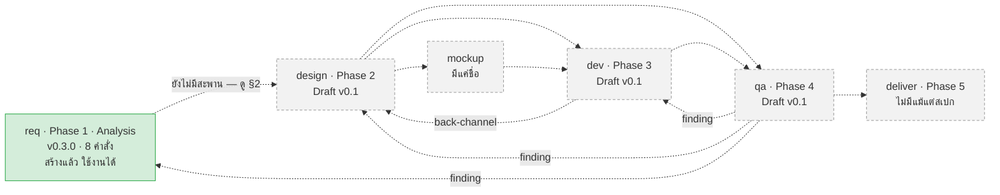
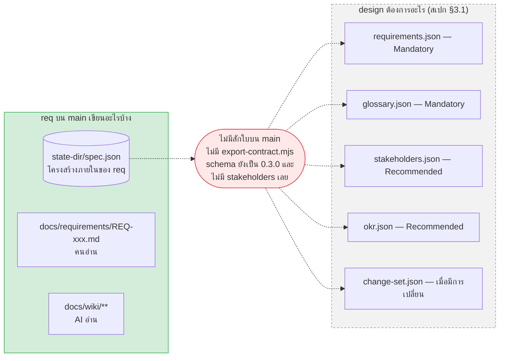
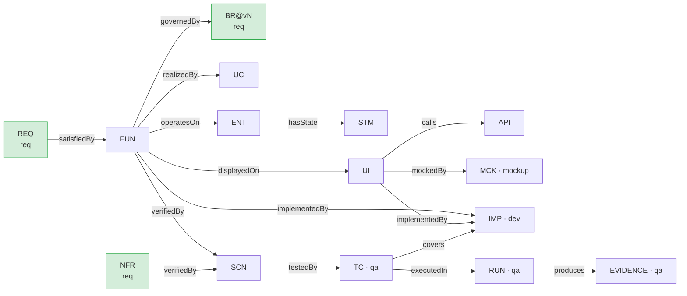
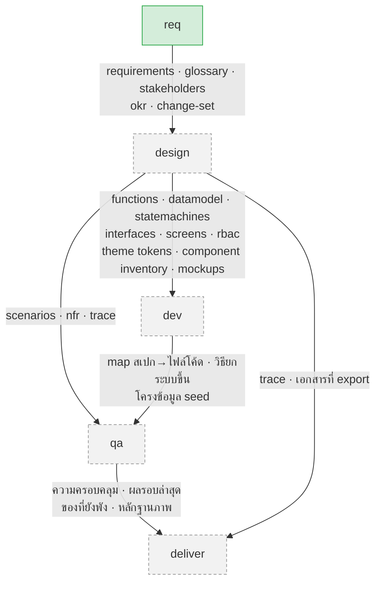
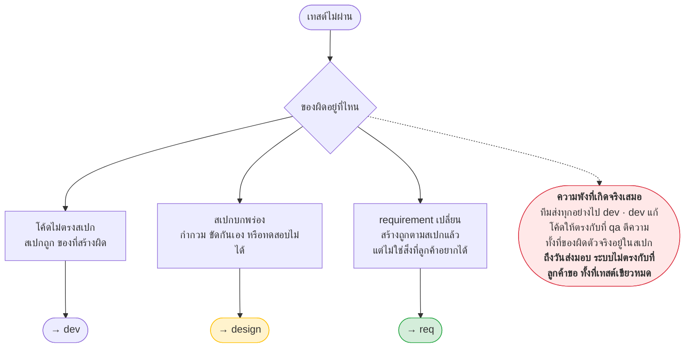
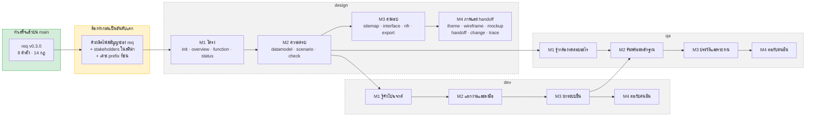
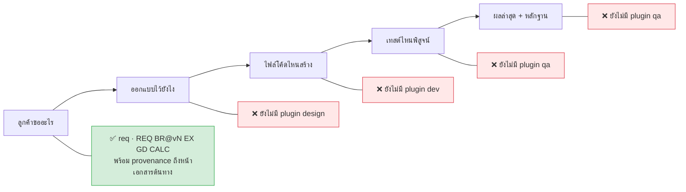

# aeon — ภาพรวมทุก plugin (ฐาน `main`)

> **ชั้นเอกสาร:** B · Authored — สคริปต์ห้ามเขียนทับ
> **owner:** user · **ทบทวนล่าสุด:** 2026-08-19 · **ตามมาตรฐาน:** [DOC-STANDARD v1.2](../standard/DOC-STANDARD.md)
>
> **ฐานอ้างอิงของใบนี้คือ branch `main`** (`af3933e`) ซึ่งเป็นต้นฉบับ — **`req` สร้างเสร็จแล้วตัวเดียว**
> `design` · `dev` · `qa` **ยังไม่ได้สร้าง** มีแต่สเปกใน `docs/requirement/`
> ใบนี้เขียนไว้บน branch `wiki-per-plugin` แต่ **ไม่ได้ merge อะไรจาก branch นี้เข้าไปในเนื้อหา** — ทุกข้อเท็จจริงอ่านจาก `main` ตรง ๆ

**ตรวจได้เองโดยไม่ต้อง merge และไม่ต้อง checkout**

```bash
git ls-tree --name-only main plugins/          # -> plugins/req เท่านั้น
git show main:.claude-plugin/marketplace.json  # -> plugins: req 0.3.0
git show main:CLAUDE.md | grep "^\*\*ประตู"    # -> ประตู 1-7 เท่านั้น
```

**ต้นทางของเนื้อหาส่วน `design` · `dev` · `qa`** — สามใบนี้เป็น **Draft v0.1** ทั้งหมด

- [`design-plugin-requirements.en.md`](../requirement/design-plugin-requirements.en.md)
- [`dev-plugin-requirements.en.md`](../requirement/dev-plugin-requirements.en.md)
- [`qa-plugin-requirements.en.md`](../requirement/qa-plugin-requirements.en.md)

> ⚠️ **ทั้งสามใบเป็นเอกสารชั้น "ข้อเสนอ"** (CLAUDE.md §2 ลำดับ 4) · **ชื่อคำสั่งทุกตัวเป็นข้อเสนอ**
> สเปกเขียนเองว่า *"Names are proposals. Inputs, outputs, and DoD are not."*
> สิ่งที่ผูกมัดคือ **อินพุต · เอาต์พุต · เงื่อนไขว่าเสร็จ (DoD)** ไม่ใช่ชื่อคำสั่ง

---

## 1. สถานะจริงบน `main` วันนี้



**บน `main` ไม่มีเส้นทึบสักเส้นระหว่าง plugin** — เพราะมี plugin เดียว

| plugin | สถานะบน `main` | คำสั่ง | ด่านตรวจ |
|---|---|---|---|
| **`req`** | ✅ **v0.3.0** ติดตั้งได้จริง | `capture` `ask` `calc` `example` `golden` `change` `check` `help` | `verify-rules.mjs` **14 ข้อ** (warn-only 3 ข้อ: 11 · 13 · 14 · ข้อ 5 เป็นของ CP2) |
| `design` | 📄 สเปกอย่างเดียว | เสนอไว้ 18 ตัว | เสนอไว้ V1–V27 |
| `dev` | 📄 สเปกอย่างเดียว | ไม่ได้ตั้งชื่อไว้ | เสนอไว้ DV1–DV16 |
| `qa` | 📄 สเปกอย่างเดียว | ไม่ได้ตั้งชื่อไว้ | เสนอไว้ QV1–QV17 |
| `mockup` · `deliver` | 📄 ถูกอ้างถึงเฉย ๆ | — | — |

**ตัวเลขสัญญาของ `req` บน `main`** (จาก `main:CLAUDE.md` §3 และ `fixtures/dirty/EXPECTED.md`)

```
verify-rules  clean -> exit 0 · PASS
verify-rules  dirty -> exit 1 · 44 error / 19 warn   (--cp1 43/19 · --cp2 30/0)
wiki.mjs      clean -> already matches · dirty -> 4 STALE · 1 MISSING · 1 ORPHAN
verify-design root  -> 0 error / 2 warn (D12b ×2 · warn ถาวรโดยประกาศ)
```

**ประตูที่เคาะแล้วบน `main` มี 7 บาน** — ประตู 3 (git) ยังเปิดค้าง · **ประตู 8–11 ยังไม่มีบน `main`**
แปลว่าเรื่องที่ประตูเหล่านั้นตัดสิน (ที่อยู่ wiki ต่อ plugin · ไฟล์สัญญา · เจ้าของ `ST-` · การชนกันของ prefix)
**ยังเป็นคำถามเปิดในฐานนี้** — ดู §4 และ §8

---

## 2. ช่องว่างที่ข้ามไม่ได้ — `req` บน `main` ยังไม่มีทางส่งของออก

สเปกของ `design` §3.1 บอกว่ามันต้องผูกกับ **ไฟล์สัญญา ไม่ใช่โครงสร้างภายในของ `req`**
แต่บน `main` **ยังไม่มีใครผลิตไฟล์สัญญาเหล่านั้นเลยสักใบ**



**สามอย่างที่ต้องเกิดก่อน `/design:init` จะรันได้แม้แต่ครั้งเดียว**

| ต้องมี | ทำไม | ตรวจว่ายังไม่มีบน main ยังไง |
|---|---|---|
| ตัวผลิตไฟล์สัญญา | `design` ห้ามอ่าน `spec.json` ตรง ๆ — มันเป็นไฟล์เดียว ปิดด้วย `additionalProperties: false` และล็อกเวอร์ชันด้วย `const` ผู้บริโภคที่ผูกกับมันจะพังทุกครั้งที่ `req` ขยับ | `git ls-tree --name-only main plugins/req/scripts/` — ไม่มี `export-contract.mjs` |
| `stakeholders[]` ในสคีมา | `design` ต้องใช้ตอนสร้างตารางสิทธิ์ · role ที่ไม่ได้มาจากคนจริงในองค์กรลูกค้า คือ role ที่ไม่มีใครเป็นเจ้าของ | `git show main:schemas/spec.schema.json \| grep -c stakeholders` → `0` |
| คำตอบว่า OKR เป็นของใคร | ทั้งสเปก `design` §3.1 และ `qa` §3.1 ขอ `okr.json` · แต่ไม่มีคำถามไหนในคลังคำถามของ `req` ถามถึง OKR เลย | ไม่มี `okr` ที่ไหนในสคีมาของ `main` |

> **กฎแข็งของทุกรอยต่อ** (design §3.1 · dev §3.1 · qa §3.1 เขียนตรงกันทั้งสามใบ) —
> **อินพุตบังคับหายหรือพัง → หยุด แล้วบอกให้ครบว่าอะไรหาย · ห้ามเดาเนื้อหาที่ขาดแล้วเดินต่อ**
> *design ที่สร้างบน requirement ที่แต่งขึ้นเอง จะดูเหมือนเสร็จ แต่สาวกลับไปหาอะไรไม่ได้เลย*

---

## 3. ทะเบียน id ทั้งระบบ — ใครสร้าง id ชนิดไหนได้ และแต่ละตัวคืออะไร

**id คือกระดูกสันหลังของทั้ง marketplace** — ทุก artifact ต้องมี id และต้องสาวขึ้นไปถึง `REQ` ได้
หัวข้อนี้อธิบายทุก prefix เป็นภาษาอังกฤษ เพราะ id เป็นของที่ข้ามระบบ (P9: *IDs in English; client-facing content in Thai*)

> 📖 **ศัพท์ที่ใช้ในหัวข้อนี้ — อ่านก่อน**
>
> | คำ | แปลว่า |
> |---|---|
> | **mint** | **สร้าง id ตัวใหม่ของชนิดนั้น** เช่น *`design` mints `FUN`* = `design` เป็นคนตั้ง `FUN-job-001` ขึ้นมาใหม่ได้ |
> | **own** | **เป็นเจ้าของชนิดนั้น** — มีสิทธิ์สร้าง แก้ และเลิกใช้ · plugin อื่น**อ้างถึงได้ แต่สร้างเองไม่ได้** |
> | **reference** | **อ้างถึง id ของคนอื่น** โดยไม่คัดเนื้อหามาเขียนซ้ำ (W3: *reference, do not copy*) |
> | **prefix** | ตัวอักษรนำหน้า id ที่บอกว่ามันเป็นของชนิดไหน เช่น `BR-` `FUN-` `TC-` |
>
> **ทำไมต้องแยกให้ชัดว่าใครสร้างอะไรได้** — id ที่ปล่อยออกไปแล้วเปลี่ยนยากมาก และถ้าสอง plugin
> ตั้ง id ชนิดเดียวกันคนละที่ จะไม่มีใครรู้ว่าใบไหนจริง · นี่คือปัญหาที่ §3.6 ทั้งหัวข้อพูดถึง

### 3.1 `req` mints — id ที่ `req` เป็นคนสร้าง · มีจริงบน `main` แล้วทุกตัว

อ่าน pattern จริงได้จาก `git show main:schemas/spec.schema.json`

| prefix | pattern | What it is |
|---|---|---|
| `REQ` | `REQ-<module>-nnn` | **Requirement.** One unit of what the client asked for, carrying an actor and a goal. Everything downstream traces up to one of these. |
| `BR` | `BR-<module>-nnn@vN` | **Business rule.** The unit of coverage in Phase 1 — not the scenario. Versioned, because a rule that changes must stay readable at the version the code was built against. |
| `CALC` | `CALC-<module>-nnn@vN` | **Calculation contract.** How a rule's numbers are produced: formula, input types, numeric type, rounding mode *and* rounding points, residual policy, boundary behaviour. Pinned to one rule version. |
| `GD` | `GD-<module>-nnn` | **Golden dataset.** The answer key, produced by *running* a script and then signed by a human. Not a formula anyone agreed to — numbers somebody checked. |
| `EX` | `EX-<module>-nnn` | **Example.** A given/when/then case that proves one rule version. Its `then` carries the verbatim Thai text the user actually sees. |
| `NFR` | `NFR-<module>-nnn` | **Non-functional requirement.** Performance, availability, security, and so on — carried inside the requirement that owns it. |
| `Q` | `Q-<module>-nnn` | **Red card.** An open question nobody can answer yet. Blocks CP1. Opening one is a good outcome, not a failure. |
| `DQ` | `DQ-<module>-nnn` | **Deferred question (spillover).** The answer is known in shape but needs an entity first. Blocks CP2 only, never CP1. |
| `CHG` | `CHG-<module>-nnn` | **Change set.** Why a rule or contract moved up a version. A node rather than a log line, because one decision usually moves several nodes at once. |
| `SRC` | `SRC-nnn` | **Source document.** The evidence a requirement came from — a file, an image, a chat log, or a customer data extract — stored on disk with page-level provenance. |
| `UL` | `UL-<module>-nnn` | **Ubiquitous language term.** One word with one agreed meaning. Vocabulary settles before rules, or every rule using an ambiguous word is ambiguous too. |

### 3.2 Authoring bundle owns — id ของเอกสาร *เครื่องมือ* ไม่ใช่ของงานลูกค้า

จาก `main:docs/standard/DOC-STANDARD.md` §5.1 · **รายการนี้มีอยู่แล้วบน `main` และเป็นเหตุผลของการชนกันใน §3.6**

| prefix | What it is |
|---|---|
| `MKT` · `PLG` · `SKL` · `SCH` | **Marketplace · Plugin · Skill · Schema.** Singletons — one repo has exactly one `req`, so a sequence number would be noise. |
| `CMD` | **Command.** One slash command of one plugin. |
| **`SCR`** | **Script.** A checker or calculator in this repo — `SCR-req-001`. **Not a screen.** |
| `ADR` | **Decision.** An architecture decision with its reasoning, in the tooling's own bundle. |
| **`FN`** | **Field Note.** The result of one real round of use — `FN-req-001`. **Not a functional requirement.** |
| `STD` | **Standard.** A standards document such as DOC-STANDARD itself. |
| `CP1`–`CP6` | **Checkpoint.** Keeps the names the whole system already uses. |

### 3.3 `design` mints — id ที่ `design` จะเป็นคนสร้าง · ยังไม่มีของจริง

จากสเปก §6.1 · **ชื่อที่ใช้ในตารางนี้คือชื่อที่เลี่ยงการชนแล้ว** เหตุผลอยู่ใน §3.6

| prefix | What it is |
|---|---|
| **`FUN`** | **Functional requirement.** One thing the system must let someone do, derived from a `REQ` and referencing the `BR` ids it must enforce. *Spec calls this `FN-`; renamed because `FN-` is Field Note.* |
| `UC` | **Use case.** The flow that realises a `FUN` — actor, precondition, main flow, alternate flow, exception flow. All five are required (V3), because the flows nobody writes are the ones dev invents. |
| **`UI`** | **Screen.** One screen with its fields, validation, actions, permitted roles, and where the user lands after each action. *Spec calls this `SCR-`; renamed because `SCR-` is Script.* |
| `ENT` | **Entity / Aggregate.** A domain object with typed, validated, PDPA-classified attributes and its invariants. This is where the glossary stops being a list of words and becomes a table dev can build. |
| `STM` | **State machine.** One lifecycle: states, transitions, and an exit path out of every state. A state nothing leaves is a dead state (V4). |
| `API` | **API endpoint.** One endpoint with its contract — name, parameters, response shape. |
| `INT` | **External integration.** One outside system, declaring direction, protocol, authentication, and what happens when it fails (V8). |
| `RPT` | **Report / printable document.** Present in nearly every Thai enterprise engagement and almost always omitted from the spec until too late. |
| `SCN` | **Test scenario.** Business-level test intent with an unambiguous expected result. Every `FUN` and every `NFR` needs at least one (V6). Produced by design, executed by qa. |
| `ADR` | **Architecture decision record.** A design decision with its reasoning, in the *project* bundle. |
| `ROLE` | **Role.** Who may act. Every role must trace to a stakeholder that `req` recorded — a role invented during design has no owner in the client's organisation (V23). |
| `ACL` | **Access rule.** One permission entry: role × resource × action × **data scope** × state condition × enforcement layer. The default effect is deny; anything not declared is forbidden. |

> **ไม่มี `RULE-` และไม่ควรมี** — กฎธุรกิจเป็น `BR-<module>-nnn@vN` ของ `req` อยู่แล้ว พร้อมเวอร์ชันและหลักฐาน
> `FUN` **อ้าง** id เหล่านั้น ไม่คัดข้อความกฎมาเขียนซ้ำ (W3: *reference, do not copy*)
> *กฎสองสำเนาจะไม่ตรงกันภายในสัปดาห์เดียว และใบที่ไม่มี `@v` คือใบที่คนจะเอาไปอ้าง*

### 3.4 `dev` mints — id ที่ `dev` จะเป็นคนสร้าง · ยังไม่มีของจริง

| prefix | What it is |
|---|---|
| **`IMP`** | **Implementation unit.** One source file, class, or module. *Spec calls this `SRC-`; renamed because `SRC-` is req's source document.* |
| `CMP` | **Component.** A unit with its own stack — API, Web, Mobile. One project may hold several, which is why the tech profile is per-component rather than per-project. |
| `TSK` | **Task.** One inspectable unit of work carrying a trace, a definition of done, and **a command that produces a real result**. No executable `verify`, no `done`. |

### 3.5 `qa` mints — id ที่ `qa` จะเป็นคนสร้าง · ยังไม่มีของจริง

| prefix | What it is |
|---|---|
| `TC` | **Test case.** Executable steps with a pass criterion and a run command, derived from a `SCN`. Owned by qa, never by the builder. |
| `RUN` | **Test run.** One execution round, recording when it ran, the scope, the code version, and the environment. A new record every time — never an overwrite. |
| `DATA` | **Test data set.** The initial data one case needs. |
| `EVIDENCE` | **Evidence.** Images, video, and logs produced by a run. The name or location must identify the test, the round, the step, and the outcome without opening the registry. |
| `FINDING` | **Finding.** A defect with reproduction steps, evidence, severity, and **a routing destination** — dev, design, or req (§7). |

> ⚠️ **`RUN` `DATA` `EVIDENCE` `FINDING` เป็นชื่อที่ยังไม่มีใครเคาะ** — สเปก qa §13 เขียนเป็นชื่อโหนดในกราฟ
> แต่ไม่ได้ประกาศเป็นรูปแบบ id และไม่ได้เทียบกับรายการที่มีอยู่แล้ว
> **นี่คือการชนกันแบบเดียวกับ §3.6 ที่ยังไม่เกิด** — เคาะก่อนสร้างจะถูกกว่าเคาะทีหลังมาก

### 3.6 prefix ที่ชนกัน — 5 จุด และทั้งห้าจุดพิสูจน์ได้บน `main`

**ไม่ใช่เรื่องสมมติ** — ทุกแถวเทียบของที่มีอยู่จริงบน `main` แล้ว

| # | สเปกใหม่จะใช้ | แต่บน `main` ชื่อนี้เป็นของ | หลักฐานบน `main` | ชื่อที่เสนอ |
|---|---|---|---|---|
| 1 | `SCR-###` = Screen (design §6.1) | **Script** ในระบบเอกสาร | `DOC-STANDARD` §5.1 → `SCR-req-001` | **`UI-`** |
| 2 | `FN-###` = Functional requirement (design §6.1) | **Field Note** | `DOC-STANDARD` §5.1 → `FN-req-001` | **`FUN-`** |
| 3 | `SRC-###` = ไฟล์โค้ด (dev §6.1 · §10) | **เอกสารต้นทาง** ของ `req` | `spec.schema.json` → `^SRC-[0-9]{3}$` | **`IMP-`** |
| 4 | `NFR-###` เป็นของ `design` (design §6.1) | **`req`** เป็นเจ้าของอยู่แล้ว | `spec.schema.json` → `^NFR-[a-z0-9-]+-[0-9]{3}$` | ยกให้ `req` · `design` **ขยายความ แต่ไม่สร้าง `NFR-` ใหม่** |
| 5 | `RULE-###` เป็นของ `design` (design §6.1) | **`BR-…@vN`** ของ `req` | `spec.schema.json` → `^BR-…@v[0-9]+$` | **ไม่มี `RULE-`** เลย |

**เหตุผลของแถวที่ 4 อยู่ในสเปกของ `design` เอง** — §1.2 ประกาศ Non-Goal ว่า *"MUST NOT perform requirement
elicitation (owned by `req`)"* และ NFR ก็คือ requirement · §7.1 ระบุ input ของ `/design:nfr` ว่าเป็น `requirements`
ซึ่งคือ**การแปลง ไม่ใช่การเก็บใหม่** · สิ่งที่ `design` ทำแทนคือผลิต `nfr.json` ที่บอก **วัดยังไง · เกณฑ์ตัวเลขเท่าไร ·
ส่วนประกอบไหนรับภาระเท่าไร** โดย**คีย์ด้วย id ของ `req`** · เจอ NFR ที่ลูกค้าไม่เคยพูดถึง → ส่งกลับเป็นคำถาม ไม่ใช่สร้างเอง

> **`ADR-` ไม่ได้ชนกัน** ถึงจะอยู่ทั้งสองรายการ — `ADR-req-003` อยู่ใน bundle ของ *เครื่องมือ* ส่วน `ADR` ของ `design`
> อยู่ใน bundle ของ *งานลูกค้า* · DOC-STANDARD §5 แยกสอง scope ไว้แล้วและ D2 ตรวจตาม scope ของ bundle ที่หน้านั้นอยู่

### 3.7 prefix ที่ต้องจองไว้ตั้งแต่ยังไม่มี plugin

`MCK` (mockup) · `IMP` (dev) · `TC` (qa) **ต้องนิยามตั้งแต่ตอนนี้ ทั้งที่ plugin ยังไม่เกิด** (design §6.1)

> **ถ้ากราฟจบที่ `SCN` การเปลี่ยนแปลงจะแพร่ไปได้แค่ถึง design แล้วหยุด ไปไม่ถึงโค้ดและไม่ถึงเทสต์เลย**
> นี่คือรูรั่ว **L2** ใน §6 — และการจองชื่อไว้ล่วงหน้าคือค่าใช้จ่ายที่ถูกที่สุดที่จะกันมันได้

---

## 4. กราฟความสัมพันธ์ — ปลายทางที่ทั้งสี่ plugin ต่อกันติด



**บน `main` มีแค่โหนดสีเขียวสามตัว** — ที่เหลือทั้งกราฟยังไม่มีใครสร้าง

> **`ROLE` กับ `ACL` ไม่อยู่ในกราฟนี้ และนั่นถูกแล้ว** — กราฟใน design §6.2 **ไม่มีโหนด `ROLE`** เลย
> การผูก role เข้ากับ stakeholder เกิดในฟิลด์ `trace` **ภายใน `rbac.json`** ไม่ใช่เป็น trace edge
> การสร้าง relation ชนิดใหม่ที่สเปกไม่ได้นิยาม จะใส่เส้นที่ plugin อื่นอ่านไม่เป็นลงใน merged view
>
> **เส้น `FUN --governedBy--> BR` คือของที่สเปกเขียนว่า `FN --governedBy--> RULE`** — ปรับตาม §3.6 แถวที่ 5
> เพราะ `RULE-` ถูกยกเลิกและกฎธุรกิจยังเป็น `BR-…@vN` ของ `req`

**6 คำถามที่กราฟนี้ต้องตอบได้ทันที** (design §6.2 — นี่คือข้อสอบของ traceability ไม่ใช่ของแถม)

| # | คำถาม | ต้องมี plugin ไหนถึงตอบได้ |
|---|---|---|
| 1 | หน้าจอ `UI-007` มาจาก requirement ข้อไหน | design |
| 2 | `FUN-004` ต้องมี scenario และ unit test อะไรบ้าง | design + qa |
| 3 | ถ้า `REQ-012` เปลี่ยน กระทบอะไรทั้งกราฟ | ทั้งสี่ |
| 4 | requirement ข้อไหนยังไม่มีหน้าจอ หรือยังไม่มีเทสต์ | design + qa |
| 5 | หน้าจอไหนสาวกลับไปหา requirement ไม่ได้เลย (scope creep) | design |
| 6 | `UI-007` สร้างแล้วยัง และเทสต์ผ่านไหม | ต้อง join design → dev → qa |

**เก็บเป็น edge list แยกตามผู้เขียน** (W1) — และ **ไม่มีไฟล์กราฟรวมที่เขียนได้อยู่บนดิสก์**
สคริปต์รวมตอนอ่านเท่านั้น · *ของที่ไม่มีตัวตนบนดิสก์ ถูกเขียนทับไม่ได้*

```
design/trace.design.json      owner: design
dev/trace.dev.json            owner: dev
qa/trace.qa.json              owner: qa
mockup/trace.mockup.json      owner: mockup
```

---

## 5. รอยต่อทั้งสาม — ใครส่งอะไรให้ใคร



### กติกาที่ผูกทุกรอยต่อเหมือนกันทั้งสามใบ (§3.3 ของแต่ละสเปก)

- ทุกไฟล์ JSON ต้องมี **`schemaVersion`** ที่ระดับบนสุด
- **เพิ่ม field = เข้ากันได้ย้อนหลัง · ลบ field หรือเปลี่ยนความหมาย = ต้องขึ้น major**
- ทุก object ต้องมี **`extensions`** เพื่อให้ plugin ในอนาคตแนบข้อมูลได้โดยไม่ต้องแก้สคีมาร่วม
- **ผู้อ่านต้องทน field ที่ไม่รู้จัก** — ข้ามไป ไม่ใช่ error

### หลักการที่สามสเปกเขียนตรงกัน — และจุดเดียวที่ `dev` กลับข้าง

| # | หลักการ | หมายเหตุ |
|---|---|---|
| P1 | JSON สำหรับสิ่งที่เครื่องต้องตัดสิน · Markdown สำหรับความรู้ที่คนและ AI ต้องอ่าน | เหมือนกันทั้งสามใบ |
| P2 | **JSON คือความจริง เอกสารเป็นการ render** | ⚠️ **`dev` กลับข้าง** — *โค้ดคือความจริงของพฤติกรรม สเปกคือความจริงของเจตนา* ทั้งสองฝั่ง drift จากกันได้จริง **การตรวจ drift จึงเป็นข้อบังคับเฉพาะใน `dev`** |
| P3 | traceability เป็นพลเมืองชั้นหนึ่ง ไม่ใช่ผลพลอยได้ | `dev` P9: *ทุกไฟล์โค้ดได้ edge ตอนสร้าง ไม่ใช่ย้อนไปทำทีหลัง เพราะการย้อนไปทำมันไม่เคยเกิดขึ้นจริง* |
| P4 | **เงื่อนไขจบมาจากสคริปต์ ไม่ใช่จาก LLM ประกาศว่าเสร็จ** | `qa` เข้มที่สุด: *คำตัดสินของ LLM คือความเห็น ไม่ใช่การทดสอบ* |
| P5 | **idempotent** — รันซ้ำได้ผลเดิม ไม่เกิดของซ้ำ | agent ที่ retry คือกรณีปกติ ไม่ใช่ความผิดพลาด |
| P6 | ห้ามทับเนื้อหาที่ลูกค้าอนุมัติแล้วโดยไม่มี change-set รองรับ | — |
| P7/W1 | **หนึ่งไฟล์ หนึ่งเจ้าของ — ใช้กับ JSON ด้วย** | ดู §6 |
| P8 | อย่า abstract ก่อนเวลา | ยังไม่มี CLI wrapper ไม่มีฐานข้อมูล |
| P9 | **id เป็นอังกฤษ · เนื้อหาที่ลูกค้าอ่านเป็นไทย** | เหตุผลที่ §3 เขียนคำอธิบายเป็นอังกฤษ |

---

## 6. W1 และ 5 รูรั่วระหว่าง plugin

**W1 คือกฎที่ทุกอย่างข้างบนยืนอยู่บนมัน** — ห้ามมีไฟล์ไหนถูกเขียนโดยสอง plugin **แม้จะแตะคนละฟิลด์ก็ตาม**
เพราะ **การ regenerate เขียนทับทั้งไฟล์เสมอ** แล้วข้อมูลของอีกฝ่ายหายไปเงียบ ๆ
ถ้าเนื้อหาต้องมาจากสองฝ่ายจริง → **แยกเป็นสองไฟล์ที่เชื่อกันด้วย id**

```
design/scenarios.json            owner: design   ← นิยาม scenario
qa/scenario-results.json         owner: qa       ← ผ่าน/ไม่ผ่าน + คำสั่ง verify
dev/implementation-map.json      owner: dev      ← FUN/UI/API → ไฟล์โค้ดจริง
mockup/mockup-map.json           owner: mockup   ← UI → ไฟล์ mockup
```

**อุปมา — การส่งเวรพยาบาล** (design §19) · คนไข้ไม่ได้หายไปไหน แฟ้มก็ยังอยู่ครบ
สิ่งที่หายทุกครั้งที่ส่งเวรคือ *สิ่งที่เวรก่อนสังเกตเห็นแต่ไม่ได้จด*
**กระบวนการส่งเวรที่ดีไม่ได้แปลว่าข้อมูลรอด แต่แปลว่าเราบังคับให้คนจดก่อนกลับบ้านได้สำเร็จ**

| รู | อาการ | ตัวกัน |
|---|---|---|
| **L1** สอง plugin เขียนไฟล์เดียว | `qa` บันทึกผลลง scenario ที่ `design` เป็นเจ้าของ → design regenerate → **ผลเทสต์หายทั้งชุดเงียบ ๆ** | W1 + แยกไฟล์ตามผู้เขียน |
| **L2** กราฟจบที่ design | ตอบไม่ได้ว่าโค้ดไหนมาจาก requirement ไหน · การเปลี่ยนแปลงไปไม่ถึง dev/qa | จองโหนด `IMP` `TC` `MCK` ไว้ล่วงหน้า (§3.7) |
| **L3** ไหลทางเดียว ไม่มีทางกลับ | `dev` พบว่าสเปกสร้างไม่ได้ ตัดสินใจอะไรบางอย่าง แล้วความรู้นั้นตายไปกับ session | `journal/*.jsonl` ต่อท้ายอย่างเดียว (§7) |
| **L4** ความรู้อยู่แต่ในบทสนทนา | ผู้ใช้บอก *"เอาแบบนั้นแหละ"* agent เข้าใจ แต่ไม่มีใครจดลงไฟล์ → หายตอนปิด session | **persist-before-answer** |
| **L5** คนแก้ไฟล์ที่ generate | แก้ mockup HTML แล้วรอบหน้าถูกเขียนทับ | ประกาศในไฟล์ว่าเป็นของ generate |

> 🔴 **L4 รั่วบ่อยที่สุดจริง และกันด้วย prompt อย่างเดียวไม่ได้**
> กติกาคือ **agent ห้ามตอบว่า "รับทราบ" หรือ "เดี๋ยวทำให้" ก่อนเขียนบันทึกลงดิสก์**
> ต้องเป็น **DoD ของทุกคำสั่ง** ไม่ใช่คำแนะนำ — *เพราะเป็นพฤติกรรมที่ LLM ละเมิดโดยปริยาย*

**สิ่งที่จะหายอยู่ดี** (design §19.5) — น้ำเสียงและบริบท เช่น *"ลูกค้ารายนี้แคร์ความเร็วมากกว่าความสวย"*
จะหายไป เว้นแต่ถูกแปลงเป็น `NFR` ที่วัดได้ หรือ `ADR` ที่มีเหตุผล
**ทางแก้ไม่ใช่การเก็บ chat log แต่คือการบังคับให้แปลงเป็น artifact ก่อนคำสั่งจะจบ**

---

## 7. ทางกลับ — finding ไปหาใคร

**ความคิดที่ดีที่สุดในสเปกทั้งสามใบ และเป็นข้อที่ทีมทำผิดกันเป็นปกติ**



**ช่องทางที่ออกแบบไว้** — `journal/decisions.jsonl` และ `journal/questions.jsonl` **ต่อท้ายอย่างเดียว**
ใช้ JSONL เพราะ append ทับของเก่าไม่ได้ และแทบไม่เกิด merge conflict

- **คำถามที่ plugin อื่นเปิด ต้องถูก `req` เก็บไปถามลูกค้า** — และคำสั่งสถานะของ `design`
  **ห้ามคืน exit 0** ตราบใดที่ยังมีคำถามที่ `blocks` ไม่ว่าง
- **กลไกที่จะพาคำถามกลับไปหา `req` ยังไม่ถูกตัดสิน** — เป็น `D16` ในตาราง §8 และเป็นช่องว่างจริง

---

## 8. คำถามที่คาบเกี่ยวหลาย plugin และยังไม่มีเจ้าของ

**หัวข้อที่ควรอ่านก่อนลงมือสร้างอะไรก็ตาม** — ทุกข้อมีสองหรือสามสเปกพูดถึงมันคนละที่ แล้วไม่มีใครรับผิดชอบ

| คำถาม | ปรากฏที่ | ทำไมต้องเคาะก่อน |
|---|---|---|
| **ใครเขียน unit test และ integration test — `dev` หรือ `qa`** | dev **DD1** = qa **QD1** | **ทั้งสองสเปกบอกเองว่าเคาะข้อนี้ก่อนข้ออื่น** · ไม่เคาะ = ได้ทั้งงานซ้ำและช่องโหว่ **พร้อมกัน** เพราะต่างฝ่ายต่างคิดว่าอีกฝ่ายทำ · และมัน **กำหนดรูปร่างของ task list ทั้งชุด** ของ `dev` |
| **generate มากแค่ไหน เขียนมือแค่ไหน** | dev **DD3** | generate หมด = งานคนถูกทับ · ไม่ generate เลย = plugin ไม่ได้ช่วยอะไร · สเปกจัดคู่กับ DD1 ว่าต้องเคาะก่อน |
| **ใครผลิตข้อมูลทดสอบ / seed data** | design **D15** = dev **DD5** = qa **QD5** | **สามสเปก หนึ่งคำถาม ศูนย์เจ้าของ** · `qa` เป็นคนใช้ แต่ `dev` เป็นคนรู้โครงข้อมูล |
| **คำถามที่ตอบไม่ได้ ย้อนกลับไปหา `req` ยังไง** | design **D16** | ตอนนี้มันแค่กองอยู่ใน `openQuestions` · **เป็นกลไกที่ §7 ต้องใช้ และยังไม่มี** |
| **แคตตาล็อก error / error code** | design **D4** = dev **DD10** | `dev` ต้องทำให้ตรงกับของ `design` แต่ `design` ยังไม่ได้ตัดสินเหมือนกัน |
| **`okr.json` เป็นของใคร** | design §3.1 · qa §3.1 ขอทั้งคู่ | **`req` บน `main` ไม่มี OKR ที่ไหนเลย** — ไม่มีในสคีมา ไม่มีคำถามในคลังถามถึง |
| **ที่อยู่ของ wiki และเจ้าของไฟล์** | design **D17** (สเปกบอกว่าเคาะแล้ว) · แต่ **`main` ยังไม่มีการเคาะนั้น** | `main` ใช้ `docs/wiki/` แบบแบน · เพิ่ม plugin ตัวที่สองเมื่อไหร่ สอง renderer จะเขียนทับกัน |
| **prefix ที่ชนกัน 5 จุด + 4 ชื่อของ `qa`** | §3.6 · §3.5 | **เคาะก่อนสร้างถูกกว่าเคาะทีหลังมาก** — id ที่ปล่อยออกไปแล้วเปลี่ยนยาก |

**ยังมี open decision อีกมากที่ยังไม่เคาะ** — `design` 22 ข้อ (D1–D22) · `dev` 15 ข้อ (DD1–DD15) ·
`qa` 15 ข้อ (QD1–QD15) · **รวมกว่า 50 ข้อ** อ่านรายการเต็มที่ §16/§17 ของแต่ละสเปก

---

## 9. ลำดับสร้างของทั้งระบบ



**`dev` กับ `qa` เริ่มได้หลัง design M2 ไม่ต้องรอ M4** — เพราะสิ่งที่ทั้งคู่ต้องใช้เป็นอันดับแรก
(functions · datamodel · statemachines · scenarios · rbac) เกิดครบใน M1–M2 ส่วนหน้าจอกับ theme มาทีหลัง

**ข้อจำกัดที่ทั้งสามสเปกเขียนตรงกัน** — ไม่มีบริการเสียเงินเพิ่ม · ไม่ต้องมี infra พิเศษ (ไม่มี graph DB ไม่มีเซิร์ฟเวอร์) ·
**เดินผ่าน index ก่อนเสมอ ห้ามโหลดทุกไฟล์พร้อมกัน** · เข้าใจได้ในหนึ่งชั่วโมง · สองภาษา (ไทยให้ลูกค้า อังกฤษให้ id) ·
**ทุกเงื่อนไขว่าเสร็จผูกกับคำสั่งที่รันได้จริง ไม่ใช่กับคำประกาศของโมเดล**

---

## 10. ข้อสอบปลายทาง — และ `main` ไปได้ถึงไหน

qa §19.2 ตั้งข้อสอบของทั้ง marketplace ไว้หนึ่งข้อ

> **"requirement ข้อนี้ — ลูกค้าขออะไร · ออกแบบไว้ยังไง · ไฟล์โค้ดไหนสร้างมัน · เทสต์ข้อไหนพิสูจน์ ·
> ผลล่าสุดคืออะไร · มีหลักฐานภาพไหม"**



**บน `main` ตอบได้ 1 จาก 5 ช่วง** — แต่ช่วงที่ตอบได้ ตอบได้จาก **ข้อมูล** ไม่ใช่จากการอนุมาน
ซึ่งเป็นสิ่งเดียวที่ทำให้ทั้งแนวคิดนี้ต่างจากการมีเอกสารกองหนึ่ง

### Cold Start Test — ข้อสอบของแต่ละ plugin

ปิดทุก session เปิดใหม่โดยมีแค่ไฟล์บนดิสก์ ไม่มีประวัติแชท แล้วถาม · **ตอบไม่ได้ข้อไหน = รั่วที่รูนั้นใน §6**

| plugin | ถามอะไร | ต้องตอบจาก |
|---|---|---|
| `req` ✅ | กฎข้อไหนยังไม่มีใครพิสูจน์ · การ์ดแดงเหลือกี่ใบ | `spec.json` ผ่าน `/req:check` |
| `design` | ทำถึงไหน ติดอะไร · ทำไมออกแบบแบบนี้ · `REQ-012` เปลี่ยนแล้วกระทบอะไร | state file · ADR · กราฟ trace |
| `dev` | ใช้สแตกอะไร ใครยืนยัน · task ไหนค้าง · ทำไมสร้างต่างจากสเปก | tech profile · task list · journal |
| `qa` | เครื่องมืออะไร ใครเลือก · ผ่านกี่ ไม่ผ่านกี่ · เทสต์นี้เริ่มพังเมื่อไหร่ · finding ค้างกับใคร | tool profile · run history · findings |

---

## 11. ตรวจว่าใบนี้ยังตรงกับ `main` ไหม

**ใบนี้ผูกกับ `main` ไม่ใช่กับ branch ที่มันวางอยู่** — ทุกคำสั่งอ่าน `main` ตรง ๆ ไม่ต้อง merge ไม่ต้อง checkout

```bash
# 1. main มี plugin กี่ตัว — ถ้าเกินหนึ่ง แปลว่าใบนี้ล้าสมัยแล้ว
git ls-tree --name-only main plugins/

# 2. req บน main ยังเป็นเวอร์ชันเดิมไหม
git show main:.claude-plugin/marketplace.json | node -e "let s='';process.stdin.on('data',d=>s+=d).on('end',()=>console.log(JSON.parse(s).plugins.map(p=>p.name+' '+p.version).join(' | ')))"

# 3. ตัวผลิตไฟล์สัญญาเกิดหรือยัง — §2 ทั้งหัวข้อจะเปลี่ยนทันทีที่มันมี
git ls-tree --name-only main plugins/req/scripts/ | grep export-contract || echo "ยังไม่มี — §2 ยังเป็นจริง"

# 4. สคีมามี stakeholders แล้วหรือยัง
git show main:schemas/spec.schema.json | grep -c stakeholders

# 5. prefix ที่ชนกันใน §3.6 ยังชนอยู่ไหม
git show main:docs/standard/DOC-STANDARD.md | grep -E "SCR-req-001|FN-req-001"
git show main:schemas/spec.schema.json | grep -oE "\^(SRC|NFR|BR)-[^\"]*"
```

**ตัวเลขสัญญาของ `req` อยู่ที่ `main:CLAUDE.md` §3 และ `main:plugins/req/scripts/fixtures/dirty/EXPECTED.md`**
— **ห้าม copy มาไว้ที่นี่** ข้อเท็จจริงหนึ่งอย่างมีที่อยู่ที่เดียว

> 📎 **บน branch `wiki-per-plugin` ที่ไฟล์นี้วางอยู่ มีการเดินหน้าเกินกว่า `main` ไปแล้วหลายเรื่อง**
> (`design` v0.3.0 · ไฟล์สัญญา · `stakeholders[]` · ประตู 8–11 ที่เคาะการชนของ prefix ใน §3.6 ไปแล้ว)
> ดูได้ที่ [`aeon-overview.md`](aeon-overview.md) · [`design-manual.md`](design-manual.md) ·
> [`dev-manual.md`](dev-manual.md) · [`qa-manual.md`](qa-manual.md)
> **ใบนี้จงใจไม่รวมของเหล่านั้นเข้ามา** เพราะฐานที่เจ้าของสั่งให้ใช้คือ `main`
