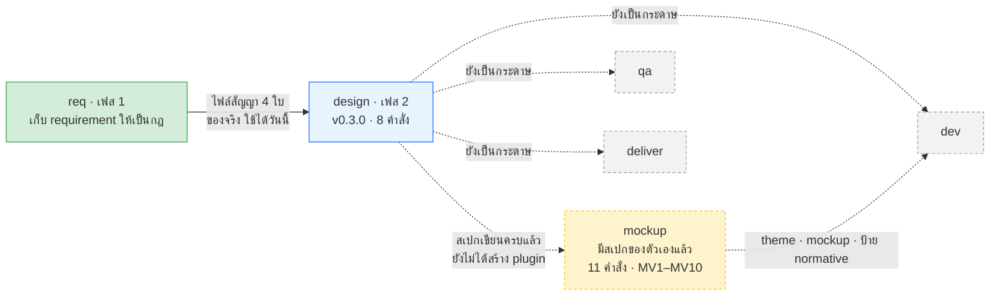
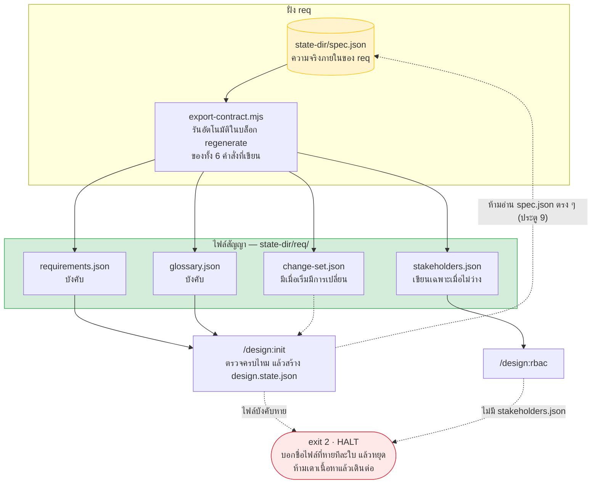
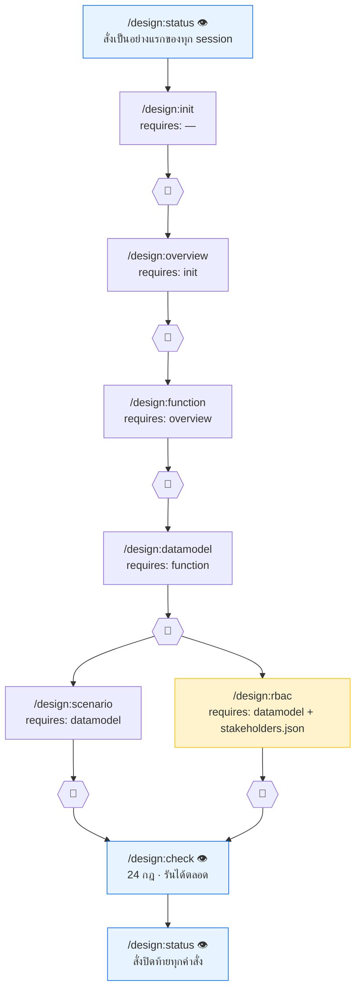
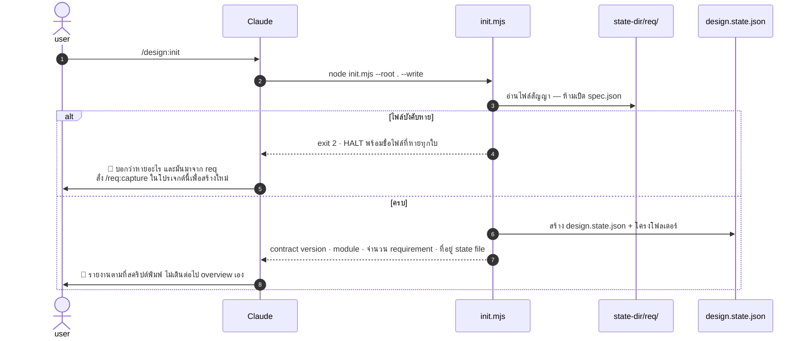
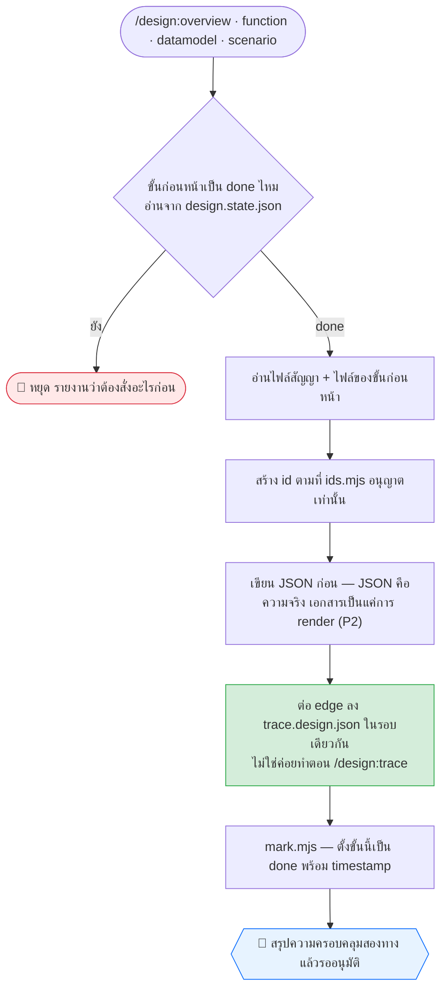
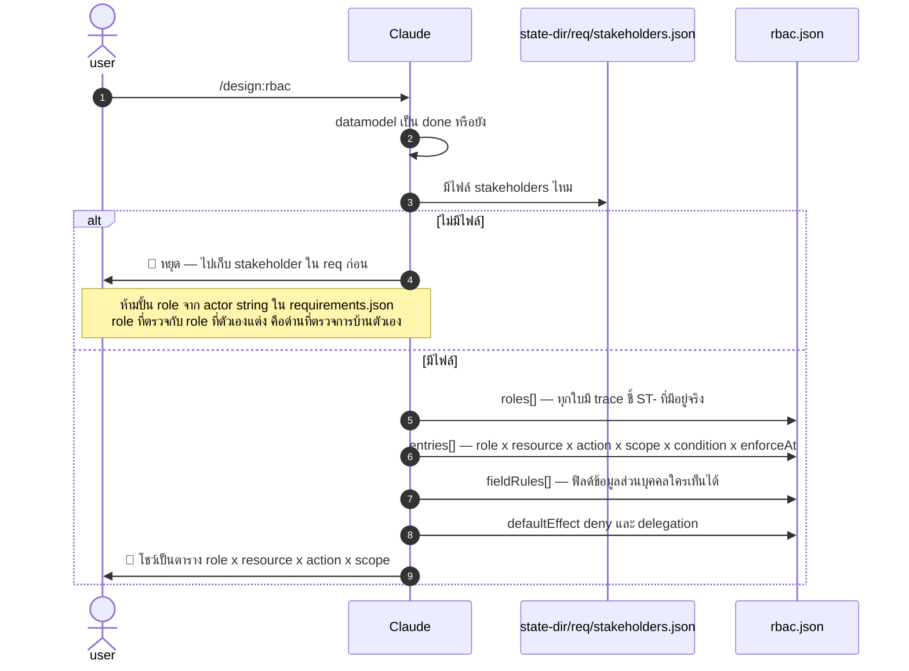
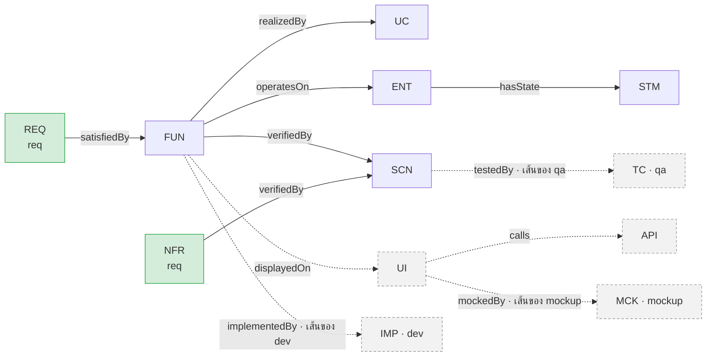
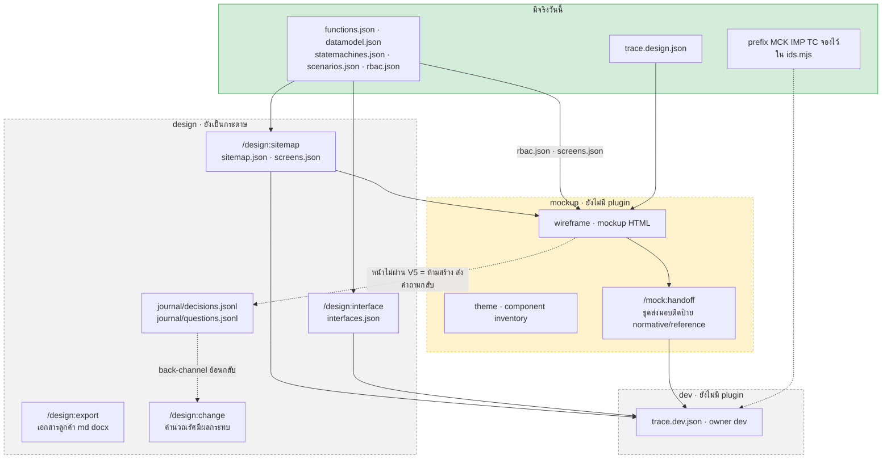

# design — คู่มือลำดับการเรียกใช้ (Phase 2)

> **ชั้นเอกสาร:** B · Authored — สคริปต์ห้ามเขียนทับ
> **owner:** user · **ทบทวนล่าสุด:** 2026-08-20 · **ตามมาตรฐาน:** [DOC-STANDARD v1.2](../standard/DOC-STANDARD.md)
>
> คู่มือใบนี้ตอบ 3 คำถาม — **`design` ทำงานยังไง · รับของจาก `req` ยังไง · ส่งต่อให้ `mockup` กับ `dev` ยังไง**
> คู่ขนานกับ [`req-manual.md`](req-manual.md) ซึ่งเป็นใบของเฟส 1
>
> **เขียนใหม่ทั้งใบเมื่อ 2026-08-20** เพราะสเปกต้นทางแยกงานภาพ (wireframe · theme · mockup · handoff)
> ออกไปเป็น **mockup plugin** ต่างหาก · ใบก่อนหน้าเก็บไว้ที่ [`design-manual-notuse.md`](design-manual-notuse.md) และ **เลิกใช้แล้ว**

## ⚠️ อ่านก่อน — ใบนี้เขียนจากของจริง ไม่ได้แปลสเปกตรง ๆ

ต้นทางที่ขอให้แปลงคือ [`docs/requirement/design-plugin-requirements.en.md`](../requirement/design-plugin-requirements.en.md)
(ฉบับไทยคู่กันคือ [`design-plugin-requirements.md`](../requirement/design-plugin-requirements.md))
ซึ่งเป็น **Draft v0.1** และเป็นเอกสารชั้น "ข้อเสนอ" (ลำดับ 4 ตาม CLAUDE.md §2) — **แพ้ทั้งสคริปต์จริงและประตูที่เคาะไปแล้ว**

| อะไร | สเปกเขียนไว้ | ของจริง `v0.3.0` |
|---|---|---|
| จำนวนคำสั่ง | **15 ตัว** (เดิม 18 · ตัดงานภาพออก 4 ตัวไป mockup ตอนแยกสเปก) | **8 ตัว** + `help` · อีก **6 ตัว**ยังเป็นกระดาษ |
| ที่อยู่ wiki | `.aeon/wiki/` | **`docs/wiki/design/`** (ประตู 8) |
| อ่านของ `req` จากไหน | ไม่ได้ระบุชัด | **`<state-dir>/req/*.json` เท่านั้น — ห้ามแตะ `spec.json`** (ประตู 9) |
| id ที่ `design` สร้างเอง (mint) | รวม `NFR-` `RULE-` `SCR-` `FN-` `SRC-` | **ไม่มี 5 ตัวนั้น** — ดูตาราง §2 |
| กฎตรวจ V16–V22 | **ปลดเลขแล้ว** ย้ายไป mockup เป็น MV1–MV7 | `check.mjs` **ยังพิมพ์ `V16-V22` ค้างอยู่** — ดู §7 |

**เอกสารใบนี้จึงสร้างจากสคริปต์ ไม่ใช่จากสเปก** — `ids.mjs` `plan.mjs` `paths.mjs` `check.mjs` และ `commands/*.md`
ส่วนที่ยกมาจากสเปกตรง ๆ คือ **เหตุผล** (อุปมา · W1–W5 · P1–P9 · 4 มิติของสิทธิ์ · 5 รูรั่ว) ซึ่งเป็นสิ่งที่โค้ดไม่ได้เก็บไว้

| อยากรู้ว่า | เปิดที่ |
|---|---|
| **ทำงานยังไง · ต่อกับ req/mockup/dev ยังไง** | **ใบนี้** |
| แต่ละคำสั่งถามอะไร ตอบยังไง | [`plugins/design/USER-GUIDE.md`](../../plugins/design/USER-GUIDE.md) |
| คำอธิบายสั้นทุกคำสั่งในเทอร์มินัล | `/design:help` |
| ขั้นตอนตัวจริงที่ Claude เดินตาม | `plugins/design/commands/<คำสั่ง>.md` |
| ของจริงที่ผ่านด่านแล้ว | `plugins/design/scripts/fixtures/clean/` |
| **งานภาพทั้งหมด** (wireframe · theme · mockup · handoff) | [`docs/requirement/mockup-plugin-requirements.md`](../requirement/mockup-plugin-requirements.md) |
| **เจตนาและเหตุผลฉบับเต็ม** (รวมของที่ยังไม่ได้ทำ) | `docs/requirement/design-plugin-requirements.en.md` |

> `.aeon/` เป็น**ค่าเริ่มต้น ไม่ใช่ค่าคงที่** — ลำดับคือ `--state-dir <ชื่อ>` > `$AEON_STATE_DIR` > `.aeon`
> `design` มี resolver ของตัวเองที่ `plugins/design/scripts/paths.mjs` (ตั้งใจซ้ำกับของ `req` เพราะ `${CLAUDE_PLUGIN_ROOT}` แยกกันคนละ plugin)
> ในใบนี้เขียน `<state-dir>/` เมื่อพูดถึงตัวแปร · **ไฟล์ทั้งหมดเกิดในโปรเจกต์ลูกค้า ไม่ใช่ใน repo ของ marketplace**

---

## 1. `design` คืออะไร — ล่ามที่จำได้ว่าประโยคไหนมาจากใคร

**อุปมาจากสเปก §0** — plugin นี้นั่งอยู่ระหว่างลูกค้ากับทีมสร้าง เหมือนล่ามในห้องประชุม
ล่ามที่ดีไม่แปลคำต่อคำ แต่แปลให้เป็นรูปที่แต่ละฝั่ง **ลงมือทำต่อได้** — ลูกค้าต้องการภาษาที่เซ็นได้ ทีมสร้างต้องการภาษาที่รันได้
และล่ามต้องจำให้ได้ว่าประโยคไหนมาจากใคร ไม่งั้นพอฝั่งหนึ่งแก้คำพูด จะไม่มีใครรู้ว่าต้องแก้อะไรตามอีกบ้าง

> **ของที่ต้องส่งมอบไม่ใช่เอกสารที่เขียนดี แต่คือ traceability ที่ครบวง** (สเปก §0)

| ปลายทาง | รูป | ใครกิน |
|---|---|---|
| คน | เอกสารบรรยาย (Markdown → Word/PDF) | ลูกค้า · PM — ไว้อ่านและเซ็นขอบเขต |
| AI | JSON มีโครงสร้าง + Wiki Markdown | agent เฟสถัดไป — ไว้สร้าง ไว้ทดสอบ |



**เส้นทึบคือของที่รันได้วันนี้ เส้นประคือ plugin ที่ยังไม่มีตัวตน** — `mockup` `dev` `qa` `deliver` ยังไม่ถูกสร้าง
`mockup` เป็นกล่องสีต่างเพราะมันอยู่คนละสถานะกับอีกสามใบ: **สเปกของมันเขียนครบแล้ว** (11 คำสั่ง · กฎ MV1–MV10 · ประเด็นค้าง MD1–MD8)
ส่วน `dev` `qa` `deliver` ยังไม่มีทั้ง plugin และยังไม่มีสเปกที่เคาะ · **แต่ทั้งสี่ใบยังไม่มี ก็คือยังไม่มี**

### สิ่งที่ `design` ห้ามทำ (Non-Goals · สเปก §1.2)

- ❌ **ห้ามเก็บ requirement เอง** — เป็นงานของ `req` · นี่คือเหตุผลที่ `NFR-` ถูกยกให้ `req` ทั้งหมด (§2)
- ❌ ห้ามเขียนโค้ดระบบจริง (`dev`) · ห้ามรันชุดทดสอบ (`qa`) · ห้ามยุ่งกับ deploy
- ❌ **ห้ามผลิต wireframe · theme · handoff · mockup ทั้งหมด** — ทั้งสี่อย่างเป็นของ mockup plugin (สเปก §12)
  รวมถึง **ห้ามกำหนดสี ฟอนต์ หรือค่า style ใด ๆ · ห้ามเขียนไฟล์ HTML · ห้ามอ่าน handoff · ห้ามเขียนลงพื้นที่ของ mockup**

> **ถ้าผู้ใช้ขอ mockup ระหว่างใช้ `design` ให้ชี้ไปที่ mockup plugin ไม่ใช่ทำให้** (สเปก §12.3)
> นี่เป็นข้อที่เปลี่ยนจากสเปกรุ่นก่อน ซึ่งเคยให้ `design` ทำงานภาพเองใน `/design:theme` `/design:wireframe` `/design:mockup` `/design:handoff`

---

## 2. สเปกเขียนไว้ → ของจริงคือ

**ครึ่งหน้านี้มีค่าที่สุดในไฟล์** — ห้าจุดนี้คือที่ที่การอ่านสเปกตรง ๆ จะพาไปผิด

| สเปก §6.1 เขียน | ของจริง | เพราะอะไร |
|---|---|---|
| `SCR-` = Screen | **`UI-`** | `SCR-` ถูกใช้เป็น Script ในระบบเอกสารของ marketplace นี้แล้ว |
| `FN-` = Functional requirement | **`FUN-`** | `FN-` ถูกใช้เป็น Field Note แล้ว |
| `SRC-` = source file ของ `dev` | **`IMP-`** | `SRC-` เป็นเอกสารต้นทางของ `req` แล้ว |
| `NFR-` เป็นของ `design` | **เป็นของ `req` ทั้งหมด** | สเปก §1.2 ประกาศเองว่า design ไม่ทำ requirement elicitation — และ NFR ก็คือ requirement · `/design:nfr` จะ **ขยายความ** ของ `req` โดยคีย์ด้วย id ของ `req` ไม่สร้าง `NFR-` ใหม่ |
| `RULE-` = Business rule ของ `design` | **ไม่มีเลย** | กฎธุรกิจยังเป็น `BR-<module>-nnn@vN` ของ `req` · กฎสองสำเนาไม่ตรงกันภายในสัปดาห์เดียว และใบที่ไม่มี `@v` คือใบที่คนจะเอาไปอ้าง |

**และของที่สเปกไม่ได้เขียนไว้ แต่มีจริง** — `ROLE-` กับ `ACL-` (ประตู 10) · ส่วน `ST-` (ใครมีตัวตน) เป็นของ `req`

```
node "${CLAUDE_PLUGIN_ROOT}/scripts/ids.mjs"     # พิมพ์รายการเต็ม — ห้ามจำเอา
```

| `design` สร้าง id พวกนี้ได้ (mint) | `design` ห้ามสร้าง id พวกนี้ — ต้องอ้างถึงอย่างเดียว |
|---|---|
| `FUN` `UC` `UI` `ENT` `STM` `API` `INT` `RPT` `SCN` `ADR` `ROLE` `ACL` | **ของ `req`:** `REQ` `BR` `UL` `SRC` `CALC` `GD` `CHG` `Q` `ST` `NFR` · **ของ marketplace:** `SCR` `FN` · **จองไว้ให้ plugin อื่น:** `MCK` (mockup) `IMP` (dev) `TC` (qa) |

> `MCK` **เป็นของ mockup ตั้งแต่ในสเปกอยู่แล้ว** ไม่ได้เพิ่งย้ายตอนแยก plugin — `ids.mjs` จดไว้ในรายการห้ามสร้างมาแต่ต้น
> `IMP` `TC` `MCK` **ต้องนิยามตั้งแต่ตอนนี้ ทั้งที่ plugin ยังไม่เกิด** (สเปก §6.1) — ถ้ากราฟจบที่ `SCN`
> การเปลี่ยนแปลงจะแพร่ไปได้แค่ถึง design แล้วหยุด ไปไม่ถึงโค้ดและไม่ถึงเทสต์เลย

---

## 3. รับของจาก `req` ยังไง — ประตูเข้าใบเดียว

**`design` อ่าน `spec.json` ไม่ได้ และนั่นคือกฎ ไม่ใช่ธรรมเนียม** (ประตู 9)
`spec.json` เป็นโครงสร้างภายในของ `req` — ไฟล์เดียว · `additionalProperties: false` · `schema_version` เป็น `const`
ผู้บริโภคที่ผูกกับมันจะพังทุกครั้งที่ `req` ขยับเวอร์ชัน โดยไม่มีช่วงผ่อนผันเลย



| ไฟล์ | บังคับไหม | `design` เอาอะไรไป |
|---|---|---|
| `requirements.json` | ✅ **บังคับ** | `REQ` id · actor · goal · priority · status · id ของกฎที่ `REQ` แต่ละใบถือ · `nfr[]` |
| `glossary.json` | ✅ **บังคับ** | ศัพท์กลาง (`UL`) ที่ artifact ทุกชิ้นต้องพูดให้ตรง — V10 ตรวจข้อนี้ |
| `stakeholders.json` | ⚠️ **บังคับสำหรับ `/design:rbac` เท่านั้น** | `ST-` id ที่ทุก `ROLE` ต้องสาวกลับไปถึง (V23) |
| `change-set.json` | ❌ ไม่บังคับ | มีเมื่อ requirement เริ่มขยับ — ป้อนให้ `/design:change` ในอนาคต |
| `okr.json` | — | **`req` ไม่ผลิตเลย** — ไม่มี OKR ในสคีมาและไม่มีคำถามไหนถามถึง สเปก §3.1 ที่เขียนว่า Recommended จึงยังไม่มีของ |

> **ไม่มีไฟล์ ≠ ไม่มีคน** — `req` เขียน `stakeholders.json` เฉพาะตอนที่มีอะไรจะเขียน
> ดังนั้น *ไฟล์หาย* แปลว่า **"ยังไม่ได้เก็บ"** ส่วน *array ว่าง* แปลว่า **"ถามแล้ว ไม่มีใครเพิ่ม"** สองสถานะนี้ยุบรวมกันไม่ได้
> ถ้ายุบ ปลายทางจะอ่านว่า "ไม่มีใครเกี่ยวข้อง" ซึ่งคือความพังที่ V23 มีไว้จับพอดี

**กฎแข็งของสเปก §3.1** — ไฟล์บังคับหายหรือพัง → **หยุดและบอกให้ครบว่าอะไรหาย · ห้ามเดาเนื้อหาที่ขาดแล้วเดินต่อ**
design ที่สร้างบน requirement ที่แต่งขึ้นเอง จะดูเหมือนเสร็จ แต่สาวกลับไปหาอะไรไม่ได้เลย

> ⚠️ **`commands/init.md` ยังมีข้อความล้าสมัยหนึ่งย่อหน้า** (ตรวจซ้ำแล้ววันนี้ ยังค้างอยู่ที่บรรทัด 71) — เขียนว่า
> *"does not invent `stakeholders.json` or `okr.json`; `req` holds no such data today"*
> ซึ่งจริงตอนเขียน แต่ `stakeholders[]` ลงจริงแล้วเมื่อ 2026-08-18 (สคีมา `0.4.0`) · `export-contract.mjs` ปล่อยไฟล์นี้แล้ว
> และ fixture `clean/.aeon/req/` มีไฟล์นี้อยู่ · **`commands/rbac.md` เป็นใบที่ทันสมัย** ให้เชื่อใบนั้น
> (ส่วน `okr.json` ยังจริงอยู่ — `req` ไม่ผลิต)

---

## 4. ลำดับคำสั่ง — 6 ขั้นที่มี prerequisite จริง

แผนอยู่ใน **โค้ด** (`plan.mjs`) ไม่ใช่ใน state file — สั่ง `node plan.mjs` เมื่อไหร่ก็ได้เพื่อดูของจริง



**`scenario` กับ `rbac` แตกขนานกันหลัง `datamodel`** — ทั้งคู่ `requires: datamodel` ไม่มีใครรอใคร

| คำสั่ง | เขียนไฟล์อะไร | เสร็จเมื่อไหร่ (DoD) |
|---|---|---|
| `/design:init` | `<state-dir>/design/design.state.json` | ไฟล์สัญญาครบ · state file เกิด |
| `/design:overview` | `<state-dir>/design/context.json` | มีขอบเขต · สิ่งที่ไม่ทำ · ข้อสมมติ · ข้อจำกัด |
| `/design:function` | `modules/<module>/functions.json` · `trace.design.json` | ทุก REQ ที่เป็น functional มี `FUN` · ทุก `UC` มี main + alternate + exception flow |
| `/design:datamodel` | `datamodel.json` · `modules/<module>/statemachines.json` · `trace.design.json` | ทุก attribute มี type · required · validation · classification · ทุก lifecycle มี `STM` |
| `/design:scenario` | `modules/<module>/scenarios.json` · `trace.design.json` | ทุก `FUN` และทุก `NFR` มี `SCN` อย่างน้อย 1 ใบ พร้อมผลลัพธ์คาดหวังที่ชัด |
| `/design:rbac` | `rbac.json` (**ใบเดียว ไม่แยกตามโมดูล**) | V23–V27 + S6 + S7 ผ่าน |
| `/design:check` 👁 | — | รายงานรายกฎ พร้อม id ที่ผิด |
| `/design:status` 👁 | — | exit code แน่นอน + บอกคำสั่งถัดไปเสมอ |

**7 กฎที่ผูกทุกคำสั่ง** (สเปก §7.2) — อ่าน `design.state.json` ก่อนทำอะไร · เช็ค prerequisite แล้วหยุดถ้าไม่ครบ ·
**idempotent** (รันซ้ำต้องอัปเดตของเดิม ห้ามสร้าง id ซ้ำ) · เขียน JSON ก่อน แล้วค่อย render Markdown ·
อัปเดต trace ทุกครั้งที่เกิด artifact ใหม่ · อัปเดต `design.state.json` พร้อม timestamp ตอนจบ ·
**ห้ามแตะ artifact ที่ `status: approved`** เว้นแต่มี change-set อนุญาต

---

## 5. ทีละคำสั่ง

### 5.1 `/design:init` — ประตูเข้าเฟส 2



**รันซ้ำปลอดภัย** — รอบสองพิมพ์ `already initialised` แล้วไม่แตะอะไรเลย ไม่รีเซ็ตความคืบหน้า (P5: agent ที่ retry คือกรณีปกติ)

> **อัปเกรด plugin แล้วต้องสั่ง `init` ใหม่** — `plan.mjs` มีขั้นเพิ่มทุกครั้งที่ Milestone ใหม่ลง
> โปรเจกต์ที่ init ไว้ตอนแผนสั้นกว่า จะมี state file ที่ไม่มีช่องของขั้นใหม่ · `status` รายงานเป็น `missing-step`
> และ `mark.mjs` ปฏิเสธขั้นที่ state file ไม่รู้จัก · สั่ง `init` ซ้ำจะ **เติมอย่างเดียว** ไม่ทับของเดิมไม่ว่าสถานะไหน

**`init` ไม่ทำ** — ไม่อ่านไม่เขียนอะไรใต้ `docs/` · ไม่สร้าง id หรือ trace edge สักเส้น (`/design:overview` เป็นใบแรกที่สร้าง)

### 5.2 `overview` · `function` · `datamodel` · `scenario` — ท่าเดียวกัน 4 ใบ

สี่ใบนี้เดินรูปแบบเดียวกัน ต่างกันที่อ่านอะไรและเขียนอะไร



| คำสั่ง | อ่าน | สร้าง id | เขียน | edge ที่ต่อ |
|---|---|---|---|---|
| `overview` | requirements · stakeholders · glossary | — | `context.json` | — |
| `function` | requirements | `FUN` `UC` | `modules/<m>/functions.json` | `REQ -satisfiedBy-> FUN` · `FUN -realizedBy-> UC` |
| `datamodel` | functions · glossary | `ENT` `STM` | `datamodel.json` · `modules/<m>/statemachines.json` | `FUN -operatesOn-> ENT` · `ENT -hasState-> STM` |
| `scenario` | ทุกไฟล์ | `SCN` | `modules/<m>/scenarios.json` | `FUN -verifiedBy-> SCN` · `NFR -verifiedBy-> SCN` |

**สามเรื่องที่คนอ่านสเปกแล้วมักเข้าใจผิด**

1. **`FUN` อ้าง `BR` ของ `req` เฉย ๆ ไม่คัดข้อความกฎมาเขียนซ้ำ** และไม่สร้าง `RULE-` ขึ้นมาเอง — W3 *"อ้างอิง อย่าคัดลอก"*
2. **`STM` อยู่ที่ `datamodel` ไม่ใช่ที่ `function`** — state machine เป็นของ entity ที่มี lifecycle ไม่ใช่ของฟังก์ชัน
3. **`scenario` ผูกกับ `NFR` ของ `req`** — `design` ไม่ได้สร้าง `NFR` แต่ต้องทำให้ทุกใบมีของที่ล้มเหลวได้ (V6)
   **RTM ไม่ใช่ไฟล์** — มันคือ view ที่ประกอบจาก `trace.design.json` ตอนอ่าน

> `docs/design/01-introduction.md` และเอกสารลูกค้าอื่น ๆ **ยังไม่ถูกเขียน** — ยังไม่มี renderer
> เขียนมือตอนนี้จะผิด P2 ทันที (JSON คือความจริง เอกสารเป็นการ render) · `/design:export` ใน Milestone 3 เป็นคนทำ จาก `context.json` ใบเดียวกันนี้

### 5.3 `/design:rbac` — ตารางที่ลูกค้าต้องเซ็น

**ไม่ใช่ artifact ภายใน** — มันคือหน้าที่ว่าด้วยอำนาจในองค์กรลูกค้า
ถ้าไม่เข้าเอกสาร มันจะไปเถียงกันตอน UAT แทน ว่าใครควรอนุมัติได้บ้าง (สเปก §13.5)



**ทำไมตาราง 2 มิติไม่พอ** (สเปก §13.1) — อุปมา: บัตรพนักงานไม่ได้บอกแค่ "เปิดได้ / ไม่ได้"
มันต้องบอกด้วยว่า **ตึกไหน** (scope) · **ช่วงเวลาไหน** (condition) · **เข้าไปแล้วเห็นอะไร** (field level) · **ใครถือแทนได้ตอนลา** (delegation)

| มิติ | ฟิลด์ | ไม่มีแล้วพังยังไง |
|---|---|---|
| ขอบเขตข้อมูล | `scope` | `dev` เดาไม่ได้ว่า "ของใคร" — ไม่ถามกลับ ก็ต้องรื้อชั้น query ทีหลัง |
| เงื่อนไขตามสถานะ | `condition.state` | ได้ CRUD เปล่า ๆ แล้วต้องไปแปะเงื่อนไขทีละหน้าจอ |
| ระดับฟิลด์ | `fieldRules` | ข้อมูลส่วนบุคคลรั่วผ่านหน้าที่ role นั้นเปิดได้อยู่แล้ว |
| การมอบอำนาจ | `delegation` | มีเกือบทุกองค์กรไทย และแทบไม่เคยอยู่ในเอกสาร requirement |

**6 ข้อของ §13.3 และใครตรวจ**

| ข้อ | กติกา | ตรวจโดย |
|---|---|---|
| A1 | ค่าเริ่มต้นต้องเป็น **deny** — อะไรที่ไม่ประกาศ คือห้าม | **S6** (สเปกไม่ได้ให้เลข V) |
| A2 | ทุก entry ต้องมี `scope` · ว่างไม่ได้ (ว่าง = อ่านว่า "ทั้งหมด" ซึ่งอันตรายที่สุด) | V25 |
| A3 | ต้องบังคับใช้ที่ `api` หรือ `domain` อย่างน้อยหนึ่ง — **`ui` อย่างเดียวคือการซ่อนปุ่ม ไม่ใช่การคุมสิทธิ์** | V26 |
| A4 | `ROLE` ต้องมาจาก stakeholder ที่ `req` บันทึกไว้ | V23 |
| A5 | เงื่อนไขตามสถานะต้องอ้าง state ที่มีอยู่ใน `STM` จริง | **S7** (สเปกไม่ได้ให้เลข V) |
| A6 | ฟิลด์ที่เป็นข้อมูลส่วนบุคคลต้องมี `fieldRules` | ผูกกับ V15 |

> **`resource` วันนี้เป็น `FUN-` หรือ `ENT-` ไม่ใช่ `UI-`** — สเปก §13.2 เขียนตัวอย่างเป็น `SCR-007`
> แต่หน้าจอยังไม่เกิดจนกว่าจะมี `/design:sitemap` · กฎที่เขียนอ้าง artifact ที่ไม่มีคำสั่งไหนผลิต คือกฎที่ไม่มีวันได้รัน
> **และ `rbac` ไม่ต่อ trace edge สักเส้น** — กราฟใน §6.2 ไม่มีโหนด `ROLE` การสร้าง relation ชนิดใหม่ที่สเปกไม่ได้นิยาม
> จะใส่เส้นที่ plugin อื่นอ่านไม่เป็นลงใน merged view

> 🔗 **`rbac.json` เป็นไฟล์ที่ mockup ต้องอ่าน ไม่ใช่แค่ dev** (สเปก §12.2) — mockup ใช้มันตอบว่า
> หน้าไหนต้องมี state "ไม่มีสิทธิ์" และฟิลด์ไหนต้องซ่อนจาก role ไหน · ดู §8

### 5.4 `/design:check` 👁 และ `/design:status` 👁

ทั้งคู่ **อ่านอย่างเดียว เขียนไม่ได้** และเป็นสองใบที่ตอบคำถามคนละข้อ

| | `/design:check` | `/design:status` |
|---|---|---|
| ถามว่า | **ของที่ทำไปแล้ว ถูกกติกาไหม** | **ทำถึงไหน ติดอะไร ต่อไปสั่งอะไร** |
| อ่าน | artifact ทุกไฟล์ | `design.state.json` |
| ผลลัพธ์ | รายงานรายกฎ พร้อม id ที่ผิด | ความคืบหน้า + ปัญหา + คำสั่งถัดไป |
| exit | `0` ผ่าน · `1` เจอ error · `2` ไฟล์พัง | `0` เสร็จหมด · `1` ยังมีงาน · `2` ติด |

**สั่ง `status` เป็นอย่างแรกของทุก session และเป็นอย่างสุดท้ายหลังทุกคำสั่ง** (สเปก §8.2)
เปิด session ใหม่ต้อง: อ่าน `design.state.json` → อ่าน index ไม่ใช่ทุกไฟล์ → **รายงานให้ผู้ใช้ฟังก่อน** → **ห้ามเริ่มงานใหม่ก่อนรายงาน**

> **เงื่อนไขจบลูปมาจากสคริปต์ ไม่ใช่จาก LLM ประกาศว่าเสร็จ** (P4) — และมี **loop guard**: `attempts` เกิน 3 ที่ขั้นเดิม
> ให้ตั้งเป็น `blocked` แล้วรอคน · `status` **ห้ามคืน 0** ตราบใดที่ยังมี artifact ค้าง `stale` หรือมี `openQuestions` ที่บล็อกขั้นอยู่

---

## 6. กราฟ traceability — ของที่ต้องส่งมอบจริง



**เส้นทึบคือ edge ที่ `design` v0.3.0 เขียนลง `trace.design.json` จริงวันนี้ · มี 5 ชนิดเท่านั้น** —
`satisfiedBy` `realizedBy` `operatesOn` `hasState` `verifiedBy` (ตรวจได้ด้วยการ grep `plugins/design/commands/*.md`)

**เส้นประไม่ได้แปลว่า "design จะทำทีหลัง" เหมือนกันหมด — มีสองแบบ**

| เส้น | ใครจะเป็นคนเขียน | ทำไม |
|---|---|---|
| `FUN -displayedOn-> UI` · `UI -calls-> API` | **`design` เอง** เมื่อ `/design:sitemap` กับ `/design:interface` ลง | หน้าจอกับ API เป็นของ design ตามสเปก §7.1 |
| `UI -mockedBy-> MCK` | **`mockup`** ลง `trace.mockup.json` ของตัวเอง | สเปก mockup §10.1 ยก edge นี้ให้มันชัดเจน · design **ห้ามเขียน** |
| `SCN -testedBy-> TC` | **`qa`** | เดียวกัน |
| `FUN -implementedBy-> IMP` | **`dev`** | เดียวกัน |

`ROLE` กับ `ACL` **ไม่อยู่ในกราฟนี้โดยตั้งใจ** (§5.3)

**แยกไฟล์ตามผู้เขียน รวมตอนอ่าน** (W1 + สเปก §19.2) — ห้ามมีไฟล์ไหนถูกเขียนโดยสอง plugin **แม้จะคนละฟิลด์ก็ตาม**
เพราะการ regenerate เขียนทับทั้งไฟล์เสมอ แล้วข้อมูลของอีกฝ่ายหายเงียบ ๆ

```
design/trace.design.json      owner: design    ← มีจริงวันนี้
mockup/trace.mockup.json      owner: mockup    ← ยังไม่มี plugin (สเปกครบแล้ว)
dev/trace.dev.json            owner: dev       ← ยังไม่มี plugin
qa/trace.qa.json              owner: qa        ← ยังไม่มี plugin
```

**ไม่มีไฟล์กราฟรวมที่เขียนได้อยู่บนดิสก์** — สคริปต์รวมตอนอ่านเท่านั้น ของที่ไม่มีตัวตนบนดิสก์ ถูกเขียนทับไม่ได้

**6 คำถามที่ระบบต้องตอบได้ทันที** (สเปก §6.2 — นี่คือข้อสอบของ traceability)

| # | คำถาม | ตอบได้วันนี้ไหม |
|---|---|---|
| 1 | หน้าจอ `UI-007` มาจาก requirement ข้อไหน | ❌ ยังไม่มี `sitemap` |
| 2 | `FUN-004` ต้องมี scenario และ unit test อะไรบ้าง | ⚠️ ครึ่งเดียว — `SCN` ได้ · `TC` รอ `qa` |
| 3 | ถ้า `REQ-012` เปลี่ยน กระทบอะไรทั้งกราฟ | ⚠️ ได้แค่ในขอบเขต design · รอ `/design:change` |
| 4 | requirement ข้อไหนยังไม่มี scenario | ✅ **V1 + V6** |
| 5 | มี artifact ไหนที่สาวกลับไปหา requirement ไม่ได้ (scope creep) | ✅ **V2** |
| 6 | `UI-007` สร้างแล้วยัง เทสต์ผ่านไหม | ❌ ต้อง join design → dev → qa ซึ่งยังไม่มีสองตัวหลัง |

---

## 7. ด่านตรวจ — 24 กฎ และกฎที่ยังไม่มีของให้ตรวจ

```
node "${CLAUDE_PLUGIN_ROOT}/scripts/check.mjs" --root .          # อ่านง่าย
node "${CLAUDE_PLUGIN_ROOT}/scripts/check.mjs" --root . --json   # นับด้วยเครื่อง ห้าม grep บรรทัด
```

| กลุ่ม | กฎ | เรื่อง |
|---|---|---|
| **traceability** | V1 V2 | ทุก `REQ` มี `FUN` · ทุก `FUN` สาวกลับถึง `REQ` |
| **ความครบของสเปก** | V3 V4 V6 V7 | `UC` ครบ 5 ส่วน · ทุก state มีทางออก · ทุก `FUN`/`NFR` มี `SCN` · ทุก attribute มี type/required/validation |
| **คุณภาพเนื้อหา** | V9 V10 ⚠️ V12 ⚠️ | **`NFR` ต้องมีตัวเลข — "เร็ว" "เสถียร" ลอย ๆ ไม่ใช่เป้าหมาย** · ศัพท์ตรง glossary · invariant บอกชั้นที่บังคับ |
| **สุขภาพของงาน** | V13 V14 | ไม่มีอะไรค้าง `stale` · ไม่มี `openQuestion` บล็อกขั้นอยู่ |
| **PDPA** | V15 | ทุก attribute มี classification · ข้อมูลส่วนบุคคลต้องมี retention |
| **สิทธิ์** | V23 V24 V25 V26 V27 ⚠️ | ดู §5.3 |
| **โครงสร้างของเราเอง** | S1–S7 | id ถูกรูป · ไม่ใช้ prefix ของคนอื่น · edge ชี้ของที่มีจริง · **S4 S5 บังคับ idempotence (P5)** · S6 S7 คือ A1 A5 |

⚠️ = warning · ที่เหลือเป็น error · **24 = 12 (V1–V15 ที่ทำแล้ว) + 5 (V23–V27) + 7 (S1–S7)**

**`PENDING` กับ `LIMIT` — เขียวเพราะยังไม่ได้ตรวจ ต่างจากเขียวเพราะผ่าน**

บรรทัดที่ `check.mjs` พิมพ์จริงวันนี้ (รันแล้ว 2026-08-20 · ทั้ง fixture `clean` และ `dirty` พิมพ์เหมือนกัน):

```
PENDING (rules with no artifact to check yet): V5 V8 V11 V16-V22
```

| กฎที่ค้าง | รอ artifact อะไร |
|---|---|
| V5 V11 | หน้าจอ — รอ `/design:sitemap` |
| V8 | integration — รอ `/design:interface` |
| ~~V16–V22~~ | **ไม่ใช่ของ design แล้ว** — ดูกล่องข้างล่าง |

> ⚠️ **`check.mjs` บรรทัด 128 ล้าสมัยหนึ่งบรรทัด และยังไม่ได้แก้** — มันยังพิมพ์
> `"V16-V22": "wireframes, mockups, theme, handoff"` ทั้งที่สเปกใหม่ **ปลดเลข V16–V22 ออกจาก design ถาวร**
> และย้ายไปเป็น **MV1–MV7 ของ mockup plugin** พร้อมสั่งไว้ตรง ๆ ว่า *"เลขเหล่านี้เกษียณแล้ว ห้ามเอากลับมาใช้ซ้ำ"*
> **คู่มือใบนี้พิมพ์ output ตามที่เครื่องพิมพ์จริง ไม่ใช่ตามที่สเปกบอกว่าควรเป็น** — ถ้าเขียนเป็น `V5 V8 V11`
> คนที่รันแล้วเห็นบนจอจะเจอคู่มือที่ขัดกับเครื่องทันที ซึ่งแย่กว่าปล่อยให้เห็นความไม่ตรง
> **แก้ยังไม่ได้ในรอบนี้** เพราะการแก้บรรทัดนี้เปลี่ยน output ของด่าน แล้วต้องไปวัด fixture ใหม่ทั้งชุด — เป็นงานที่เจ้าของต้องสั่ง

`check` พิมพ์สองบรรทัดนี้เองทุกครั้ง — **`PENDING` = กฎยังไม่มีของให้ตรวจ · `LIMIT` = ไฟล์ยังไม่มี จึงมีกฎบางข้อไม่ได้รันในโปรเจกต์นี้**
ด่านที่แอบตรวจน้อยกว่าที่โฆษณา คือวิธีที่ผลเขียวเลิกมีความหมาย

```bash
# ตัวเลขสัญญาของ fixture — อยู่ที่ plugins/design/scripts/fixtures/EXPECTED.md ที่เดียว
node plugins/design/scripts/check.mjs  --root plugins/design/scripts/fixtures/clean   # exit 0 · PASS · 0/0
node plugins/design/scripts/status.mjs --root plugins/design/scripts/fixtures/dirty   # exit 1 · problems: 8
```

> **V5 ถูกขยายในสเปกใหม่ และข้อที่เพิ่มเป็นของ `design` ไม่ใช่ของ mockup** — ของเดิมคือ
> หน้าจอต้องประกาศ role ที่เข้าได้ · ฟิลด์พร้อม validation · action · ปลายทางหลังกด
> **ของใหม่คือ "รายการ state ที่หน้านั้นต้องรองรับ"** (ว่าง · กำลังโหลด · error · ไม่มีสิทธิ์ · ข้อมูลล้น)
> สเปก §12.1 อธิบายไว้เองว่าทำไมข้อนี้ไม่ตามงานภาพไป: **มันเป็นข้อกำหนดเชิงพฤติกรรม ไม่ใช่เรื่องหน้าตา**
> `dev` ต้องสร้างและ `qa` ต้องทดสอบ ไม่ว่าโปรเจกต์นั้นจะเคยทำ mockup หรือไม่

---

## 8. ส่งต่อให้ใคร — `mockup` กับ `dev` คนละก้อน

> ⚠️ **ทั้งหัวข้อนี้เป็นเจตนาที่ออกแบบไว้ ไม่ใช่ของที่รันได้วันนี้**
> `/design:sitemap` `/design:interface` `/design:export` `/design:trace` `/design:change` **ยังไม่ถูกสร้าง**
> และ `mockup` `dev` `qa` **ยังไม่มีตัวตนสักตัว**
> สิ่งที่มีจริงคือ **`trace.design.json`** · **`rbac.json`** · และ **prefix `MCK-` `IMP-` `TC-` ที่จองไว้ใน `ids.mjs`** เท่านั้น

**`/design:handoff` ไม่ได้ "ยังไม่ได้ทำ" — มันหายไปจากสเปกแล้ว** ชุดส่งมอบภาพเป็นงานของ `/mock:handoff`
ใครที่อ่านคู่มือใบเก่าแล้วรอคำสั่งนี้ใน design จะรอเปล่า



### 8.1 ใครได้ไฟล์อะไร

**`design` ส่งของออกสองปลายทาง ไม่ใช่ปลายทางเดียว** และรายการไฟล์ไม่เท่ากัน

| ปลายทาง | ต้องอ่านไฟล์อะไรได้ | เอาไปทำอะไร |
|---|---|---|
| **`mockup`** | `sitemap.json` · `screens.json` · `rbac.json` + trace ของ design | สร้าง wireframe และ mockup (สเปก §12.2) |
| **`dev`** | `functions.json` · `datamodel.json` · `interfaces.json` · `statemachines.json` · `screens.json` · `rbac.json` | แตกเป็นงาน (สเปก §3.2) |
| **`qa`** | `scenarios.json` · trace · `nfr.json` | แตกเป็น test case |
| **`deliver`** | trace · `okr.json` · เอกสารที่ export | เกณฑ์ปิดงาน |

> **`dev` ไม่ได้รับ theme กับ mockup จาก `design`** — มันมาจาก `mockup` โดยตรง (สเปก mockup §3.2)
> `design` ส่งให้ `dev` แค่ของที่เป็นพฤติกรรมและโครงสร้าง · **ของที่เป็นภาพเดินคนละเส้น**
> นี่คือความต่างที่ใหญ่ที่สุดจากคู่มือใบเก่า ซึ่งเคยให้ `design` เป็นคนประกอบชุดส่งมอบทั้งก้อนเอง

### 8.2 เส้นเชื่อมสองทางกับ `mockup` — กฎเดียวที่ต้องจำ

> **หน้าจอที่ยังไม่ผ่าน V5 (ขาดฟิลด์ ขาด action ขาดสิทธิ์ หรือขาดรายการ state) — `mockup` ห้ามสร้าง**
> ต้องส่งคำถามย้อนกลับผ่าน back-channel แทน (สเปก §12.2 และ mockup §3.1)

เหตุผลอยู่ในสเปก mockup ตรง ๆ: **ภาพสวยที่สร้างจากสเปกไม่ครบ ลูกค้าจะอ่านว่าตกลงกันแล้ว**
แล้วมันกลายเป็นคำมั่นที่ไม่มีใครตั้งใจให้เกิด · หน้าที่ของ `design` ในเส้นนี้จึงมีข้อเดียว — **ทำให้ V5 ผ่านก่อน**

| `design` เป็นเจ้าของ | `mockup` เป็นเจ้าของ |
|---|---|
| sitemap | wireframe รายหน้า |
| รายละเอียดหน้าจอ — ฟิลด์ · validation · action · ปลายทางหลังกด | ไฟล์ mockup HTML |
| สิทธิ์ระดับหน้าจอและระดับ action | design token และรายการ component |
| **รายการ state ที่แต่ละหน้าต้องรองรับ** | การอ่าน handoff และการเสนอ prompt สำหรับสร้าง theme |
| กฎธุรกิจและ state machine ที่หน้านั้นอ้างถึง | ชุดส่งมอบภาพให้ `dev` |

### 8.3 ทางกลับ — plugin ปลายทางส่งอะไรกลับขึ้นมาได้

**นี่คือรูรั่วที่แพงที่สุด** (สเปก §19.1 L3) — `dev` พบว่าสเปกสร้างไม่ได้ ตัดสินใจอะไรบางอย่าง แล้วความรู้นั้นตายไปกับ session

ทางแก้ที่ออกแบบไว้คือ **ช่องทางต่อท้ายอย่างเดียว** — `<state-dir>/journal/decisions.jsonl` และ `questions.jsonl`
ใช้ JSONL เพราะการ append ทับของเก่าไม่ได้ และแทบไม่เกิด merge conflict
**คำถามที่ plugin อื่นเปิด ต้องถูก `req` เก็บไปถามลูกค้า** และ `status` ของ `design` **ห้ามคืน 0** ตราบใดที่ยังมีคำถามที่ `blocks` ไม่ว่าง

> **ยังไม่มี `journal/` ที่ไหนเลยในตอนนี้** — ตรวจแล้วไม่พบทั้งใน fixture และในโค้ด · เป็นข้อเสนอล้วน

### 8.4 5 รูรั่วระหว่าง plugin และตัวกันของแต่ละรู

| รู | อาการ | ตัวกัน | มีจริงยัง |
|---|---|---|---|
| **L1** สอง plugin เขียนไฟล์เดียว | `qa` บันทึกผลลง scenario ที่ `design` เป็นเจ้าของ → design regenerate → **ผลเทสต์หายทั้งชุดเงียบ ๆ** | W1 + แยกไฟล์ตามผู้เขียน | ✅ `trace.design.json` แยกแล้ว |
| **L2** กราฟจบที่ design | ตอบไม่ได้ว่าโค้ดไหนมาจาก requirement ไหน | จองโหนด `MCK` `IMP` `TC` | ✅ จองใน `ids.mjs` แล้ว |
| **L3** ไหลทางเดียว ไม่มีทางกลับ | ความรู้ของ `dev` ตายกับ session | journal ต่อท้ายอย่างเดียว | ❌ กระดาษ |
| **L4** ความรู้อยู่แต่ในบทสนทนา | ผู้ใช้บอก "เอาแบบนั้นแหละ" แล้วไม่มีใครจดลงไฟล์ | **persist-before-answer** | ⚠️ เป็น DoD ในคำสั่ง ยังไม่มีสคริปต์บังคับ |
| **L5** คนแก้ไฟล์ที่ generate | แก้ mockup HTML แล้วรอบหน้าถูกเขียนทับ | ประกาศในไฟล์ว่าเป็นของ generate | ⚠️ **ย้ายไปเป็นเรื่องของ mockup แล้ว** (MD7) · ฝั่ง design เหลือแค่เอกสารที่ export |

> **L4 เป็นรูที่รั่วบ่อยที่สุดจริง และกันด้วย prompt อย่างเดียวไม่ได้** — กติกาคือ
> **agent ห้ามตอบว่า "รับทราบ" ก่อนเขียนบันทึกลงดิสก์** และนี่ต้องเป็น DoD ของทุกคำสั่ง ไม่ใช่คำแนะนำ
> เพราะมันเป็นพฤติกรรมที่ LLM ละเมิดโดยปริยาย

**สิ่งที่จะหายอยู่ดี** (สเปก §19.5) — น้ำเสียงและบริบท เช่น *"ลูกค้ารายนี้แคร์ความเร็วมากกว่าความสวย"*
จะหายไป เว้นแต่ถูกแปลงเป็น `NFR` ที่วัดได้ หรือ `ADR` ที่มีเหตุผล
**ทางแก้ไม่ใช่การเก็บ chat log แต่คือการบังคับให้แปลงเป็น artifact ก่อนคำสั่งจะจบ**

---

## 9. กฎยืนที่อธิบายว่าทำไมทุกอย่างข้างบนเป็นแบบนี้

| # | หลักการ | ผลที่เห็นในคู่มือใบนี้ |
|---|---|---|
| P1 | **JSON สำหรับสิ่งที่เครื่องต้องตัดสิน · Markdown สำหรับความรู้ที่คนและ AI ต้องอ่าน** | สถานะ · รายการ · ผ่าน/ไม่ผ่าน → JSON · เหตุผล · บริบท · ADR → Markdown |
| P2 | **JSON คือความจริง เอกสาร Word เป็นแค่การ render** | แก้ในไฟล์ที่ export แล้ว **ห้ามคาดหวังว่าจะไหลกลับ** |
| P3 | traceability เป็นพลเมืองชั้นหนึ่ง ไม่ใช่ผลพลอยได้ | ทุก artifact มี id และต่อ edge ในรอบที่สร้าง ไม่ใช่ค่อยทำทีหลัง |
| P4 | **เงื่อนไขจบมาจากสคริปต์ ไม่ใช่จาก LLM ประกาศว่าเสร็จ** | `status.mjs` มี exit code แน่นอน |
| P5 | **idempotent** — รันซ้ำได้ผลเดิม ไม่เกิดของซ้ำ | S4 S5 เป็นด่านเดียวที่บังคับข้อนี้ |
| P6 | ห้ามทับเนื้อหาที่ลูกค้าอนุมัติแล้วโดยไม่มี change-set รองรับ | กฎข้อ 7 ของ §7.2 |
| P7 | แยกไฟล์ตามโมดูลเมื่อโปรเจกต์โต | `modules/<module>/` |
| P8 | อย่า abstract ก่อนเวลา | ยังไม่มี CLI wrapper ไม่มีฐานข้อมูล |
| P9 | **id เป็นอังกฤษ · เนื้อหาที่ลูกค้าอ่านเป็นไทย** | `label` เป็นไทย `id` เป็นอังกฤษ ในไฟล์เดียวกัน |

**และ 5 กฎของไฟล์** (W1–W5) — หนึ่งไฟล์หนึ่งเจ้าของ (รวม JSON) · หนึ่งไฟล์หนึ่งหน่วยที่ค้างได้อิสระ ·
**อ้างอิง อย่าคัดลอก** · **id นิ่ง path ไม่นิ่ง** · **โฟลเดอร์มีไว้ให้คนกับ git · index มีไว้ให้ agent**

> **การแยก mockup ออกไปคือ W1 ที่ถูกบังคับใช้ในระดับ plugin** ไม่ใช่แค่ระดับไฟล์ —
> theme กับ mockup ใช้ข้ามโปรเจกต์ได้ ส่วน sitemap ผูกกับโปรเจกต์เดียวเสมอ
> ของสองอย่างที่มีอายุไม่เท่ากัน ถ้าอยู่ใน plugin เดียวกันจะถูก regenerate พร้อมกันโดยไม่มีเหตุผล

---

## 10. ยังไม่มีอะไรบ้าง — และอะไรที่ออกนอกขอบเขตไปแล้ว

**สองสถานะนี้ต่างกัน และห้ามรวมกัน**

| คำสั่ง | สถานะ |
|---|---|
| `nfr` · `interface` · `sitemap` · `change` · `trace` · `export` | ⏸ **ยังเป็นกระดาษ** — อยู่ในสเปก design และจะทยอยลงตาม Milestone |
| `theme` · `wireframe` · `mockup` · `handoff` | ❌ **ออกจาก design ถาวรแล้ว** — ไปเป็น `/mock:theme` `/mock:wireframe` `/mock:html` `/mock:handoff` |

**ยังไม่มีคือยังไม่มี ไม่ใช่กำลังจะมีในคำสั่งถัดไป** — 6 ตัวแรกออกแบบไว้แล้วใน
[`docs/requirement/design-plugin-requirements.md`](../requirement/design-plugin-requirements.md)

| Milestone (ตามสเปก §17) | คำสั่ง | พิสูจน์อะไร |
|---|---|---|
| 1 ✅ | `init` `overview` `function` `status` | state file · prerequisite · traceability ทำงานจริง |
| 2 ✅ | `datamodel` `scenario` `check` | กติกาตรวจจับของที่ขาดได้จริง |
| 3 ⏸ | `sitemap` `interface` `nfr` `export` | ผลลัพธ์เป็นเอกสารที่ลูกค้าอ่านรู้เรื่อง |
| 4 ⏸ | ~~`rbac`~~ `change` `trace` | การเปลี่ยนแปลงและการสาวกลับ |

> ⚠️ **`rbac` ลงไปก่อนลำดับในสเปก** — สเปก §17 จัดมันไว้ Milestone 4 แต่ของจริงลงพร้อม Milestone 2 เมื่อ 2026-08-18
> เขียนไว้ตรงนี้เพราะคนที่เทียบสองใบจะคิดว่ามีใบใดใบหนึ่งผิด · **ไม่มีใบไหนผิด — เจ้าของเร่งมันขึ้นมาโดยตั้งใจ**
> เหตุผลอยู่ใน `commands/rbac.md`: หน้าจอที่ออกแบบก่อนจะมีใครตัดสินว่าใครเปิดได้ คือหน้าจอที่ `dev` ต้องเดา

**เรื่องที่ยังไม่เคาะ** — สเปก §16 เหลือ **17 ข้อที่ยังมีเลข** (D1–D17) · เคาะไปแล้ว 2 ข้อ (D1 สิทธิ์ · D17 wiki) · **ยังเปิดอยู่ 15 ข้อ**
เช่น รายงาน/เอกสารพิมพ์ (`RPT`) · ตารางรหัส dropdown · แคตตาล็อก error · การแจ้งเตือน · การย้ายข้อมูลจากระบบเดิม · ที่เก็บ audit trail
ส่วน **D18–D22 ย้ายไป mockup เป็น MD1–MD5** แล้ว (รูปแบบ handoff · theme ข้ามโปรเจกต์ได้ไหม · หน้าไหนควรทำถึง L2 · ขนาดจอ · mockup เก็บหรือทิ้ง)

---

## 11. ตรวจว่าใบนี้ยังตรงกับของจริงไหม

คู่มือใบนี้เป็นเอกสารชั้น B เขียนด้วยมือ ไม่มีสคริปต์ไหน generate หรือ verify มัน — ล้าสมัยได้เงียบ ๆ
รอบนี้พิสูจน์แล้วว่า**สเปกต้นทางก็ขยับเงียบ ๆ ได้เหมือนกัน** จึงเพิ่มข้อ 5 เข้ามา

```bash
# 1. ยังมี 8 คำสั่งเท่าเดิมไหม
ls plugins/design/commands/*.md

# 2. แผนยังเป็น 6 ขั้นตามลำดับเดิมไหม — แผนอยู่ในโค้ด ไม่ใช่ใน state file
node plugins/design/scripts/plan.mjs

# 3. prefix ยังเป็นชุดเดิมไหม — ห้ามจำเอา
node plugins/design/scripts/ids.mjs

# 4. ด่านยังนับได้เท่าเดิมไหม — ตัวเลขสัญญาอยู่ที่ fixtures/EXPECTED.md
node plugins/design/scripts/check.mjs --root plugins/design/scripts/fixtures/clean
node plugins/design/scripts/status.mjs --root plugins/design/scripts/fixtures/dirty

# 5. สเปกยังมี 15 คำสั่งและยังไม่มีงานภาพกลับเข้ามาไหม
#    ต้องได้ 15 และต้องไม่เจอ theme/wireframe/mockup/handoff ในตารางคำสั่งของ design
grep -c '^| `/design:' docs/requirement/design-plugin-requirements.en.md
grep -nE '/design:(theme|wireframe|mockup|handoff)' docs/requirement/design-plugin-requirements.en.md   # ต้องไม่เจอ

# 6. บรรทัด V16-V22 ใน check.mjs ถูกแก้หรือยัง — ถ้าไม่เจอแล้ว แปลว่า §7 ของใบนี้ต้องอัปเดต
grep -n 'V16-V22' plugins/design/scripts/check.mjs
```

ตัวเลขสัญญาทั้งหมดอยู่ที่ [`CLAUDE.md` §3](../../CLAUDE.md) และ `plugins/design/scripts/fixtures/EXPECTED.md`
**ห้าม copy มาไว้ที่นี่** — ข้อเท็จจริงหนึ่งอย่างมีที่อยู่ที่เดียว
