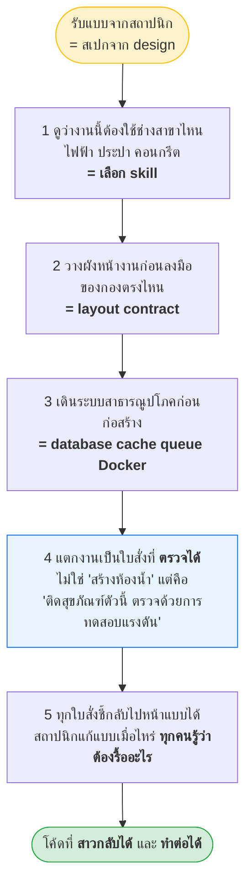
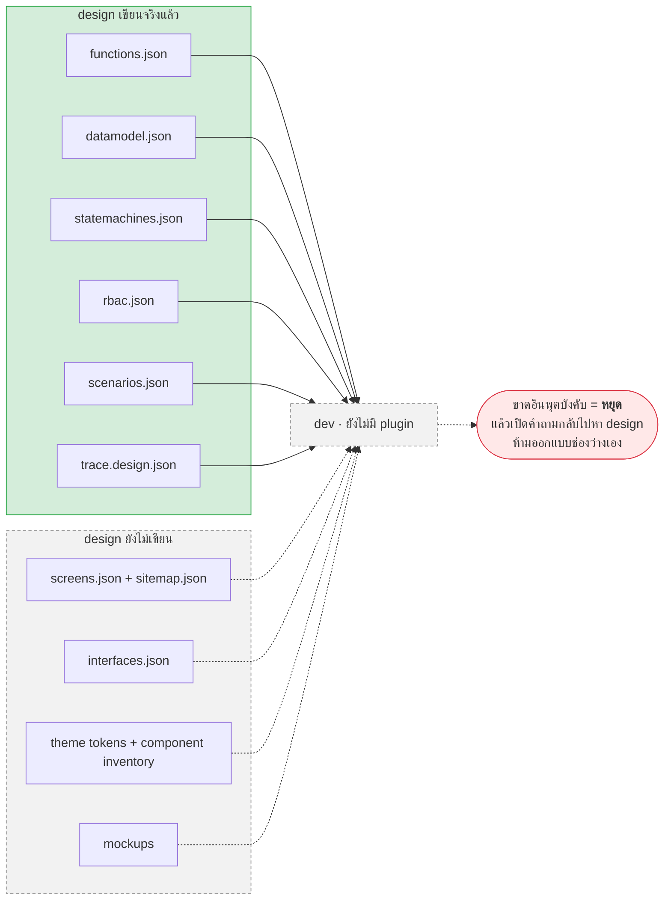
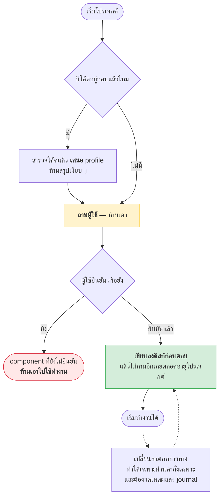
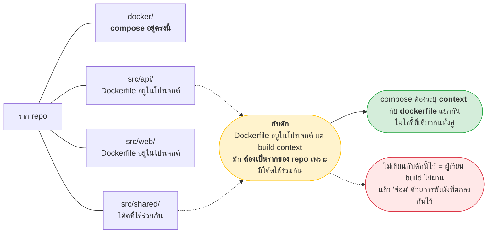
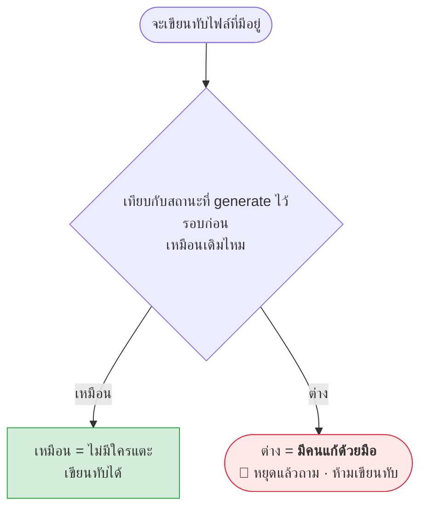
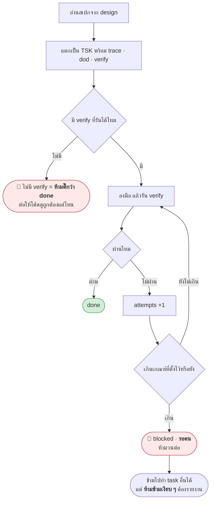
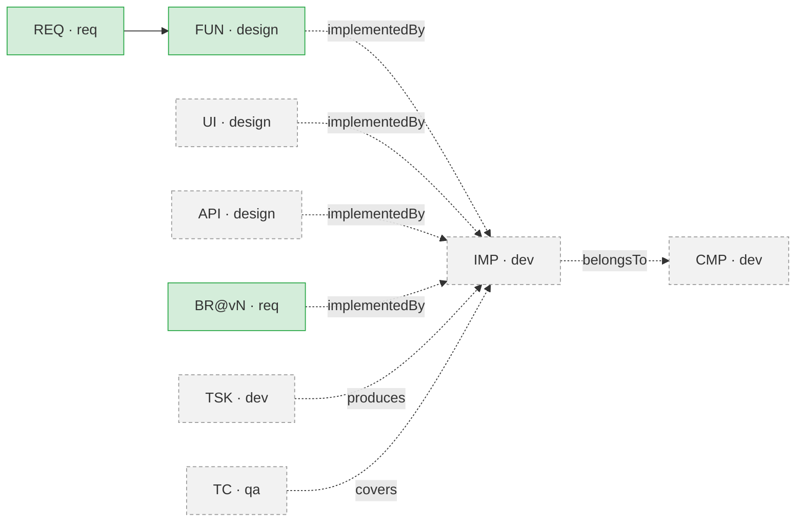

# dev — คู่มือของแบบ (Phase 3 · Build)

> **ชั้นเอกสาร:** B · Authored — สคริปต์ห้ามเขียนทับ
> **owner:** user · **ทบทวนล่าสุด:** 2026-08-19 · **ตามมาตรฐาน:** [DOC-STANDARD v1.2](../standard/DOC-STANDARD.md)

## 🚧 ยังไม่มี plugin นี้ — ใบนี้คือคู่มือของ *แบบ* ไม่ใช่คู่มือการใช้งาน

**ไม่มี `/dev:*` ให้พิมพ์วันนี้** — ไม่มี `plugins/dev/` ไม่มีสคริปต์ ไม่มี fixture ไม่มีแม้แต่งานใน `docs/progress.json`
พิมพ์คำสั่งอะไรที่ขึ้นต้นด้วย `/dev:` แล้วจะได้คำตอบว่า **ยังไม่มี** และนั่นคือพฤติกรรมที่ถูกต้อง

ใบนี้เขียนไว้ให้ **คนที่จะลงมือสร้าง plugin ตัวนี้** — เป็นการแปลง [`dev-plugin-requirements.en.md`](../requirement/dev-plugin-requirements.en.md)
(**Draft v0.1**) ให้อ่านเป็นภาพ พร้อม**แก้จุดที่สเปกล้าสมัยแล้ว**ตามประตูที่เคาะไปหลังจากสเปกถูกเขียน

> ⚠️ **ชื่อคำสั่งทุกตัวในใบนี้เป็นข้อเสนอ** — สเปกเขียนเองว่า *"Names are proposals. Inputs, outputs, and DoD are not."**
> สิ่งที่ผูกมัดคือ **อินพุต · เอาต์พุต · เงื่อนไขว่าเสร็จ** ไม่ใช่ชื่อ

| อยากรู้ว่า | เปิดที่ |
|---|---|
| **แบบของ `dev` เป็นยังไง** | **ใบนี้** |
| รอยต่อระหว่าง plugin ทั้งหมด · prefix ที่ถูกแก้ · คำถามที่ยังไม่มีเจ้าของ | [`aeon-overview.md`](aeon-overview.md) |
| เฟส 1 ที่รันได้จริงแล้ว | [`req-manual.md`](req-manual.md) |
| เฟส 2 ที่รันได้จริงแล้ว | [`design-manual.md`](design-manual.md) |
| สเปกฉบับเต็ม รวมของที่ใบนี้ตัดออก | `docs/requirement/dev-plugin-requirements.en.md` |

---

## 1. `dev` คืออะไร — โฟร์แมนหน้างาน

**อุปมาจากสเปก §0** — โฟร์แมนรับแบบจากสถาปนิกมาแล้วต้องทำ 5 อย่าง



> **เป้าหมายไม่ใช่ "AI เขียนโค้ดได้" — มันเขียนได้อยู่แล้ว**
> **เป้าหมายคือโค้ดที่มันเขียน ต้องสาวกลับไปหา requirement ได้ และทำต่อจากเดิมได้**

### สิ่งที่ `dev` ห้ามทำ (Non-Goals · §1.2)

- ❌ **ห้ามออกแบบระบบ** — สเปกไม่ครบให้**ถามกลับ ห้ามออกแบบช่องว่างเอง**
  *โค้ดที่เขียนจากสเปกที่ agent แต่งขึ้น คือหนี้ที่ไม่มีใครรู้ว่ามี*
- ❌ ห้ามเก็บ requirement (`req`) · ห้ามรันชุดทดสอบเต็มหรือตัดสินคุณภาพ (`qa`) — `dev` รันแค่การตรวจระดับ task
- ❌ ห้าม deploy ขึ้น production · ห้ามทำ UI/UX เอง (รับ mockup มาแปลง) · ห้ามดูแล infra จริง (จบที่ Docker Compose สำหรับทดสอบ)

---

## 2. สเปกเขียนไว้ → ต้องแก้เป็นอะไร

**สเปกของ `dev` ถูกเขียนก่อนประตู 11 จึงใช้ prefix ที่ชนกับของที่มีอยู่แล้ว 3 ตัว** — ต้องแก้ทุกจุด ไม่ใช่แค่จำไว้ว่ามีปัญหา

| สเปกเขียน | ต้องใช้ | prefix เดิมถูกจองโดย |
|---|---|---|
| `SRC-###` = ไฟล์โค้ด / คลาส / โมดูล (§6.1 · §10 · §5) | **`IMP-`** | `SRC-` = เอกสารต้นทางของ `req` |
| `FN-004` ในตัวอย่าง task §9.1 และกราฟ §10 | **`FUN-`** | `FN-` = Field Note ของระบบเอกสาร marketplace |
| `RULE-014` ในตัวอย่าง task §9.1 และกราฟ §10 | **`BR-<module>-nnn@vN`** | `design` **ไม่มี `RULE-`** — กฎธุรกิจเป็นของ `req` และมีเวอร์ชันติดมาด้วย |
| `SCR-###` ที่อ้างในกราฟ | **`UI-`** | `SCR-` = Script |

**`IMP` ถูกจดไว้ใน `ids.mjs` แล้ว** ทั้งที่ plugin ยังไม่เกิด — ตรวจได้ด้วยคำสั่ง ห้ามจำเอา

```
node plugins/design/scripts/ids.mjs        # IMP  dev (not built yet) · one source file / class / module
```

**ตัวอย่าง task ของ §9.1 เขียนใหม่ให้ถูก** — สามฟิลด์ `trace` เปลี่ยนทั้งหมด

```json
{
  "id": "TSK-014",
  "title": "บังคับกฎวงเงินตอนสร้างใบขอสินเชื่อ",
  "component": "CMP-api",
  "trace": ["REQ-loan-012", "FUN-loan-004", "BR-loan-014@v2"],
  "dod": ["LoanApplicationTests.RejectsWhenExceedsCreditLimit"],
  "verify": "dotnet test --filter FullyQualifiedName~LoanApplicationTests",
  "status": "in_progress",
  "attempts": 1,
  "blocked_by": []
}
```

> **`BR` ต้องมี `@vN` ติดไปด้วยเสมอ** — id เปล่า ๆ จะเลื่อนตามเองเงียบ ๆ ตอน `req` ยกเวอร์ชัน
> แล้วโค้ดที่สร้างตาม `@v1` จะดูเหมือนยังตรงกับกฎ `@v2` ทั้งที่กฎเปลี่ยนไปแล้ว

---

## 3. รับอะไรจาก `design` — และวันนี้มีจริงแค่ไหน



**นับตามรายการของ `dev` §3.1 เอง (9 แถว) ได้ 6 มีจริง / 3 ยังไม่มี**

| อินพุต (dev §3.1) | บังคับไหม | มีจริงยัง |
|---|---|---|
| ฟังก์ชันและ use case | บังคับ | ✅ `functions.json` |
| data model + invariant ของ aggregate | บังคับ | ✅ `datamodel.json` |
| state machine | บังคับถ้ามี | ✅ `statemachines.json` |
| **ตารางกำหนดสิทธิ์** | **บังคับ** | ✅ `rbac.json` |
| scenario ทดสอบ | บังคับ | ✅ `scenarios.json` |
| กราฟ trace ของ design | บังคับ | ✅ `trace.design.json` |
| หน้าจอพร้อมฟิลด์และ action | บังคับถ้ามี UI | ❌ รอ `/design:sitemap` |
| สัญญา API และ integration ภายนอก | บังคับถ้ามี API | ❌ รอ `/design:interface` |
| mockup + theme token + รายการ component | ถ้ามี | ❌ รอ Milestone 4 |

> ℹ️ **ตัวเลขนี้ต่างจาก 4/9 ใน [`aeon-overview.md`](aeon-overview.md) §4 และทั้งคู่ถูก** — เพราะนับคนละรายการ
> §4 นับตามรายการ **outbound ของ `design` §3.2** ซึ่ง**ไม่มี `rbac.json` และไม่มี `scenarios.json`** อยู่ในแถวของ `dev`
> ส่วนตารางนี้นับตามรายการ **inbound ของ `dev` §3.1** ซึ่งมีทั้งสองใบ · **สองสเปกเขียนรายการไม่ตรงกัน** และนั่นคือช่องว่างที่ต้องเคาะ

**กฎแข็ง** — อินพุตบังคับหาย → **หยุดและเปิดคำถามกลับไปหา `design` ห้ามออกแบบเติมเอง** (§3.1)

---

## 4. Tech Profile — ต่อ *component* ไม่ใช่ต่อโปรเจกต์

**ความพังที่ต้องกันตั้งแต่วันแรก** (§6.1) — โปรเจกต์เดียวมีได้หลายสแตก: API เป็น .NET · เว็บเป็น Next.js · มือถือเป็น MAUI
**profile ที่เก็บค่าเดียวต่อโปรเจกต์ ต้องถูกรื้อทิ้งทันทีที่โปรเจกต์จริงตัวที่สองโผล่มา**



```json
{
  "schemaVersion": "1.0",
  "components": [
    { "id": "CMP-api", "kind": "api", "language": "csharp", "framework": "aspnetcore",
      "version": "8.0", "orm": "efcore", "skills": ["dotnet-dev"],
      "confirmedBy": "user", "confirmedAt": "2026-08-18T09:00:00Z" },
    { "id": "CMP-web", "kind": "web", "framework": "nextjs", "version": "15",
      "skills": ["vercel-best-practice", "frontend-design"], "confirmedBy": "user" }
  ],
  "runtime": {
    "database": { "engine": "postgresql", "version": "16" },
    "cache": { "engine": "redis" },
    "queue": { "engine": "rabbitmq" },
    "others": []
  }
}
```

**5 กฎของการได้มาซึ่ง profile** (§6.2) — ต้องถามผู้ใช้ ห้ามสแกนแล้วสรุปเงียบ ๆ · มีโค้ดอยู่แล้วให้ **เสนอ** แล้วรอยืนยัน ·
ทุก component ต้องมี `confirmedBy` และ **ตัวที่ยังไม่ยืนยันห้ามเอาไปใช้** · ยืนยันแล้ว **persist ก่อนตอบ** แล้วไม่ถามอีก ·
เปลี่ยนสแตกกลางทางได้เฉพาะผ่านคำสั่งเฉพาะ และต้องจดเหตุผล

> **P6 — ถามครั้งเดียว จำไปตลอดอายุโปรเจกต์** · *ถามว่าใช้ .NET เวอร์ชันไหนใหม่ทุก session = plugin ที่ใช้งานจริงไม่ได้*

---

## 5. Skill Routing — เลือกช่างให้ถูกสาขา

**ตารางเงื่อนไข → skill ที่ต้องแก้ไขได้ และต้องมีลำดับความสำคัญชัดเจน**

| เงื่อนไข | skill |
|---|---|
| component เป็น .NET / ASP.NET Core | `dotnet-dev` |
| component เป็น Next.js | skill best-practice ของ Next.js / Vercel |
| งานแตะ UI · HTML · component | `frontend-design` |
| งานผลิตเอกสารให้ลูกค้า | skill ผลิตเอกสาร |
| **ไม่ตรงเงื่อนไขไหนเลย** | **ถามผู้ใช้ · ห้ามเดา · ห้ามเดินต่อโดยไม่มี skill** |

**กฎที่พลาดง่ายที่สุด: ต้องดูทั้ง component และ *ลักษณะของงาน* พร้อมกัน**
งานเดียวใช้สอง skill ได้ — Razor page ใน .NET ต้องใช้ทั้ง `dotnet-dev` และ `frontend-design`

- ทุกการเลือก skill **ต้องจดว่าเงื่อนไขข้อไหนเป็นตัวสั่ง** เพื่อให้ย้อนอธิบายผลงานเก่าได้ (**DV4**)
- **skill ที่ต้องใช้ยังไม่ได้ติดตั้ง → รายงานแล้วหยุด** ห้ามเดินต่อโดยทำเหมือนได้ใช้ skill นั้นแล้ว
- ผู้ใช้ override ได้ตลอด และ **การ override ต้องถูกจำ**

> **ข้อสอบคุณภาพของแบบ** (§14) — เพิ่มการรองรับ Vue ต้องแก้แค่ **ตาราง routing กับ tech profile**
> ถ้าต้องไปแก้การแตก task หรือระบบ trace ด้วย แปลว่าแบบผูกกับ framework แน่นเกินไป

---

## 6. Layout Contract — ประกาศก่อน ไม่ใช่ให้มันงอกเอง

**ก่อนสร้างไฟล์แรก ต้องมีผังที่ประกาศไว้แล้ว** ระบุอย่างน้อย: component แต่ละตัวอยู่ไหน · ภายใน component แบ่งชั้นยังไง
(domain / application / infrastructure / presentation) · bounded context ของ design map ลงโฟลเดอร์ยังไง ·
โค้ดที่ใช้ร่วมกันอยู่ไหน · เทสต์อยู่ไหน · ไฟล์ Docker อยู่ไหน

> **ผังต้องมาจาก bounded context ของ `design` ไม่ใช่คิดเอง** (§7.1)
> พอโครงโฟลเดอร์ไม่ตรงกับโครงของโดเมน คนอ่านจะหา entity ไม่เจออีกเลย

### กับดัก Docker ที่ต้องเขียนไว้ในสเปกตั้งแต่แรก (§7.2)



---

## 7. Drift Detection — ส่วนที่ยากที่สุด และเป็นตัวทำให้คนเลิกใช้

> **สเปกเรียกข้อนี้เองว่า** *"the hardest part of this plugin and the failure mode that causes immediate user abandonment"* (§7.3)

**และนี่คือจุดที่ `dev` กลับหลักการของ `design`**

| | `design` | `dev` |
|---|---|---|
| **P2** | JSON คือความจริง เอกสารเป็นการ render · **drift ไม่ควรมี** | **โค้ดคือความจริงของพฤติกรรม · สเปกคือความจริงของเจตนา** |
| ผลที่ตามมา | render ใหม่ทับได้เสมอ | **ทั้งสองฝั่ง drift จากกันได้จริง → การตรวจ drift จึงเป็นข้อบังคับเฉพาะที่นี่** |



| ปัญหา | ความสามารถที่ต้องมี |
|---|---|
| agent สร้างไฟล์ซ้ำผิดที่ | เทียบผังจริงกับผังที่ประกาศไว้ แล้วรายงานส่วนต่าง (**DV5**) |
| agent เขียนทับโค้ดที่คนแก้ | แยกของที่ generate ออกจากของที่คนเขียน แล้วปกป้องอย่างหลัง (**P3**) |
| ไฟล์ถูกย้ายหรือลบ ทำให้ trace ห้อย | ตรวจว่า path ที่บันทึกไว้ยังมีอยู่จริง ไม่มีก็ยกธงให้คนดู |

**เกณฑ์ขั้นต่ำของ v1:** ก่อนเขียนทับไฟล์ไหน **เทียบกับสถานะที่ generate ไว้รอบก่อน · ต่างเมื่อไหร่ = คนแก้ → หยุดแล้วถาม ห้ามทับ**

---

## 8. Task — ต้องตรวจได้ ไม่ใช่แค่บรรยาย

**ทุก task ต้องมี 7 อย่าง** — งานที่ต้องทำ · trace ไปหา artifact ของ design · นิยามว่าเสร็จ (ชื่อเทสต์ที่ต้องผ่าน) ·
**คำสั่งที่รันแล้วได้ผลจริง** · สถานะ · จำนวนครั้งที่ลอง · สิ่งที่บล็อกอยู่



**เงื่อนไขจบลูป** (§9.2) — ความคืบหน้าตัดสินด้วยสคริปต์ที่แน่นอน **ไม่ใช่ให้ agent ประเมินตัวเอง** ·
ระบบต้องบอกชื่อ task ถัดไปได้เสมอ · เกินเกณฑ์ครั้งลองที่ task เดิม → **blocked แล้วรอคน ห้ามวนต่อ** ·
**ข้าม task ที่ blocked ไปทำอันอื่นได้ แต่ห้ามข้ามเงียบ ๆ**

---

## 9. Trace ที่ `dev` ต่อเพิ่ม

`dev` เป็นเจ้าของโหนด **`IMP-`** (ไฟล์ · คลาส · โมดูล) และ **ต่อ edge ได้เฉพาะของตัวเอง**
ห้ามแก้ edge ของ `design` และของ `qa` (W1 · **DV15**)



> **P9 — ทุกไฟล์โค้ดได้ edge ตอนสร้าง ไม่ใช่ย้อนไปทำทีหลัง** *เพราะการย้อนไปทำ trace มันไม่เคยเกิดขึ้นจริง*

**5 คำถามที่ต้องตอบได้เมื่อ `dev` มีตัวตน** (§10)

| # | คำถาม |
|---|---|
| 1 | requirement ข้อไหนทำให้เกิดคลาสนี้ |
| 2 | requirement ข้อนี้สร้างแล้วยัง อยู่ไฟล์ไหน |
| 3 | ถ้า requirement ข้อนี้เปลี่ยน ต้องแก้กี่ไฟล์ |
| 4 | **ไฟล์โค้ดไหนที่สาวกลับไปหาสเปกไม่ได้เลย** |
| 5 | สเปกข้อไหนยังไม่มีโค้ด |

**ข้อ 4 คือเครื่องจับงานที่ทำเกินสเปก** — สาเหตุปกติของขอบเขตที่บวมขึ้นเงียบ ๆ

---

## 10. รับการเปลี่ยนแปลงจาก `design`

**`dev` ห้ามแก้โค้ดตามการเปลี่ยนแปลงทันที** (§11 ข้อ 4) — เดินกราฟหาว่า task และไฟล์ไหนผูกอยู่กับ artifact ที่เปลี่ยน →
ตั้งเป็น `stale` พร้อมจดเหตุผล → **รายงานผลกระทบเป็นตัวเลขให้คนตัดสิน** (กี่ task กี่ไฟล์) →
**รอคนอนุมัติว่าจะทำตามการเปลี่ยนแปลง หรือจะย้อนกลับไปเถียง** → ถือว่างานยังไม่เสร็จตราบใดที่ยังมีของค้าง `stale` (**DV13**)

---

## 11. ด่านตรวจ DV1–DV16

| กลุ่ม | กฎ | เรื่อง |
|---|---|---|
| ความครบและ trace | DV1 DV2 | ทุกฟังก์ชัน/หน้าจอ/API มีโค้ด หรือมีเหตุผลที่จดไว้ · ไม่มีโค้ดที่สาวกลับสเปกไม่ได้ |
| ความไม่เดา | DV3 DV4 | ทุก component ผู้ใช้ยืนยันเอง ไม่ใช่ agent สรุป · ทุกงานจดว่าใช้ skill ไหนและเงื่อนไขไหนเป็นตัวเลือก |
| ผังและ Docker | DV5 DV7 DV9 DV14 | ผังจริงตรงผังที่ประกาศ · dependency กับ service ใน Docker ตรงกัน **สองทาง** · ไฟล์ Docker อยู่ที่ตกลง · ระบบ build ได้และ Docker ยกทุก service ขึ้นได้ |
| ความเสร็จที่พิสูจน์ได้ | DV6 DV12 DV13 | ทุก task มีคำสั่ง verify · **ห้าม done ขณะ verify ยังไม่ผ่าน** · ไม่มีของค้าง stale |
| ความปลอดภัย | DV8 DV16 | ไม่มี secret ฝังในโค้ด · **ทุกหน้าที่คุมสิทธิ์ต้องบังคับฝั่งเซิร์ฟเวอร์** |
| ความถูกต้องกับสเปก | DV10 DV11 | API ที่สร้างตรงกับสัญญาของ design · **invariant บังคับที่ชั้น domain ไม่ใช่แค่ UI** |
| ขอบเขตความเป็นเจ้าของ | DV15 | `dev` ไม่ได้เขียนไฟล์ของ plugin อื่น |

> 🔴 **DV11 กับ DV16 คือสองข้อที่ AI พลาดบ่อยที่สุด และทั้งคู่ "ดูเหมือนใช้งานได้" ตอนทดสอบด้วยมือ**
> `DV16` ผูกกับ **A3/V26** ของ `design` โดยตรง — *ซ่อนปุ่มไม่ใช่การคุมสิทธิ์*

---

## 12. ต้องเคาะอะไรก่อนถึงจะสร้าง `dev` ได้

| ต้องเคาะ | ปรากฏที่ | ทำไมบล็อก |
|---|---|---|
| **ใครเขียน unit test และ integration test** | **DD1** = qa **QD1** | **สเปกบอกเองว่าเคาะข้อนี้ก่อน** เพราะมัน **กำหนดรูปร่างของ task list ทั้งชุด** |
| **generate มากแค่ไหน เขียนมือแค่ไหน** | **DD3** | generate หมด = งานคนถูกทับ · ไม่ generate เลย = plugin ไม่ได้ช่วยอะไร · **สเปกจัดข้อนี้คู่กับ DD1 ว่าต้องเคาะก่อนข้ออื่น** |
| ใครผลิต seed / test data | **DD5** = design D15 = qa QD5 | `qa` ใช้ แต่ `dev` รู้โครงข้อมูล |
| monorepo หรือหลาย repo | **DD11** | กระทบทั้งผังโฟลเดอร์และ build context ของ Docker โดยตรง |
| โค้ดที่ใช้ร่วมกันระหว่าง component อยู่ไหน | **DD14** | กระทบผังและ build context เหมือนกัน (§6 กับดัก Docker) |
| ใครเป็นเจ้าของ database migration | **DD2** | agent สร้าง migration อิสระ = ชนกันทันทีที่มีคนทำงานขนานกันสองคน |

**ที่เหลืออีก 9 ข้อ** (DD4 · DD6–DD10 · DD12 · DD13 · DD15) อยู่ใน §16 ของสเปก
**คำถามที่คาบเกี่ยวหลาย plugin** ดูที่ [`aeon-overview.md`](aeon-overview.md) §8 — **ห้าม copy มาไว้ที่นี่**

---

## 13. ลำดับสร้าง (Build Order · §17)

| Milestone | ทำอะไร | พิสูจน์อะไร |
|---|---|---|
| **1 — รู้จักโปรเจกต์** | init → ถามและจำ tech profile → route skill ถูก → รายงานสถานะ | plugin **ถามครั้งเดียว จำได้ และไม่เดา** |
| **2 — แตกงานและลงมือ** | ประกาศ layout → แตก task จากสเปก → ทำ task พร้อม verify | **ความเสร็จตัดสินด้วยคำสั่ง ไม่ใช่คำประกาศของ agent** |
| **3 — ยกระบบขึ้น** | หา dependency → สร้าง Docker → ยกทั้งระบบ | **มันรันบนเครื่องคนอื่นได้ ไม่ใช่แค่บนเครื่องคนเขียน** |
| **4 — ต่อกับคนอื่น** | ต่อ edge ให้ครบ → รับการเปลี่ยนจาก design → ส่งต่อ qa → ส่ง feedback ย้อนขึ้น | ปิดวงกับทั้ง marketplace |

**ข้อจำกัดของ plugin เอง** — ไม่มีบริการเสียเงินเพิ่ม · รันบนเครื่องผู้เรียนทั่วไป · เดินผ่าน index ห้ามกวาดทั้ง repo ·
เข้าใจได้ในหนึ่งชั่วโมง · **ต้องใช้ได้ทั้งโปรเจกต์เปิดใหม่และโปรเจกต์ที่มีโค้ดอยู่แล้ว** · ทุกเงื่อนไขจบผูกกับคำสั่งที่รันได้

> **PN5 สำคัญกว่าที่เห็น** — *งานจริงส่วนใหญ่คือการทำต่อจากโค้ดที่มีอยู่ ไม่ใช่การเริ่มจากศูนย์*

---

## 14. ตรวจว่าใบนี้ยังตรงกับของจริงไหม

**ใบนี้จะล้าสมัยทันทีที่ `dev` เกิดจริง** — ตอนนั้นให้เขียนคู่มือการใช้งานแบบเดียวกับ `req-manual.md` แล้วลดใบนี้เหลือแค่ที่มา

```bash
# 1. plugin เกิดแล้วหรือยัง — ยังไม่เกิด = ไม่มีโฟลเดอร์
ls -d plugins/dev/ 2>/dev/null || echo "ยังไม่มี plugins/dev/ — ใบนี้ยังเป็นคู่มือของแบบ"

# 2. IMP ยังจองไว้ให้ dev อยู่ไหม (ถ้าหาย แปลว่ามีคนเปลี่ยน prefix)
node plugins/design/scripts/ids.mjs | grep IMP

# 3. design เขียนไฟล์อะไรให้ dev ใช้ได้แล้วบ้าง
ls -R plugins/design/scripts/fixtures/clean/.aeon/design/

# 4. มีงานสร้าง dev ใน progress.json แล้วหรือยัง
node -e "const t=JSON.parse(require('fs').readFileSync('docs/progress.json','utf8')).tasks;console.log(t.filter(x=>/dev plugin/i.test(x.title)).length+' task')"
```
