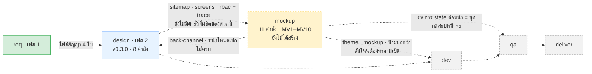
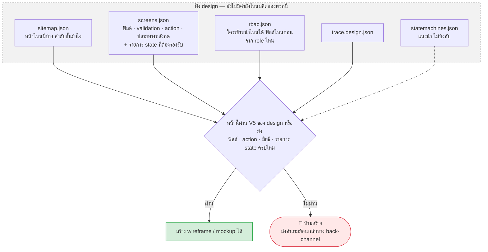
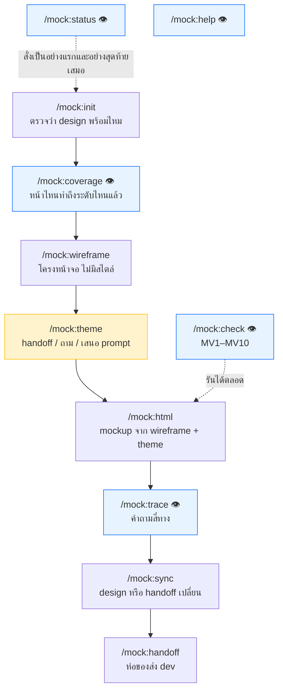
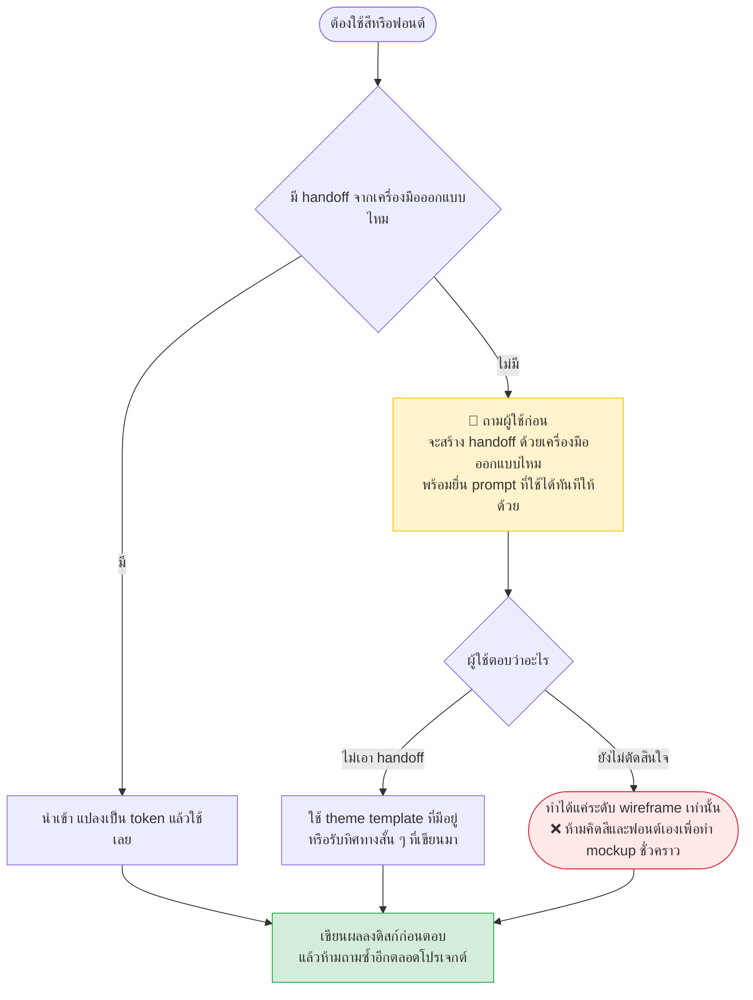
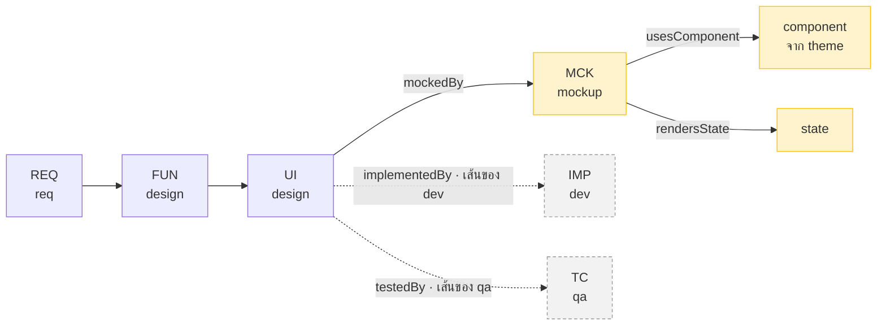

# mockup — คู่มือลำดับการเรียกใช้ (งานภาพ)

> **ชั้นเอกสาร:** B · Authored — สคริปต์ห้ามเขียนทับ
> **owner:** user · **ทบทวนล่าสุด:** 2026-08-20 · **ตามมาตรฐาน:** [DOC-STANDARD v1.2](../standard/DOC-STANDARD.md)
>
> คู่มือใบนี้ตอบ 3 คำถาม — **`mockup` ทำงานยังไง · รับของจาก `design` ยังไง · ส่งต่อให้ `dev` ยังไง**
> คู่ขนานกับ [`design-manual.md`](design-manual.md) ซึ่งเป็นใบของเฟส 2

## 🛑 อ่านก่อน — plugin นี้ยังไม่มีตัวตน และเริ่มไม่ได้แม้จะเขียนมันวันนี้

**ใบนี้ต่างจากใบอื่นในโฟลเดอร์นี้ทุกใบ** — `req-manual.md` กับ `design-manual.md` เขียนจากสคริปต์ที่รันได้จริง
ใบนี้ทำแบบนั้นไม่ได้ เพราะ**ไม่มีสคริปต์ ไม่มีคำสั่ง ไม่มี fixture ไม่มีโฟลเดอร์ `plugins/mock/`**

**ของจริงที่มีอยู่ในตอนนี้มีชิ้นเดียว** คือ prefix `MCK` ที่ถูกจองไว้ในรายการห้ามสร้างของ `plugins/design/scripts/ids.mjs`

```
node plugins/design/scripts/ids.mjs | grep MCK
```

**และต่อให้มีคนเขียน plugin นี้เสร็จวันนี้ มันก็ยังเริ่มทำงานไม่ได้ เพราะติดอยู่สองชั้น ทั้งสองชั้นอยู่ต้นทาง**

| ติดอะไร | ทำไม | รอใคร |
|---|---|---|
| **ไม่มีคลังหน้าจอให้ทำงานด้วย** | ของบังคับ 3 อย่างที่ `mockup` ต้องอ่าน — sitemap · รายละเอียดหน้าจอ · รายการ state ที่แต่ละหน้าต้องรองรับ — ผลิตโดย `/design:sitemap` ซึ่ง**ยังไม่ถูกสร้าง** | `docs/progress.json` งาน 28.1 · สถานะ `pending` |
| **ตัวตรวจ V5 ยังไม่มีของให้ตรวจ** | V5 คือประตูที่ `mockup` ห้ามข้าม (หน้าไหนไม่ผ่าน V5 ห้ามสร้างภาพ) แต่ `design:check` พิมพ์ V5 อยู่ในรายการ `PENDING` เพราะยังไม่มีหน้าจอในระบบเลย | งาน 28.1 เหมือนกัน |

**ทั้งใบนี้จึงเป็นการแปลงสเปกเป็นภาษาไทยให้อ่านรู้เรื่อง ไม่ใช่คู่มือใช้งาน** — ห้ามอ่านแล้วเข้าใจว่ามีอะไรให้สั่งได้

| อยากรู้ว่า | เปิดที่ |
|---|---|
| **จะทำงานยังไง · ต่อกับ design/dev ยังไง** | **ใบนี้** |
| **เจตนาและเหตุผลฉบับเต็ม** | [`docs/requirement/mockup-plugin-requirements.md`](../requirement/mockup-plugin-requirements.md) (ไทย) · [`.en.md`](../requirement/mockup-plugin-requirements.en.md) (อังกฤษ) |
| ฝั่งที่ส่งของมาให้ | [`design-manual.md`](design-manual.md) |
| prefix ที่จองไว้แล้ว | `node plugins/design/scripts/ids.mjs` |

> ⚠️ **เมื่อสองฉบับขัดกัน ให้เชื่อฉบับอังกฤษ** — หัวไฟล์ทั้งสองฉบับประกาศเองว่าเลข G · MP · MV · MD · PN
> ใช้ร่วมกันทั้งคู่ แต่ตอนนี้ยังไม่ตรงกันจริงหนึ่งจุด (ดู §10) · ในใบนี้ผมยึดฉบับอังกฤษ

> **ชื่อคำสั่งใช้ `/mock:` ไม่ใช่ `/mockup:`** — ชื่อ plugin กับชื่อไฟล์สเปกเป็น "mockup" แต่ namespace ของคำสั่งเป็น `mock`
> เขียนกำกับไว้ครั้งเดียวตรงนี้ ในใบนี้ผมใช้ `/mock:` ตลอด ตามสเปก §12

---

## 1. `mockup` คืออะไร — บ้านหลังเดียว แต่แบบแปลนกับสเปกวัสดุคนละใบ

**อุปมาจากสเปก §0** — ของสามอย่างที่คนมักเรียกรวมกันว่า "ออกแบบหน้าจอ" จริง ๆ แล้วเป็นคนละชั้นกัน

| ชั้น | เทียบกับบ้าน | คืออะไร |
|---|---|---|
| **wireframe** | แบบแปลน | ห้องไหนอยู่ตรงไหน ประตูเปิดทางไหน มีหน้าต่างกี่บาน · **ไม่พูดถึงสีผนังเลย** |
| **theme** | สเปกวัสดุและสีที่ใช้ | สี · วัสดุ · ตัวอักษร · ระยะห่าง |
| **mockup** | ภาพเสมือนจริง | แบบแปลน + สเปกวัสดุ ประกอบกัน |

**สองชั้นแรกต้องแยกกันเด็ดขาด** เพราะ**แบบแปลนต้องตรงกับสเปก ส่วนสีเปลี่ยนเมื่อไหร่ก็ได้**
ถ้าปนกัน วันที่ลูกค้าเปลี่ยนสีประจำบริษัท จะต้องมาไล่ตรวจใหม่ทั้งระบบว่าฟิลด์ยังครบอยู่ไหม ทั้งที่ไม่มีใครแตะฟิลด์เลย

> **เป้าหมายไม่ใช่หน้าจอที่สวย แต่คือทุกภาพต้องบอกได้ว่ามาจาก requirement ข้อไหน และตอนนี้สร้างกับทดสอบไปถึงไหนแล้ว** (สเปก §0)



**มีเส้นทึบเส้นเดียวในผังนี้** และมันอยู่ต้นน้ำสุด — ที่เหลือเป็นเส้นประทั้งหมด

**เส้นที่วิ่งย้อนกลับจาก `mockup` ไป `design` ไม่ใช่ของแถม** — มันคือกลไกที่ทำให้ภาพสวยไม่ถูกสร้างจากสเปกที่ไม่ครบ (§3)

### สิ่งที่ `mockup` ห้ามทำ (Non-Goals · สเปก §1.2)

- ❌ **ห้ามกำหนดว่าหน้าจอมีฟิลด์อะไร หรือใครเข้าได้** — เป็นของ `design`
  ผู้ใช้ขอ *"เพิ่มฟิลด์ในหน้านี้หน่อย"* → **ต้องชี้กลับไป `design` ไม่ใช่ทำให้** (สเปก §12.1)
- ❌ **ห้ามคิดระบบออกแบบหรือแบรนด์ขึ้นมาเอง** — ต้องมาจาก handoff หรือ theme template
- ❌ ห้ามเขียนโค้ดจริง — mockup เป็นภาพอ้างอิงเท่านั้น
- ❌ ห้ามสร้างครบทุกขนาดจออัตโนมัติ (ยังไม่ตัดสิน · MD4)
- ❌ **ห้ามตัดสินว่าดีไซน์นี้สวยหรือไม่สวย**

---

## 2. สเปกเขียนไว้ → ของจริงคือ

**ตารางนี้สั้นกว่าของ `design` มาก เพราะยังไม่มีโค้ดให้ขัดกับสเปก** — ที่ขัดจริงมีข้อเดียว และมันมาจากการที่ repo นี้เปลี่ยนชื่อ prefix ไปแล้ว

| สเปก mockup เขียน | ของจริงใน repo นี้ | เพราะอะไร |
|---|---|---|
| หน้าจอคือ `SCR-007` (ใช้ทั้งฉบับ รวม MV8) | **`UI-<module>-nnn`** | `SCR-` ถูกใช้เป็น Script ในระบบเอกสารของ marketplace นี้แล้ว · `design` เปลี่ยนไปใช้ `UI-` ตั้งแต่เรื่องที่ตัดสินไปแล้วข้อ 11 (2026-08-18) |
| `MCK-###` เป็นของ mockup | **ตรงกัน ไม่ต้องแก้** | `MCK` ไม่ชนกับใคร และถูกจองไว้ในรายการห้ามสร้างของ `design` เรียบร้อยแล้ว |

**แปลว่ากฎ MV8 ในของจริงคือ `MCK` → `UI` → `REQ` ไม่ใช่ `MCK` → `SCR` → `REQ`**

> ⚠️ **สเปก mockup ยังไม่ได้แก้ตามข้อนี้** — ทั้งฉบับยังเขียน `SCR` อยู่ · ตอนสร้าง plugin จริงต้องแปลงตรงนี้ให้ครบทุกจุด
> ไม่ใช่แค่ใน MV8 · **ตรวจด้วยคำสั่ง ห้ามจำเอา:** `node plugins/design/scripts/ids.mjs`

---

## 3. รับของจาก `design` ยังไง — ประตูเข้าที่มีคนเฝ้า



| ไฟล์จาก `design` | บังคับไหม | `mockup` เอาไปทำอะไร |
|---|---|---|
| sitemap | ✅ **บังคับ** | รู้ว่ามีหน้าอะไรบ้างและลำดับชั้นยังไง |
| รายละเอียดหน้าจอ (ฟิลด์ · validation · action · ปลายทาง) | ✅ **บังคับ** | เนื้อในของ wireframe |
| ตารางสิทธิ์ (`rbac.json`) | ✅ **บังคับ** | รู้ว่าหน้าไหนต้องมีภาพ "ไม่มีสิทธิ์" และฟิลด์ไหนต้องซ่อนจาก role ไหน |
| **รายการ state ที่แต่ละหน้าต้องรองรับ** | ✅ **บังคับ** | วาดภาพให้ครบทุกสถานะ |
| `trace.design.json` | ✅ **บังคับ** | ใช้เป็นฐานในการต่อเส้นของตัวเอง |
| state machine | ⚠️ แนะนำ | เข้าใจว่าหน้านี้อยู่ตรงไหนของกระบวนการ |

### กฎแข็งข้อเดียวของประตูนี้

> **หน้าจอที่ยังไม่ผ่าน V5 — ห้ามสร้างภาพ ต้องส่งคำถามย้อนกลับแทน** (สเปก §3.1)

เหตุผลอยู่ในสเปกตรง ๆ และมันเป็นเหตุผลเชิงธุรกิจ ไม่ใช่เชิงเทคนิค:

**ภาพสวยที่สร้างจากสเปกไม่ครบ ลูกค้าจะอ่านว่าตกลงกันแล้ว** แล้วมันกลายเป็นคำมั่นที่ไม่มีใครตั้งใจให้เกิด
คนที่จะมารับผลคือ `dev` ซึ่งต้องสร้างของที่ไม่เคยมีใครเขียนสเปกไว้

**นี่คือเหตุผลที่ `mockup` เริ่มไม่ได้วันนี้** — V5 ยังไม่มีของให้ตรวจ (ดูกล่องบนสุดของใบนี้)

---

## 4. ลำดับคำสั่ง — 11 ตัว 3 รอบ



| รอบ (สเปก §17) | คำสั่ง | พิสูจน์อะไร |
|---|---|---|
| **1 — รู้ว่าต้องสร้างหน้าไหน** | `init` `coverage` `wireframe` | สร้างตาม sitemap เท่านั้น และ wireframe ไม่มีสไตล์ปนสักตัว |
| **2 — จัดการเรื่อง theme** | `theme` `html` | plugin ไม่คิดสีเอง และ prompt ที่เสนอมาจากสเปกจริง ไม่ใช่ข้อความสำเร็จรูป |
| **3 — ต่อกับ plugin อื่น** | `trace` `sync` `handoff` | ตอบคำถามสี่ทางได้ และชุดส่งมอบแยกออกว่าอะไรต้องทำตามเป๊ะ อะไรแค่ดูเป็นแนวทาง |

**`wireframe` มาก่อน `theme` โดยตั้งใจ** — เพราะ wireframe ไม่ต้องใช้ theme เลย
ทำให้คุยเรื่องความครบของข้อมูลกับลูกค้าได้ตั้งแต่ยังไม่มีใครตัดสินใจเรื่องสี

| คำสั่ง | ผลิตอะไร | เสร็จเมื่อไหร่ (DoD) |
|---|---|---|
| `/mock:init` | state file | sitemap และ screens ผ่าน V5 |
| `/mock:coverage` 👁 | รายงาน | ทุกหน้ามีระดับกำกับ รวมหน้าที่ยังไม่ได้แตะ |
| `/mock:wireframe` | wireframe รายหน้า | MV1 · MV3 ผ่าน |
| `/mock:theme` | theme + บันทึกการตัดสินใจ | มี theme ที่ยืนยันแล้ว **หรือ** บันทึกไว้ว่าผู้ใช้เลือกทางไหน |
| `/mock:html` | mockup รายหน้า | MV2 · MV4 · MV5 ผ่าน |
| `/mock:trace` 👁 | ผลลัพธ์การค้น | ตอบคำถามสี่ทางได้ครบ |
| `/mock:sync` | รายการที่ล้าสมัย | ทำเครื่องหมายครบทุกชิ้นที่กระทบ |
| `/mock:handoff` | ชุดส่งมอบพร้อมป้าย | MV7 ผ่าน |
| `/mock:check` 👁 | รายงานรายกฎ | ระบุ id ที่ผิดได้ |
| `/mock:status` 👁 | สถานะ + exit code | แน่นอน ไม่ขึ้นกับที่ LLM ประเมินตัวเอง |
| `/mock:help` 👁 | ข้อความช่วยเหลือ | บอกลำดับ · prerequisite · **และสิ่งที่ plugin นี้ไม่ทำ** |

> **`/mock:help` มีข้อกำหนดเขียนไว้เป็นพิเศษ** (สเปก §12.1) เพราะเรื่องที่สำคัญที่สุดในนั้นคือ
> **บอกว่า plugin นี้ไม่ทำอะไร และให้ไปใช้ตัวไหนแทน** — ผู้ใช้จะขอของที่เป็นของ `design` อยู่เรื่อย ๆ
> ("เพิ่มฟิลด์ในหน้านี้") และถ้าทำตาม จะเกิดความจริงสองชุดที่ขัดกันภายในสัปดาห์เดียว

---

## 5. ทีละเรื่อง

### 5.1 `/mock:theme` — ลำดับหาที่มาของสี และข้อห้ามที่สำคัญที่สุดในทั้ง plugin



**ข้อ 4 คือหัวใจ** (สเปก §6.1 และหลักการ MP2) — ยังไม่ตัดสินใจ = **ทำได้แค่ wireframe**

เหตุผล: **mockup ที่ AI คิดสีเอง ลูกค้าจะอ่านว่าเป็นดีไซน์ที่ตกลงกันแล้ว**
แล้วมันกลายเป็นข้อผูกพันที่ไม่มีใครตั้งใจ · การ "ทำไปก่อนพลาง ๆ" จึงไม่ใช่ทางเลือกที่มีอยู่

> **ห้ามตอบว่า "รับทราบ ใช้ theme นี้" ก่อนเขียนบันทึกลงดิสก์** (persist-before-answer · MP4)
> และเมื่อบันทึกแล้ว **ห้ามถามซ้ำอีกเลยตลอดอายุโปรเจกต์** — session ใหม่ต้องอ่านบันทึกก่อนทำอะไร

**prompt ที่เสนอต้องประกอบจากสเปกจริง ไม่ใช่ข้อความสำเร็จรูป** (สเปก §6.2) — นี่คือสิ่งที่ทำให้คำสั่งนี้มีค่ามากกว่า prompt ที่ก็อปมาจากที่อื่น

| ต้องใส่อะไรลงใน prompt | เอามาจากไหน |
|---|---|
| ธุรกิจอะไร ผู้ใช้เป็นใคร | `context.json` และ stakeholder |
| ใช้งานจริงในสภาพไหน — นั่งโต๊ะทั้งวัน หรือถือมือถือเดินทาง | `context.json` |
| **รายการ component ที่ระบบนี้ต้องใช้จริง** — ตารางที่กรองและแบ่งหน้าได้ · ฟอร์มหลายขั้น · ป้ายสถานะกี่แบบ · กล่องยืนยันรายการ | ไล่จากหน้าจอทุกหน้า |
| ข้อจำกัดที่รู้อยู่แล้ว — รองรับภาษาไทย · อ่านกลางแดด · โหมดคอนทราสต์สูง | สเปกและ NFR |
| สิ่งที่ไม่เอาชัด ๆ | ผู้ใช้ระบุ |

**ผลที่ได้ต่างกันตรงนี้:** theme ที่ได้กลับมาจะมี component ครบตามที่ระบบต้องใช้จริง
แทนที่จะเป็น theme ที่สวยแต่ไม่มีตารางแบบที่ระบบนี้ต้องใช้พอดี

**ตอนนำเข้า handoff ต้องตรวจ 4 ข้อ** (สเปก §6.3) — และทุกข้อมีไว้ให้ปัญหาโผล่ตอนนี้ ไม่ใช่ตอนทำหน้าที่ 20

| ตรวจอะไร | ไม่ตรวจแล้วพังยังไง |
|---|---|
| handoff ครอบคลุม component ที่ระบบต้องใช้ครบไหม | ช่องว่างจะโผล่ตอนทำไปได้ครึ่งทางแล้ว |
| หน้าไหนใน sitemap ที่ handoff ไม่ครอบคลุม | **ต้องรายงาน ห้ามเดาเติมเงียบ ๆ** |
| มี component ที่ไม่มีหน้าไหนใช้เลยไหม | ถ้ามี แปลว่า sitemap ขาดหน้า หรือ handoff ทำเกิน |
| สถานะการโต้ตอบครบไหม (ปกติ · ชี้ · กด · ปิดใช้ · error) | ที่ขาดไป `dev` จะคิดเอง และคิดไม่เหมือนกันทุกหน้า |

**handoff เปลี่ยนเมื่อไหร่ mockup ที่สร้างบน theme เก่าต้องถูกทำเครื่องหมายว่าล้าสมัย** ด้วยกลไกเดียวกับตอน requirement เปลี่ยน

### 5.2 `/mock:wireframe` — แบบแปลนที่ห้ามมีสีแม้แต่ค่าเดียว

| ต้องเป็นยังไง (สเปก §7.1) |
|---|
| สร้างจาก sitemap เท่านั้น · **ห้ามคิดหน้าจอขึ้นมาเอง** |
| ทุกฟิลด์และทุก action ที่หน้านั้นประกาศไว้ ต้องปรากฏครบ |
| **ห้ามมีค่าสไตล์ใด ๆ อยู่ในตัวเลย** — ไม่มีสี ไม่มีฟอนต์ ไม่มีขนาด ไม่มี CSS |
| ลำดับและการจัดกลุ่มต้องตรงกับที่สเปกระบุ |
| ต้องบอกได้ว่าส่วนไหนเห็นได้เฉพาะบาง role |

**ทำไมต้องเข้มขนาดนี้** (สเปก §7.2) — wireframe คือของที่เอาไปคุยกับลูกค้าเพื่อยืนยันว่า**ข้อมูลครบและลำดับถูก**

พอมีสีเข้ามา บทสนทนาจะเปลี่ยนทันทีจาก *"ฟิลด์ครบหรือยัง"* เป็น *"ไม่ชอบสีนั้น"*
แล้วคำถามที่สำคัญกว่าจะไม่มีใครตอบ

### 5.3 `/mock:html` — และรายการสถานะที่คนมักลืม

| ต้องเป็นยังไง (สเปก §8.1) |
|---|
| สร้างจาก wireframe + theme เท่านั้น |
| **อ้างค่าจาก token เท่านั้น ห้ามใส่ค่าสไตล์ตรง ๆ** |
| ทุก component ที่ใช้ ต้องมีอยู่ใน component inventory |
| ข้อมูลที่โชว์เป็นเรื่องแต่ง และ**ต้องกำกับไว้ว่าเป็นเรื่องแต่ง** |

**`design` เป็นคนประกาศว่าหน้าไหนต้องมีสถานะอะไร · `mockup` เป็นคนวาด** — ไม่ใช่ `mockup` คิดเอง

สถานะที่ต้องมีบ่อย ๆ (สเปก §8.2):

- ยังไม่มีข้อมูลเลย (ใช้ครั้งแรก) · กำลังโหลด · โหลดไม่สำเร็จ
- ข้อมูลเยอะจนต้องแบ่งหน้า
- ข้อความล้นกรอบ — **ชื่อคนไทยที่ยาว · ชื่อบริษัทที่ยาวกว่า**
- ผู้ใช้ไม่มีสิทธิ์เห็นบางส่วนของหน้า
- ฟอร์มที่ผิดหลายช่องพร้อมกัน
- กำลังส่งข้อมูลอยู่ (กันกดซ้ำ)

> **วาดแต่ทางที่ราบรื่นอย่างเดียว แปลว่า `dev` ไม่รู้ว่าสถานะพวกนี้มีอยู่ และ `qa` ไม่มีอะไรให้ทดสอบ**

### 5.4 `/mock:coverage` 👁 — ไม่ใช่ทุกหน้าต้องทำถึงระดับสูงสุด

| ระดับ | ได้อะไรออกมา | เอาไปทำอะไร |
|---|---|---|
| **L0** | มีแค่ชื่อใน sitemap ยังไม่ได้ผลิตอะไร | ตรวจว่าหน้าครบไหม |
| **L1 — wireframe** | โครง · ฟิลด์ · ปุ่ม · ลำดับ · **ไม่มีสไตล์** | ให้ลูกค้าตรวจว่าข้อมูลครบและลำดับถูก |
| **L2 — mockup** | L1 + theme | ให้ลูกค้าเห็นภาพ และให้ `dev` ใช้อ้างอิง |

**หน้าจอ CRUD ที่หน้าตาเหมือนกัน 10 หน้า ต้องการตัวแทนแค่หน้าเดียวที่ทำถึง L2** ที่เหลืออยู่ที่ L1 ก็พอ

ความสามารถที่คำสั่งนี้ต้องมี (สเปก §9.2): รายงานระดับของทุกหน้ารวมหน้าที่ยังไม่ได้แตะ ·
เลือกสร้างเฉพาะบางส่วนได้ (รายหน้า · รายโมดูล · ตามลำดับความสำคัญ) · รายงานความครอบคลุม ·
**และตรวจจับหน้าที่เพิ่งถูกเพิ่มเข้า sitemap แต่ยังไม่มีภาพ**

> **ใครเป็นคนตัดสินว่าหน้าไหนควรทำถึง L2 — ยังไม่มีเกณฑ์และยังไม่ตัดสิน** (MD3)

---

## 6. คำถามสี่ทาง — ของที่ `mockup` ต้องตอบให้ได้

`mockup` ต่อเส้นของตัวเองลง `trace.mockup.json` **3 ชนิด** และห้ามแตะเส้นของใครทั้งสิ้น



**สำหรับหน้าเว็บหนึ่งหน้า ต้องตอบได้ 4 ข้อ** (สเปก §10.2) — นี่คือข้อสอบของ plugin นี้

| ทาง | คำถาม | อ่านจากไหน |
|---|---|---|
| **req** | หน้านี้มาจาก requirement ข้อไหนของลูกค้า | trace ของ design สาวขึ้นไปถึง `REQ` |
| **design** | หน้านี้มีฟิลด์ · กฎ · สิทธิ์อะไร และอยู่ตรงไหนของกระบวนการ | screens · rbac · statemachines |
| **code** | สร้างแล้วหรือยัง อยู่ไฟล์ไหน | trace ของ `dev` |
| **qa** | มีเทสต์อะไรคุมอยู่ ผลล่าสุดเป็นยังไง | trace ของ `qa` |

> **`mockup` อ่านข้อมูลของ `dev` และ `qa` เพื่อตอบได้ แต่ห้ามเขียนลงไฟล์ของเขาเด็ดขาด**
> กราฟถูกประกอบตอนอ่านเท่านั้น (merged view) ไม่มีไฟล์กราฟรวมที่เขียนได้อยู่บนดิสก์ จึงไม่มีอะไรให้เขียนทับ
> **ถ้ายังไม่มี `dev` หรือ `qa` ในโปรเจกต์ คำตอบต้องเป็น "ยังไม่มีข้อมูล" — ห้ามเดา และห้ามเงียบ**

---

## 7. ตัวตรวจ — 10 กฎ

**ยังไม่มีสคริปต์ตัวไหนรันกฎพวกนี้ได้** — ตารางนี้มาจากสเปก §13 ล้วน

| กฎ | เรื่อง | ระดับ | เดิมเป็นเลขอะไรฝั่ง design |
|---|---|---|---|
| MV1 | wireframe ต้องไม่มีค่าสไตล์ใด ๆ (สี ฟอนต์ ขนาด) | ❌ error | V16 |
| MV2 | mockup อ้างค่าจาก theme token เท่านั้น | ❌ error | V17 |
| MV3 | ทุกฟิลด์และทุก action ที่หน้าจอประกาศไว้ ต้องปรากฏใน wireframe | ❌ error | V18 |
| MV4 | ทุกหน้าที่ทำถึง L2 ต้องวาดครบทุกสถานะที่ `design` ประกาศไว้ | ❌ error | V19 |
| MV5 | ทุก component ที่ใช้ ต้องมีอยู่ใน component inventory | ❌ error | V20 |
| MV6 | ทุกหน้าใน sitemap ต้องมีบันทึกระดับ (รวม "ยังไม่ทำ") | ⚠️ warn | V21 |
| MV7 | ชุดส่งมอบติดป้ายครบว่าอะไรต้องทำตามเป๊ะ อะไรแค่อ้างอิง | ❌ error | V22 |
| MV8 | ทุก `MCK` สาวกลับถึงหน้าจอและ `REQ` ได้ | ❌ error | **ใหม่** |
| MV9 | ไม่มี mockup ที่ล้าสมัยค้างอยู่หลัง handoff หรือสเปกเปลี่ยน | ❌ error | **ใหม่** |
| MV10 | ห้ามสร้างหน้าที่ไม่ได้อยู่ใน sitemap | ❌ error | **ใหม่** |

> **เลข V16–V22 ฝั่ง `design` ถูกปลดถาวรแล้ว และห้ามเอากลับมาใช้ซ้ำ** — สเปกทั้งสองฉบับสั่งไว้ตรงกัน
> **แต่ `plugins/design/scripts/check.mjs` บรรทัด 128 ยังพิมพ์ `V16-V22` ค้างอยู่** ดูรายละเอียดใน [`design-manual.md` §7](design-manual.md)

---

## 8. ส่งต่อให้ `dev` ยังไง

> **หลักการเดียวที่คุมทั้งหัวข้อ: mockup เป็นภาพอ้างอิง ไม่ใช่ความจริงของพฤติกรรม** (MP3 · สเปก §11)

ถ้าไม่ประกาศข้อนี้ `dev` จะแปะ HTML ลง framework แล้วได้หน้าจอที่ **ดูถูกต้อง** แต่ไม่ผูกข้อมูล
ไม่ตรวจ validation ไม่บังคับสิทธิ์ และต่อยอดไม่ได้ · ชุดส่งมอบจึงต้อง**ติดป้ายทุกชิ้น**

| ชิ้น | ป้าย | แปลว่าอะไรสำหรับ `dev` |
|---|---|---|
| design token | **ต้องทำตามเป๊ะ** | ห้ามตั้งสีหรือระยะเอง ให้อ้าง token |
| รายการ component | **ต้องทำตามเป๊ะ** | component เดียวกันต้องใช้ทั่วทุกหน้า |
| รายการสถานะที่แต่ละหน้าต้องรองรับ | **ต้องทำตามเป๊ะ** | เป็นรายการงาน ไม่ใช่ของแถม |
| แผนที่ หน้าจอ ↔ ไฟล์ mockup ↔ requirement | **ต้องทำตามเป๊ะ** | ใช้ต่อกราฟ trace โดยไม่ต้องจับคู่ใหม่เอง |
| โครง HTML ของ mockup | *อ้างอิง* | ดูลำดับและเลย์เอาต์ได้ แต่ห้ามลอกทั้งดุ้น |
| ข้อความและข้อมูลตัวอย่าง | *อ้างอิง* | เป็นเรื่องแต่ง **ห้ามกลายเป็นค่าตั้งต้นจริง** |

> ⚠️ **รายการฟิลด์ · กฎ validation · สิทธิ์ ไม่อยู่ในตารางนี้ และไม่ใช่ความผิดพลาด**
> ทั้งสามอย่างเป็นของ `design` · `dev` ต้องไปอ่านจาก `design` เอง และ **`mockup` ห้ามคัดลอกมาไว้ในชุดของตัวเอง**
> (กฎ W3 — อ้างอิง อย่าคัดลอก) · สำเนาที่สองจะไม่ตรงกับต้นฉบับภายในสัปดาห์เดียว และคนจะอ้างใบที่ผิด

**ต้องตัดสินตั้งแต่ต้นว่าเมื่อหน้าจอจริงเกิดแล้ว จะทำยังไงกับ mockup** — เพราะพอของจริงมี mockup จะเริ่มไม่ตรง
จะดูแลมันต่อไปเรื่อย ๆ หรือจะประกาศเลิกใช้เมื่อสร้างเสร็จ · **ยังไม่ตัดสิน (MD5)**

### 8.1 รูรั่วเฉพาะของ plugin นี้ 4 ข้อ

สืบทอดกลไกทั้งหมดจาก `design` §19 แล้วเพิ่มของตัวเองอีก 4 ข้อ (สเปก §14)

| อาการ | ตัวกัน |
|---|---|
| session ใหม่ถามซ้ำว่าจะใช้ handoff ไหม | **ต้องอ่านบันทึกการตัดสินใจเรื่อง theme ก่อนทำอะไรทั้งสิ้น** |
| คนแก้ HTML ด้วยมือแล้วถูกเขียนทับตอน regenerate | ต้องเทียบก่อนเขียนทับ — **ดูข้อขัดแย้งใน §10** |
| ภาพยังอยู่ทั้งที่สเปกเปลี่ยนไปแล้ว | ทำเครื่องหมายว่าล้าสมัย **และแสดงให้เห็นบนตัวภาพเอง** ลูกค้าจะได้ไม่รีวิวของเก่าแล้วเข้าใจผิด |
| ไม่รู้ว่าภาพนี้สร้างจากสเปกรุ่นไหน | ทุก mockup ต้องบันทึกรุ่นของสเปกที่ใช้สร้าง — ไม่งั้นไปเถียงกันตอน UAT |

---

## 9. กฎยืน

| # | หลักการ (สเปก §4) | ผลที่เห็นในคู่มือใบนี้ |
|---|---|---|
| MP1 | **แยกโครงสร้างออกจากหน้าตาเด็ดขาด** | wireframe กับ theme คนละคำสั่ง คนละไฟล์ |
| MP2 | **ห้ามคิดสไตล์เอง — ไม่มี theme ก็ทำได้แค่ wireframe** | §5.1 ข้อ 4 |
| MP3 | **mockup เป็นภาพอ้างอิง ไม่ใช่ความจริงของพฤติกรรม** | ป้าย "ต้องทำตามเป๊ะ / อ้างอิง" ใน §8 |
| MP4 | **ถามครั้งเดียว แล้วจำไปตลอดโปรเจกต์** | บันทึกการตัดสินใจเรื่อง theme |
| MP5 | หนึ่งไฟล์หนึ่งเจ้าของ รวมถึงไฟล์ JSON | `trace.mockup.json` แยกจากของคนอื่น |
| MP6 | **ทุกภาพต่อเส้น trace ตอนที่สร้าง** | ต่อย้อนหลังไม่มีวันเกิดขึ้นจริง |
| MP7 | **เก็บ theme แยกจาก mockup ตั้งแต่วันแรก** | theme ใช้ข้ามโปรเจกต์ได้ · mockup ผูกกับ sitemap ของโปรเจกต์เดียวเสมอ |
| MP8 | อย่า abstract ก่อนเวลา | ยังไม่รองรับรูปแบบผลลัพธ์อื่นจนกว่าจะมีคนขอ |

**ข้อจำกัดของตัว plugin เอง** (สเปก §15) — ไม่ใช้บริการภายนอกที่ต้องจ่ายเงินเพิ่ม (PN1) ·
รันบนเครื่องผู้เรียนทั่วไปได้ (PN2) · เดินผ่าน index เสมอ ห้ามโหลดทุกหน้าพร้อมกัน (PN3) ·
เข้าใจได้ในหนึ่งชั่วโมง (PN4) · **ผลลัพธ์ต้องเปิดในเบราว์เซอร์ธรรมดาได้โดยไม่ต้องติดตั้งอะไร (PN5)** ·
คุมขนาดที่เก็บ เพราะไฟล์ HTML และรูปโตเร็วมาก (PN6)

---

## 10. ยังไม่มีอะไรบ้าง — และสามจุดที่ขัดกันอยู่ตอนนี้

**ยังไม่มีอะไรเลยทั้งหมด** — ไม่มี plugin · ไม่มีคำสั่งสักตัว · ไม่มีสคริปต์ · ไม่มีชุดทดสอบ
มีแค่ prefix `MCK` ที่จองไว้ใน `ids.mjs` ของ `design`

**และมีสามจุดที่เอกสารในมือขัดกันเอง ทั้งสามจุดยังไม่มีใครแก้**

### 10.1 แผนงานยังวางไว้ว่างานภาพอยู่ใน `design`

`docs/progress.json` งานข้อ 28 ยังแบ่งรอบไว้แบบเดิม โดยให้ theme · wireframe · mockup · handoff
เป็น**รอบที่ 5–8 ของ `design`** และอ้างเลขกฎ V16–V22 ที่ถูกปลดไปแล้ว

| รอบใน progress.json | สเปกใหม่บอกว่า |
|---|---|
| 28.5 รอบ 5 theme | เป็น `/mock:theme` ของ plugin คนละตัว |
| 28.6 รอบ 6 wireframe (V16 V18) | เป็น `/mock:wireframe` · กฎเป็น MV1 MV3 |
| 28.7 รอบ 7 mockup (V17 V19 V20) | เป็น `/mock:html` · กฎเป็น MV2 MV4 MV5 |
| 28.8 รอบ 8 handoff (V22) | เป็น `/mock:handoff` · กฎเป็น MV7 |

**นี่เป็นแผนที่คุณเป็นคนวาง ผมจึงไม่แก้ให้** — แต่ตราบใดที่ยังไม่แก้ ใครที่เปิดไฟล์นั้นจะสร้างงานภาพลงใน `design` ตามแผนเดิม

### 10.2 ฉบับไทยของสเปกยังไม่ตามฉบับอังกฤษ 2 จุด

ทั้งสองจุดอยู่ในตารางคำสั่ง §12 ของฉบับไทย และมันขัดกับ **§13 ของฉบับไทยเอง** ไม่ใช่แค่ขัดกับฉบับอังกฤษ

| ที่ | ฉบับไทย §12 เขียน | ควรเป็น |
|---|---|---|
| `/mock:check` | ตรวจตามกฎ **MV1–MV9** | MV1–MV10 (ฉบับไทย §13 เองมี 10 ข้อ) |
| DoD ของ `/mock:handoff` | ผ่าน **MV8** | MV7 (MV8 คือกฎเรื่อง trace ไม่ใช่เรื่องป้าย) |

### 10.3 สเปกสั่งให้แก้ HTML ด้วยมือได้ แต่กฎยืนของ repo ห้าม

**นี่คือข้อที่หนักที่สุด และห้ามใครตัดสินเองโดยไม่ได้รับคำสั่ง**

| ฝั่ง | เขียนว่าอะไร | อยู่ที่ไหน |
|---|---|---|
| **สเปก mockup** | "แก้ไฟล์ HTML ด้วยมือแล้ว regenerate — **สิ่งที่แก้ต้องไม่หาย**" และ "ต้องเทียบก่อนเขียนทับ" | §18 รายการตรวจรับ · §14 |
| **กฎยืนของ repo** | "**เอกสารที่ generate ห้ามแก้ด้วยมือ และห้ามมี marker block 'แก้ตรงนี้ได้'** — สุดท้ายจะมีคนแก้นอก marker แล้ว regenerate กินทิ้งเงียบ ๆ พังครั้งเดียวแล้วทั้งทีมเลิกเชื่อ regeneration" | `CLAUDE.md` §7 กติกา 1 |

**สองข้อนี้อยู่ร่วมกันไม่ได้** และสเปกเองก็เปิดคำถามนี้ค้างไว้พอดี — **MD7: คนแก้ mockup ด้วยมือได้แค่ไหน**
คู่มือใบนี้จึงไม่เลือกข้าง · **ต้องมีคนตัดสินก่อนถึงจะเขียน `/mock:html` ได้** เพราะมันเปลี่ยนวิธีเขียนคำสั่งทั้งใบ

### 10.4 เรื่องที่ยังไม่ตัดสิน 8 ข้อ

| # | เรื่อง | เดิมเป็นข้อไหนฝั่ง design |
|---|---|---|
| MD1 | รูปแบบ handoff ที่รับได้มีขั้นต่ำแค่ไหน | D18 |
| MD2 | theme ผูกกับโปรเจกต์เดียว หรือใช้ข้ามโปรเจกต์ได้ | D19 |
| MD3 | หน้าไหนควรทำถึง L2 และใครเป็นคนตัดสิน | D20 |
| MD4 | ต้องทำครบทุกขนาดจอไหม | D21 |
| MD5 | mockup เก็บไว้ต่อ หรือเลิกใช้เมื่อของจริงเสร็จ | D22 |
| MD6 | ออกเป็น HTML อย่างเดียว หรือรูปแบบอื่นด้วย | ใหม่ |
| MD7 | **คนแก้ mockup ด้วยมือได้แค่ไหน** | ใหม่ · ดู §10.3 |
| MD8 | ข้อมูลตัวอย่างใน mockup มาจากไหน | ใหม่ |

> **MD8 เป็นคำถามเดียวกับ QD4 ของ `qa` และสเปกบอกเองว่าควรตัดสินครั้งเดียวใช้ทั้งสองที่**
> เหตุผลคือ ถ้าใช้ข้อมูลที่เหมือนจริงเกินไป mockup ที่ commit ลง git จะกลายเป็นข้อมูลส่วนบุคคล

---

## 11. ตรวจว่าใบนี้ยังตรงกับของจริงไหม

**ที่นี่ไม่มีสคริปต์ของ `mockup` ให้รัน** — คำสั่งข้างล่างจึงตรวจกับ**ไฟล์สเปก**และกับ `ids.mjs` ของ `design` เท่านั้น
วันไหนที่คำสั่งข้อ 1 เริ่มเจอโฟลเดอร์ แปลว่าถึงเวลารื้อคู่มือใบนี้ใหม่ทั้งใบ

```bash
# 1. plugin เกิดหรือยัง — วันนี้ต้องยังไม่เจอ
ls plugins/mock 2>/dev/null || echo "ยังไม่มี plugin — ถูกต้องตามที่คู่มือเขียน"

# 2. MCK ยังถูกจองไว้ในรายการห้ามสร้างของ design ไหม
#    คำสั่งเดียวนี้ยืนยันสองเรื่อง — MCK เป็นของ mockup และหน้าจอเป็น UI ไม่ใช่ SCR
node plugins/design/scripts/ids.mjs

# 3. กฎยังเป็น 10 ข้อทั้งสองฉบับไหม — ต้องได้ 10 ทั้งคู่
grep -c '^| MV' docs/requirement/mockup-plugin-requirements.en.md
grep -c '^| MV' docs/requirement/mockup-plugin-requirements.md

# 4. คำสั่งยังเป็น 11 ตัวไหม — ต้องได้ 11 ทั้งคู่
grep -c '^| `/mock:' docs/requirement/mockup-plugin-requirements.en.md
grep -c '^| `/mock:' docs/requirement/mockup-plugin-requirements.md

# 5. ฉบับไทยตามฉบับอังกฤษหรือยัง (§10.2) — คลุมทั้งสองจุดที่ผิด ไม่ใช่จุดเดียว
#    วันนี้ต้องเจอ 2 บรรทัด · ถ้าไม่เจอเลยแปลว่าแก้ครบแล้ว · เจอบรรทัดเดียวแปลว่าแก้ไปครึ่งเดียว
grep -nE 'MV1–MV9|ผ่าน MV8' docs/requirement/mockup-plugin-requirements.md

# 6. แผนใน progress.json ยังวางงานภาพไว้ใน design ไหม (§10.1)
node -e "const t=JSON.parse(require('fs').readFileSync('docs/progress.json','utf8')).tasks.flatMap(x=>[x,...(x.subtasks||[])]);for(const x of t)if(/theme|wireframe|mockup|handoff/i.test(x.title))console.log(x.status,x.id,x.title)"
```

ตัวเลขสัญญาของ plugin อื่นอยู่ที่ [`CLAUDE.md` §3](../../CLAUDE.md)
**ห้าม copy มาไว้ที่นี่** — ข้อเท็จจริงหนึ่งอย่างมีที่อยู่ที่เดียว
