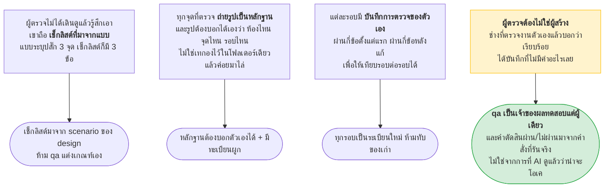
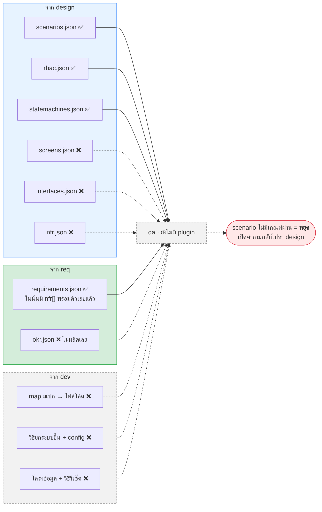
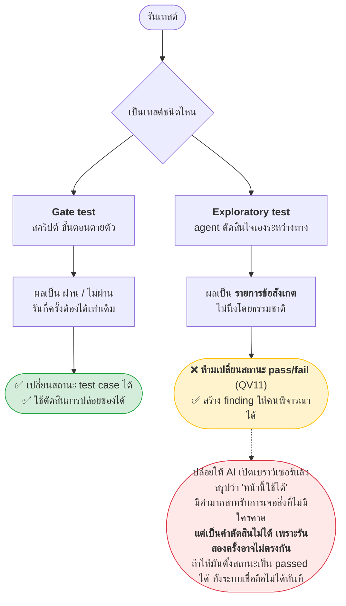
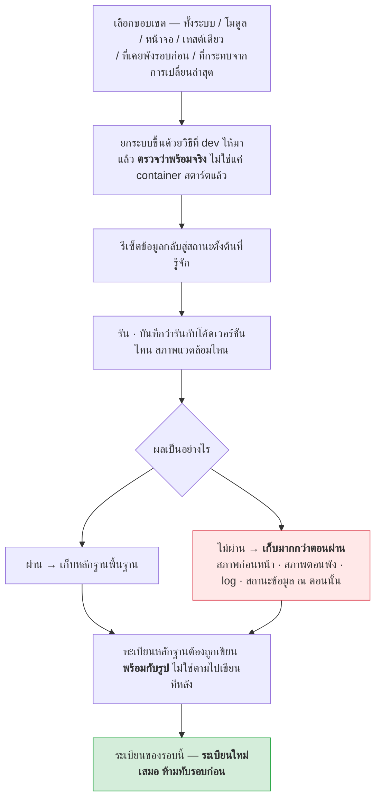
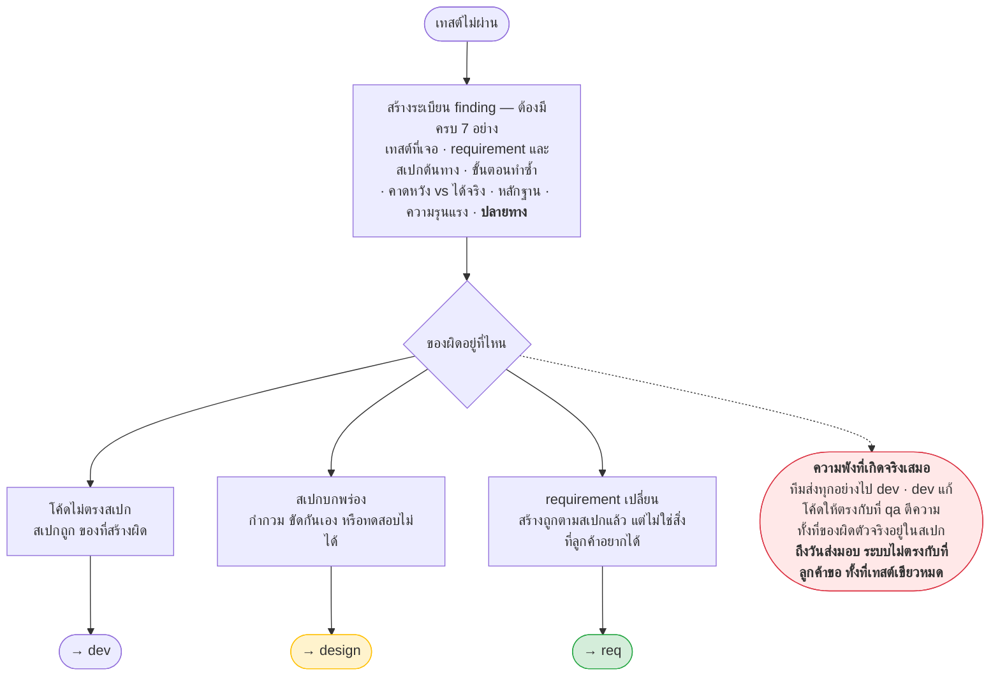
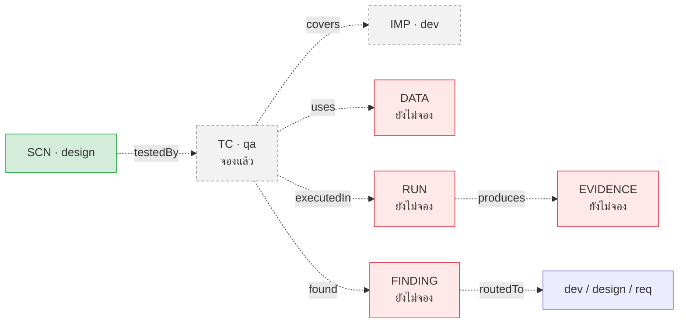

# qa — คู่มือของแบบ (Phase 4 · Verify)

> **ชั้นเอกสาร:** B · Authored — สคริปต์ห้ามเขียนทับ
> **owner:** user · **ทบทวนล่าสุด:** 2026-08-19 · **ตามมาตรฐาน:** [DOC-STANDARD v1.2](../standard/DOC-STANDARD.md)

## 🚧 ยังไม่มี plugin นี้ — ใบนี้คือคู่มือของ *แบบ* ไม่ใช่คู่มือการใช้งาน

**ไม่มี `/qa:*` ให้พิมพ์วันนี้** — ไม่มี `plugins/qa/` ไม่มีสคริปต์ ไม่มี fixture ไม่มีงานใน `docs/progress.json`
พิมพ์คำสั่งที่ขึ้นต้นด้วย `/qa:` แล้วจะได้คำตอบว่า **ยังไม่มี** และนั่นคือพฤติกรรมที่ถูกต้อง

ใบนี้เขียนไว้ให้ **คนที่จะลงมือสร้าง plugin ตัวนี้** — แปลง [`qa-plugin-requirements.en.md`](../requirement/qa-plugin-requirements.en.md)
(**Draft v0.1**) ให้อ่านเป็นภาพ พร้อมชี้จุดที่ยังไม่ได้เคาะ

> ⚠️ **ชื่อคำสั่งเป็นข้อเสนอ** — สิ่งที่ผูกมัดคือ **อินพุต · เอาต์พุต · เงื่อนไขว่าเสร็จ**
> 📌 **ขอบเขตของสเปกใบนี้ถูกตีความใหม่** — โจทย์ต้นทางพาดหัวว่า *"qa plugin for screen design"* ซึ่งดูเหมือนติดมาจากเอกสารของ `design`
> สเปกจึงตีความขอบเขตเป็น **การทดสอบระบบ** ตามรายละเอียดทุกข้อที่ตามมา · **ถ้าเจ้าของตั้งใจอย่างอื่น ต้องเคาะก่อนสร้าง**

| อยากรู้ว่า | เปิดที่ |
|---|---|
| **แบบของ `qa` เป็นยังไง** | **ใบนี้** |
| รอยต่อระหว่าง plugin · prefix ที่ถูกแก้ · คำถามที่ยังไม่มีเจ้าของ | [`aeon-overview.md`](aeon-overview.md) |
| เฟส 3 ที่ยังเป็นแบบเหมือนกัน | [`dev-manual.md`](dev-manual.md) |
| เฟส 1 · เฟส 2 ที่รันได้จริงแล้ว | [`req-manual.md`](req-manual.md) · [`design-manual.md`](design-manual.md) |

---

## 1. `qa` คืออะไร — ผู้ตรวจอาคาร

> **`qa` พิสูจน์ว่าสิ่งที่สร้าง ตรงกับสิ่งที่ลูกค้าขอ — ด้วยหลักฐานที่ตรวจซ้ำได้**



### สิ่งที่ `qa` ห้ามทำ (Non-Goals · §1.2)

- ❌ **ห้ามออกแบบระบบ หรือตัดสินเองว่าอะไรถูกต้องทางธุรกิจ** — เกณฑ์มาจาก `design`
- ❌ **ห้ามแก้โค้ดระบบ** — แก้ได้แค่โค้ดเทสต์ที่ตัวเองเป็นเจ้าของ
- ❌ **ห้ามตัดสินว่าจะปล่อยของหรือไม่** — มันรายงาน คนตัดสิน
- ❌ ห้ามทำ load test ระดับ infra หรือ penetration test เชิงลึก (ตัดออกก่อน · ดู QD10) · ห้าม deploy (ใช้ทางที่ `dev` ให้มา)

> **กฎแข็ง** — scenario ที่ไม่มีผลลัพธ์คาดหวังชัดเจน **`qa` ห้ามแต่งเกณฑ์เอง ต้องเปิดคำถามกลับไปหา `design`**
> *เทสต์ที่เกณฑ์ผ่านมาจากคนเทสต์ พิสูจน์ได้อย่างเดียวว่าระบบตรงกับสมมติฐานของคนเทสต์*

---

## 2. รับอะไรจากใครบ้าง — และวันนี้มีจริงแค่ไหน

`qa` เป็น plugin เดียวที่รับของจาก **สามทาง** พร้อมกัน



| อินพุต (qa §3.1) | จาก | บังคับไหม | มีจริงยัง |
|---|---|---|---|
| scenario ทดสอบ | design | บังคับ | ✅ `scenarios.json` |
| ตารางกำหนดสิทธิ์ | design | บังคับ | ✅ `rbac.json` |
| state machine | design | บังคับถ้ามี | ✅ `statemachines.json` |
| **NFR พร้อมตัวเลขเป้าหมาย** | design | บังคับ | ⚠️ **ครึ่งเดียว** — ดูกล่องข้างล่าง |
| หน้าจอพร้อมฟิลด์และ validation | design | บังคับถ้ามี UI | ❌ รอ `/design:sitemap` |
| สัญญา API | design | บังคับถ้ามี API | ❌ รอ `/design:interface` |
| map สเปก → ไฟล์โค้ด | dev | บังคับ | ❌ ไม่มี plugin |
| วิธียกระบบขึ้น + config | dev | บังคับ | ❌ ไม่มี plugin |
| โครงข้อมูล + วิธีรีเซ็ต | dev | บังคับ | ❌ ไม่มี plugin |
| OKR ที่ตกลงกันไว้ | req | แนะนำ | ❌ **`req` ไม่ผลิต และประตู 10 จงใจปล่อยให้ยังไม่มีเจ้าของ** |

> ✅ **NFR หาได้แล้ววันนี้ แม้ `/design:nfr` ยังไม่มี** — ประตู 11 เคาะว่า `NFR-` เป็นของ `req` ทั้งหมด
> และ `<state-dir>/req/requirements.json` ปล่อย `requirements[].nfr[]` ออกมาแล้วจริง พร้อม `id` · `kind` · `statement` · `verifiedBy`
> ```json
> { "id": "NFR-job-001", "kind": "performance",
>   "statement": "หน้ารายการงานต้องโหลดภายใน 2 วินาทีที่ 5,000 งาน", "verifiedBy": "load_test" }
> ```
> แปลว่า **QV5** (ทุก NFR ที่เป็นตัวเลขต้องมีเทสต์ที่วัดตัวเลขนั้นจริง) **มีของให้เริ่มได้แล้ว**
> สิ่งที่ยังขาดคือ *การขยายความ* ของ `/design:nfr` — วัดยังไง ส่วนประกอบไหนรับภาระเท่าไร — ไม่ใช่ตัวเลขเป้าหมาย

---

## 3. Gate test กับ Exploratory test — เส้นแบ่งที่โจทย์ต้นทางไม่ได้เขียนไว้

> **สเปกเตือนเองว่า** *"โจทย์ต้นทางไม่ได้แยกสองอย่างนี้ · ไม่แยก = มีปัญหาแน่นอน"* (§6.3)
> **นี่คือหัวข้อที่ถ้าพลาด รายงานทั้งชุดจะสวยและไร้ความหมาย**



---

## 4. ชั้นของการทดสอบ — และรูที่ยังไม่มีเจ้าของ

> **สเปกบอกให้เคาะข้อนี้ก่อนอย่างอื่น** — เป็นตะเข็บที่ `dev` กับ `qa` ทับกันง่ายที่สุด

| ชั้น | ทดสอบอะไร | เจ้าของที่เสนอ | ที่มาของเกณฑ์ |
|---|---|---|---|
| Unit | ตรรกะโดเมนและ invariant | **`dev`** (เขียนไปพร้อมโค้ด) | `BR@vN` ของ `req` |
| Integration | โมดูลคุยกัน · แตะฐานข้อมูลจริง | ⚠️ **`dev` หรือ `qa` — ยังไม่เคาะ (QD1)** | สัญญา API |
| API / Contract | endpoint ตรงสัญญา | **`qa`** | สัญญา API ของ `design` |
| UI / E2E | ผู้ใช้เดินงานจริงได้จบ | **`qa`** | scenario + หน้าจอ |
| Workflow | การเปลี่ยนสถานะเป็นไปตาม state machine ทั้งทางปกติและทางพัง | **`qa`** | `statemachines.json` |
| **Permission** | role เข้าถึงสิ่งที่ตารางอนุญาต และ **เข้าไม่ได้ในสิ่งที่ห้าม** | **`qa`** | `rbac.json` |
| NFR | เวลาตอบสนองและปริมาณงาน เทียบตัวเลขที่ระบุ | **`qa`** | `requirements[].nfr[]` ของ `req` |
| Exploratory | หาสิ่งที่ไม่มีใครคาด | **`qa`** (agentic) | ไม่มีที่มาตายตัว |

> 🔴 **ข้อที่ถูกลืมบ่อยที่สุด: การทดสอบสิทธิ์ต้องพิสูจน์ *ด้านลบ* ด้วย**
> ไม่ใช่แค่ว่าผู้จัดการเปิดหน้าจอได้ แต่คือ **พนักงานทั่วไปที่ยิง API ตรง ๆ ต้องถูกปฏิเสธจริง**
> **ซ่อนปุ่มไม่ใช่การคุมสิทธิ์** — ผูกกับ `design` A3/V26 และ `dev` DV16 เป็นเรื่องเดียวกันทั้งสามที่ (**QV6**)

**เลือกเครื่องมือ** — ตารางเงื่อนไข → เครื่องมือ แบบเดียวกับ skill routing ของ `dev`
เบราว์เซอร์ = Playwright (ค่าเริ่มต้นที่แนะนำ) · ต้องใช้เบราว์เซอร์ของผู้ใช้เอง = เครื่องมือ agentic ·
API และ unit = เครื่องมือประจำสแตกนั้น · **ไม่ตรงเงื่อนไขไหน = ถามผู้ใช้ ห้ามเดา**
กติกาเดียวกับ `dev`: ถามครั้งเดียว · **persist ก่อนตอบ** · ไม่ถามซ้ำ · override ได้ · ทุกการเลือกจดเหตุผล

---

## 5. รัน · เก็บหลักฐาน · เก็บประวัติ



**ชื่อไฟล์หรือที่อยู่ต้องบอกได้เองว่า เทสต์ไหน รอบไหน ขั้นไหน ผลอะไร — โดยไม่ต้องเปิดทะเบียน**
*รูปที่บอกตัวเองไม่ได้ คือขยะที่กินพื้นที่* (P6)

**ประวัติต้องตอบได้ 4 ข้อ** — เทียบรอบก่อน อะไรดีขึ้น อะไรถอยหลัง · เทสต์นี้เริ่มพังตั้งแต่เมื่อไหร่ และตอนนั้นโค้ดเปลี่ยนอะไร ·
เทสต์ไหนไม่นิ่ง (เดี๋ยวผ่านเดี๋ยวไม่ผ่านโดยโค้ดไม่เปลี่ยน) · ความครอบคลุมต่อ requirement กำลังขึ้นหรือลง

> 🔴 **ความไม่นิ่ง (flaky) ต้องมีนโยบายที่ประกาศไว้ ไม่ใช่จัดการเป็นราย ๆ ด้วยคำว่า "รันใหม่อีกทีสิ"**
> **นาทีที่ทีมรับนิสัยนั้น ชุดเทสต์ทั้งชุดจะหมดความหมายภายในเดือนเดียว**
> เทสต์ที่ไม่นิ่งต้อง **ถูกยกธงและถูกกันออกจากการตัดสิน gate จนกว่าจะซ่อมเสร็จ** (**QV13**)

**สองช่องว่างในโจทย์ต้นทางที่จะสร้างปัญหาแน่** (§8.2)

| ช่องว่าง | ทำไมต้องเคาะก่อนเริ่มเก็บหลักฐาน |
|---|---|
| **นโยบายเก็บรักษาหลักฐาน (QD3)** | รูป E2E กินที่เร็วมาก · รันวันละหลายรอบแล้วเก็บทุกอย่างไว้ตลอด = repo ใช้ไม่ได้ภายในไม่กี่สัปดาห์ · ต้องตัดสินว่ารอบที่ผ่านเก็บนานแค่ไหน เทียบกับรอบที่พัง (ปกติรอบที่พังควรเก็บนานกว่า) |
| **ข้อมูลส่วนบุคคลในรูป (QD4)** | ทดสอบด้วยข้อมูลเหมือนจริง = **ทุก screenshot กลายเป็นข้อมูลส่วนบุคคลที่ commit เข้า git ไปแล้ว** · ต้องตัดสินว่าใช้ข้อมูลสังเคราะห์ล้วน หรือปิดบังก่อนถ่าย (**QV14**) |

---

## 6. Finding — ไปหาใคร คือคำถามที่สำคัญที่สุด

**เทสต์ที่ไม่ผ่านต้องกลายเป็นระเบียนที่ติดตามได้ ไม่ใช่แค่ตัวหนังสือสีแดง**



**ทุก finding ต้องประกาศปลายทาง (QV12)** — และการแยกสามทางนี้คือสิ่งที่ทำให้ `qa` มีค่ามากกว่าการเป็นเครื่องรันเทสต์

---

## 7. เลือกว่าต้องรันอะไรใหม่ เมื่อมีการเปลี่ยนแปลง

**เดินกราฟ trace ย้อนกลับ** จาก artifact ที่เปลี่ยน ไปหา test case ที่ผูกอยู่ — จะได้ subset ไม่ต้องรันใหม่ทั้งหมด

> ⚠️ **แต่การเลือกบางส่วนเป็นดาบสองคม** (§12) — กราฟไม่ครบ แปลว่า **พลาดเทสต์ที่ควรรัน แล้วปล่อยข้อบกพร่องหลุดไป**
> **กติกา: เมื่อไม่มั่นใจในความครบของกราฟ ให้รันทั้งชุด** และ **รันทั้งชุดตามรอบเวลาที่กำหนดไว้ ไม่ว่าจะมีการเปลี่ยนแปลงหรือไม่**

---

## 8. Trace ที่ `qa` ต่อเพิ่ม — และ prefix ที่ยังไม่ได้เคาะ



> 🔴 **`DATA` `RUN` `EVIDENCE` `FINDING` ยังไม่ได้จดใน `ids.mjs` เลย** — ทั้งฝั่ง "ของเรา" และฝั่ง `NOT_OURS`
> **ไม่ใช่ของผิด แต่คือช่องว่างที่ต้องเคาะก่อนสร้าง** และเป็นชนิดเดียวกับที่ทำให้ `SCR-` `FN-` `SRC-` ชนกันมาแล้ว (ประตู 11)
> `TC-` จองไว้ให้ `qa` แล้ว — ตรวจได้ด้วย `node plugins/design/scripts/ids.mjs`

**`qa` ต่อ edge ได้เฉพาะของตัวเอง ลงไฟล์ `qa/trace.qa.json` ของตัวเอง** และ **ห้ามเขียน**: scenario ของ `design` ·
โค้ดระบบของ `dev` · tech profile ของ `dev` (**QV16**)

> **L1 คือรูที่ `qa` เสี่ยงที่สุดในทั้ง marketplace** — ถ้า `qa` บันทึกผลลงไฟล์ scenario ที่ `design` เป็นเจ้าของ
> วันที่ `design` regenerate **ผลเทสต์ทั้งชุดหายเงียบ ๆ** · ทางแก้คือ `qa` ถือผลไว้ในไฟล์ของตัวเอง (W1)

---

## 9. รายงาน — ความครอบคลุมสำคัญกว่าจำนวนที่ผ่าน

**ต้องมี 6 อย่าง** — จำนวนผ่าน/ไม่ผ่าน/ยังไม่ทดสอบ · **ความครอบคลุมเทียบ requirement** ·
รายการที่พังพร้อมหลักฐานและขั้นตอนทำซ้ำ · เทียบกับรอบก่อน · เทสต์ที่ไม่นิ่งแยกออกมา · สภาพแวดล้อมและเวอร์ชันที่ทดสอบ

> **ตัวเลขที่สำคัญที่สุดคือความครอบคลุม** — *"เทสต์ 200 ข้อ เขียวหมด"* ไม่ได้บอกอะไรเลยถ้าครึ่งหนึ่งของ requirement ไม่มีใครแตะ
> **รายงานต้องระบุ requirement ที่ไม่มีเทสต์เลย** ไม่ใช่แค่โชว์ว่าผ่าน 100%
> **P9 — ความครอบคลุมที่นับคือของ requirement ไม่ใช่ของบรรทัดโค้ด** · code coverage สูงพร้อม requirement coverage โหว่ คือการหลอกตัวเอง

**สองระดับ** — ฉบับลูกค้า (*สิ่งที่ขอไป ใช้ได้แล้วหรือยัง*) และฉบับทีม (*อะไรพัง พังตรงไหน*)

**7 คำถามที่ต้องตอบได้** (§7) — และสเปกย้ำว่านี่ **ไม่ใช่ฟีเจอร์แยก แต่เป็นผลพลอยได้ของ traceability ที่ครบ**

| # | คำถาม |
|---|---|
| 1–3 | หน้าจอนี้มีเทสต์อะไรบ้าง ชนิดไหน สถานะไหน · ใช้ข้อมูลอะไร ต้องเตรียมอะไรก่อน · อยู่ใน workflow ไหน ขั้นที่เท่าไร |
| 4–5 | requirement และ scenario ไหนทำให้เกิดเทสต์นี้ และมันแตะไฟล์โค้ดไหน · requirement นี้ทดสอบครบหรือยัง ขาดอะไร |
| **6** | **ไฟล์โค้ดนี้เปลี่ยน ต้องรันเทสต์ไหนใหม่** — *ผลตอบแทนสูงสุดของความพยายามเรื่อง traceability ทั้งหมด* |
| **7** | **เทสต์นี้พังไปกี่ครั้งใน 10 รอบหลัง** — *ตัวกันไม่ให้ทีมไถลเข้าสู่นิสัย "รันใหม่อีกทีเดี๋ยวก็ผ่าน"* |

---

## 10. ด่านตรวจ QV1–QV17

| กลุ่ม | กฎ | เรื่อง |
|---|---|---|
| ที่มาของเทสต์ | QV1 QV2 QV3 | ทุก scenario มี test case · ทุก test case สาวถึง scenario และ requirement · ทุกใบมีคำสั่งรันและเกณฑ์ผ่านที่ชัด |
| ความครอบคลุม | QV4 QV5 QV6 QV7 | ทุก requirement มีเทสต์หรือมีเหตุผลที่จดไว้ · ทุก NFR ที่เป็นตัวเลขมีเทสต์ที่วัดตัวเลขนั้น · **ทุก role มีเทสต์ทั้งด้านบวกและด้านลบ** · ทุก state และ transition ถูกครอบคลุม |
| หลักฐานและรอบ | QV8 QV9 | หลักฐานทุกชิ้นผูกกับ test case และรอบ ไม่มีรูปกำพร้า · ทุกรอบบันทึกเวอร์ชันโค้ดและสภาพแวดล้อม |
| 🔴 **ความน่าเชื่อถือ** | **QV10 QV11** | **ห้ามติ๊กว่าผ่านโดยไม่มีการรันจริง** · **ผลจาก agentic tool ห้ามเปลี่ยนสถานะ pass/fail ของ gate test** |
| การส่งต่อ | QV12 QV13 ⚠️ | ทุก finding ประกาศปลายทาง · เทสต์ไม่นิ่งถูกยกธงและกันออกจากการตัดสิน gate |
| ข้อมูลและสภาพแวดล้อม | QV14 QV15 | ข้อมูลทดสอบไม่มีข้อมูลส่วนบุคคลจริง · มีวิธีรีเซ็ตข้อมูลกลับสถานะตั้งต้นที่ใช้ได้จริง |
| ขอบเขตและความสด | QV16 QV17 | `qa` ไม่ได้เขียนไฟล์ของ plugin อื่น · ไม่มีของค้าง stale หลังต้นทางเปลี่ยน |

> 🔴 **QV10 กับ QV11 ปกป้องคุณค่าทั้งหมดของ plugin นี้**
> **ข้อใดข้อหนึ่งพัง รายงานจะกลายเป็นของสวยที่ไม่มีความหมายทันที**

---

## 11. ต้องเคาะอะไรก่อนถึงจะสร้าง `qa` ได้

| ต้องเคาะ | ปรากฏที่ | ทำไมบล็อก |
|---|---|---|
| **unit และ integration test เป็นของ `dev` หรือ `qa`** | **QD1** = dev **DD1** | **สเปกบอกเองว่าเคาะข้อนี้ก่อน** เพราะกระทบ `dev` และ `qa` พร้อมกัน · ไม่เคาะ = ได้ทั้งงานซ้ำและช่องโหว่ในเวลาเดียวกัน |
| **นโยบายเก็บรักษาหลักฐาน** | **QD3** | ไม่เคาะ = repo บวมจนใช้ไม่ได้ภายในไม่กี่สัปดาห์ · **ความเสียหายเกิดกับ repo จริง** |
| **ข้อมูลสังเคราะห์ หรือปิดบังข้อมูลจริง** | **QD4** | ผูกกับ PDPA โดยตรง และตัดสินว่า screenshot commit ได้ไหม · **ตัดสินช้า = ข้อมูลส่วนบุคคลอยู่ในประวัติ git ไปแล้ว** |
| **เกณฑ์และวิธีจัดการเทสต์ไม่นิ่ง** | **QD6** | ไม่มีเกณฑ์ = ทุกคนเลือก "รันใหม่" จนชุดเทสต์หมดความหมาย |
| **เกณฑ์ผ่านสำหรับการปล่อยของ** | **QD8** | 100% หรือยอมให้มีข้อบกพร่องเล็กน้อยได้ — และ **ใครเป็นคนตัดสิน** |
| ใครผลิตข้อมูลทดสอบ | **QD5** = dev DD5 = design D15 | `qa` ใช้ แต่ `dev` รู้โครงข้อมูล |
| **prefix ของ `RUN` `DATA` `EVIDENCE` `FINDING`** | §13 (ไม่มีเลข QD) | ยังไม่ได้จดใน `ids.mjs` — ดู §8 |
| ขอบเขตที่ตีความใหม่ถูกไหม | หัวสเปก | โจทย์ต้นทางพาดหัวว่า *"for screen design"* · สเปกตีความเป็นการทดสอบระบบ **ต้องให้เจ้าของยืนยัน** |

**ที่เหลืออีก 9 ข้อ** (QD2 · QD7 · QD9–QD15) อยู่ใน §17 ของสเปก · **คำถามที่คาบเกี่ยวหลาย plugin** ดูที่
[`aeon-overview.md`](aeon-overview.md) §8

---

## 12. ลำดับสร้าง (Build Order · §18)

| Milestone | ทำอะไร | พิสูจน์อะไร |
|---|---|---|
| **1 — รู้ว่าต้องทดสอบอะไร** | init → แปลง scenario เป็น test case ที่มี trace → ตอบได้ว่าหน้าจอนี้ต้องทดสอบอะไร | **เทสต์มาจากสเปก ไม่ใช่จากการแต่งขึ้น** |
| **2 — รันพร้อมหลักฐาน** | เลือกเครื่องมือ → ตั้งโครงโปรเจกต์เทสต์ → รันพร้อมเก็บหลักฐานแบบจัดหมวด | **ผลมาจากการรันจริง ไม่ใช่จากสิ่งที่ AI คาดว่าจะเป็น** |
| **3 — ประวัติและรายงาน** | บันทึกทุกรอบ → เทียบรอบต่อรอบ → รายงานตามขอบเขตที่ขอ | **เทียบข้ามรอบและรายงานความครอบคลุมได้ ไม่ใช่แค่นับจำนวนที่ผ่าน** |
| **4 — ต่อกับคนอื่น** | เลือก regression จากการเปลี่ยน → ส่ง finding ตามปลายทาง → ส่งต่อ deliver | ปิดวงกับทั้ง marketplace |

**ข้อจำกัดของ plugin เอง** — ไม่มีบริการเสียเงินเพิ่ม · รันบนเครื่องผู้เรียนทั่วไป ·
**เดินผ่านทะเบียนและ index ห้ามโหลดไฟล์ผลทั้งหมด เพราะประวัติโตเร็ว** · เข้าใจได้ในหนึ่งชั่วโมง ·
ใช้ได้ทั้งโปรเจกต์ที่ยังไม่มีเทสต์และที่มีเทสต์อยู่แล้ว · **ห้ามทำให้พื้นที่จัดเก็บโตแบบคุมไม่ได้**

---

## 13. ข้อสอบข้อสุดท้ายของทั้ง marketplace

เมื่อครบทั้งสี่ plugin ให้ถามคำถามเดียว (§19.2)

> **"requirement ข้อนี้ — ลูกค้าขออะไร · ออกแบบไว้ยังไง · ไฟล์โค้ดไหนสร้างมัน · เทสต์ข้อไหนพิสูจน์ · ผลล่าสุดคืออะไร · มีหลักฐานภาพไหม"**

**ตอบครบในคำตอบเดียวโดยไม่ต้องเปิดหาเอง = ทั้งระบบทำงานถูก** · วันนี้ตอบได้ **2 จาก 5 ช่วง** — ดู [`aeon-overview.md`](aeon-overview.md) §10

---

## 14. ตรวจว่าใบนี้ยังตรงกับของจริงไหม

**ใบนี้จะล้าสมัยทันทีที่ `qa` เกิดจริง** — ตอนนั้นให้เขียนคู่มือการใช้งานแบบเดียวกับ `req-manual.md` แล้วลดใบนี้เหลือแค่ที่มา

```bash
# 1. plugin เกิดแล้วหรือยัง
ls -d plugins/qa/ 2>/dev/null || echo "ยังไม่มี plugins/qa/ — ใบนี้ยังเป็นคู่มือของแบบ"

# 2. TC ยังจองไว้ให้ qa อยู่ไหม · RUN DATA EVIDENCE FINDING ถูกเคาะหรือยัง
node plugins/design/scripts/ids.mjs | grep -E "TC|RUN|DATA|EVIDENCE|FINDING"

# 3. NFR ที่ qa ต้องใช้ มาถึงในไฟล์สัญญาแล้วจริงไหม
node -e "const o=JSON.parse(require('fs').readFileSync('plugins/req/scripts/fixtures/clean/.aeon/req/requirements.json','utf8'));console.log(JSON.stringify(o.requirements.flatMap(r=>r.nfr||[]),null,1))"

# 4. design เขียน scenarios.json ให้แล้วหรือยัง
ls plugins/design/scripts/fixtures/clean/.aeon/design/modules/*/scenarios.json
```
