# req — คู่มือลำดับการเรียกใช้ (Phase 1)

> **ชั้นเอกสาร:** B · Authored — สคริปต์ห้ามเขียนทับ
> **owner:** user · **ทบทวนล่าสุด:** 2026-08-19 · **ตามมาตรฐาน:** [DOC-STANDARD v1.2](../standard/DOC-STANDARD.md)
>
> คู่มือใบนี้ตอบ **3 คำถามเท่านั้น** — สั่งอะไรก่อนหลัง · แต่ละคำสั่งเขียนไฟล์อะไรออกมา · จบแล้วสั่งอะไรต่อ
> อ้างอิงจาก `plugins/req/commands/*.md` (v0.3.1) ซึ่งเป็นต้นทางเดียวของขั้นตอน — ถ้าไฟล์นั้นขยับ ใบนี้ผิด

## อ่านใบไหน — ใบนี้ไม่ใช่คู่มืออ้างอิง

| อยากรู้ว่า | เปิดที่ |
|---|---|
| **สั่งอะไรก่อนหลัง · ได้ไฟล์อะไร · ต่อด้วยอะไร** | **ใบนี้** |
| แต่ละคำสั่งถามอะไร ตอบยังไง มีตัวอย่างเดินจริง | [`plugins/req/USER-GUIDE.md`](../../plugins/req/USER-GUIDE.md) |
| คำอธิบายสั้นทุกคำสั่งในเทอร์มินัล | `/req:help` |
| ขั้นตอนตัวจริงที่ Claude เดินตาม (ต้นทาง) | `plugins/req/commands/<คำสั่ง>.md` |
| ของจริงที่รันผ่านแล้ว ใช้เทียบตาได้ | `plugins/req/scripts/fixtures/clean/` |

> ⚠️ **`.aeon/` ในใบนี้คือค่าเริ่มต้น ไม่ใช่ค่าคงที่** — ลำดับจริงคือ `--spec <path>` > `--state-dir <ชื่อ>` > `$AEON_STATE_DIR` > `.aeon`
> ทุกคำสั่งถามชื่อจริงจาก `node "${CLAUDE_PLUGIN_ROOT}/scripts/state-dir.mjs"` ก่อนเขียนเสมอ · ในใบนี้เขียนว่า `<state-dir>/` เมื่อพูดถึงตัวแปร
> **ไฟล์ทั้งหมดในใบนี้เกิดในโปรเจกต์ที่ติดตั้ง plugin ไม่ใช่ใน repo ของ marketplace**

---

## 1. แผนที่รวม — ลำดับปกติ และจุดหยุด

**ไม่มีคำสั่งไหนเรียกคำสั่งถัดไปเอง** ทุกใบจบที่ 🛑 แล้วรอคนอนุมัติ · ลูกศรในผังคือ *"คนพิมพ์คำสั่งต่อไป"* ไม่ใช่ *"ระบบไหลต่อ"*

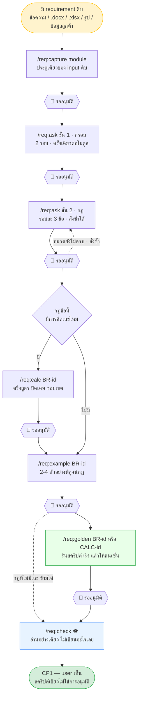

**อ่านผังนี้ผิดได้ 3 จุด — จำไว้:**

1. **`/req:calc` กับ `/req:golden` ไม่ใช่ของทุกกฎ** — เฉพาะกฎที่ `kind` เป็น `calculation` หรือกฎที่มีตัวเลขซ่อนอยู่
2. **`/req:ask` ชั้น 1 ต้องมี `sources[]` ก่อน** — การ์ดแดงของชั้น 1 ชี้ได้แค่ `SRC-xxx` เท่านั้น `/req:capture` จึงเป็นเงื่อนไขก่อนหน้า ไม่ใช่แค่ธรรมเนียม
3. **`/req:check` เขียนไฟล์ไม่ได้เลย แม้แต่เอกสารที่ค้าง** — เจอเอกสารเก่า มันรายงาน ไม่ซ่อม การซ่อมเป็นงานของ `/req:capture`

---

## 2. บล็อก regenerate — ท่าเดียวกันทุกคำสั่งที่เขียน

6 คำสั่งที่เขียน `spec.json` (`capture` `ask` `calc` `example` `golden` `change`) **ปิดท้ายด้วยชุดเดียวกันเสมอ**
ไม่ใช่แค่ `capture` — เข้าใจผิดข้อนี้แล้วจะคิดว่า wiki กับไฟล์สัญญาอัปเดตแค่ตอน capture

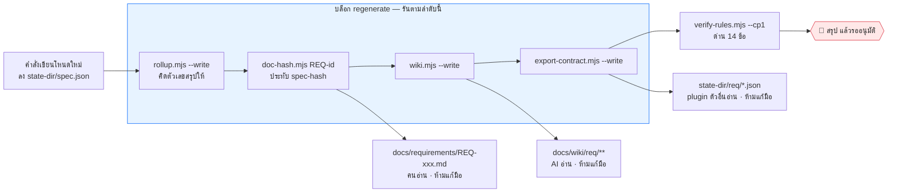

```
node "${CLAUDE_PLUGIN_ROOT}/scripts/rollup.mjs"          --root . --write
node "${CLAUDE_PLUGIN_ROOT}/scripts/doc-hash.mjs"        --root . [REQ-id]
node "${CLAUDE_PLUGIN_ROOT}/scripts/wiki.mjs"            --root . --write
node "${CLAUDE_PLUGIN_ROOT}/scripts/export-contract.mjs" --root . --write
node "${CLAUDE_PLUGIN_ROOT}/scripts/verify-rules.mjs"    --root . --cp1
```

- **ห้ามนับ `rollup` เอง** — นับเองแปลว่าต้องลากทั้งไฟล์เข้า context ทุกรอบ (field test รอบ 1 หมดไป ~449k token กับเรื่องนี้)
- **ห้ามคิด hash เอง** — เว้นวรรคหรือลำดับคีย์ต่างนิดเดียว เอกสารจะค้างตั้งแต่เกิด
- **อัปเดตแค่ `doc-hash` ไม่อัปเดต `wiki` = check ข้อ 12 แดง** โดยที่รายงานไม่ได้บอกว่าเพราะอะไร
- `wiki.mjs` เป็น idempotent — รันซ้ำไม่เขียนอะไร · `log.md` ต่อท้ายอย่างเดียว ไม่เคยถูกทับ

---

## 3. ตารางสรุป — อินพุต · ไฟล์ที่ได้ · คำสั่งถัดไป

| คำสั่ง | อาร์กิวเมนต์ | เขียนโหนดอะไรลง `spec.json` | ไฟล์ที่ได้เพิ่มนอก `spec.json` | ถัดไป |
|---|---|---|---|---|
| `/req:capture` | `[module] [file...]` | `sources[]` `glossary[]` `requirements[]` `rules[]` `examples[]` `questions[]` | `docs/sources/**` + บล็อก regenerate | `/req:ask` ชั้น 1 · หรือ `/req:change` ถ้ามีกฎถูกแช่แข็ง |
| `/req:ask` ชั้น 1 | `[หมวด]` | `requirements[].goal/business_value/actor/narrative` · `glossary[]` · `questions[]` | บล็อก regenerate | `/req:ask` ชั้น 2 |
| `/req:ask` ชั้น 2 | `[หมวด]` | `rules[]` (`BR@v1` draft) · `glossary[]` · `questions[]` · `deferred_questions[]` | บล็อก regenerate | `/req:ask` ซ้ำ · `/req:calc` · `/req:example` · `/req:change` |
| `/req:calc` | `<BR-id>` | `calculations[]` (`CALC@v1`) + `rules[].constrained_by` | บล็อก regenerate | `/req:example` แล้ว `/req:golden` |
| `/req:example` | `<BR-id>` | `examples[]` (`EX-xxx` · `proves[]`) | บล็อก regenerate | `/req:check` หรือกฎข้อถัดไป |
| `/req:golden` | `<BR-id\|CALC-id>` | `golden_datasets[]` (`GD-xxx`) + `rules[].golden` | **`<state-dir>/golden/<CALC-id>.mjs`** + บล็อก regenerate | เลขตรง → `/req:check` · เลขไม่ตรง → `/req:calc` |
| `/req:change` | `<BR-id\|CALC-id>` | `@v(n+1)` + `changes[]` (`CHG-xxx`) + ปิดโหนดเก่า | บล็อก regenerate | `/req:change` ที่ `CALC` · `/req:golden` · `/req:example` |
| `/req:check` 👁 | `[--cp2]` | **ไม่เขียนอะไรเลย** | — | คำสั่งเดียวที่มันแนะ (มันไม่รันให้) |
| `/req:help` 👁 | — | **ไม่เขียนอะไรเลย** | — | — |

> 👁 = อ่านอย่างเดียว · `/req:change` **เป็นทางเดียวในระบบที่ผลิต `@v(n+1)` ได้** ไม่มีคำสั่งอื่นทำแทน และนั่นคือข้อบังคับ ไม่ใช่ความสะดวก

---

## 4. ทีละคำสั่ง — ลำดับการเรียกภายใน

ทุกผังในหัวข้อนี้อ่านแบบเดียวกัน: **user** พิมพ์คำสั่ง → **Claude** เดินตาม `commands/<คำสั่ง>.md` → เรียก **สคริปต์** → เกิด **ไฟล์** → 🛑 หยุด

### 4.1 `/req:capture [module] [file...]` — ประตูเดียวของ input ดิบ

ยุบ `/req:new` + `/req:import` + `/req:append` มาไว้ใบเดียว เพราะของเข้ามาเป็นกองผสม ไม่ได้เข้ามาทีละชนิด

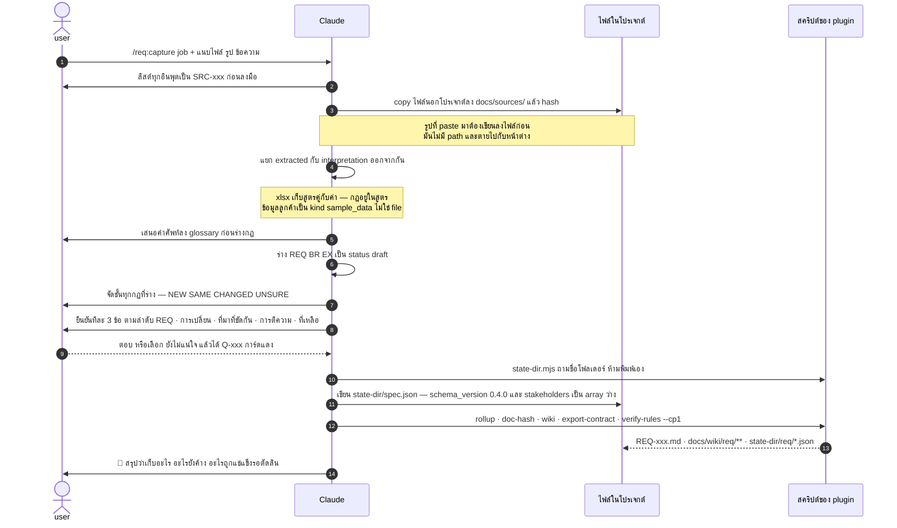

**ได้ไฟล์อะไร**

| ไฟล์ | เกิดเมื่อไหร่ |
|---|---|
| `docs/sources/<ไฟล์>` | มีไฟล์จากนอกโปรเจกต์ หรือมีรูป paste เข้ามา |
| `<state-dir>/spec.json` | เสมอ — ครั้งแรกคือการสร้างไฟล์ |
| `docs/requirements/REQ-xxx.md` · `docs/wiki/req/**` · `<state-dir>/req/*.json` | เสมอ (บล็อก regenerate) |

**เรียกอะไรต่อ**

- โมดูลนี้ยังไม่เคยตั้งกรอบ → **`/req:ask` ชั้น 1** · capture คือเงื่อนไขก่อนหน้าของมัน เพราะเป็นคนสร้าง `SRC` ให้การ์ดแดงชี้
- มีกฎถูกจัดชั้นเป็น ⚠️ CHANGED → **`/req:change <BR-id@v>`** · capture **ไม่ยกเวอร์ชันให้** มันแช่แข็งแล้วบอกให้ไปสั่งเอง
- มีคู่คำที่ชนกันแล้วยังไม่ตัดสิน → รายงานไว้ให้รอบ `language` ของชั้น 1 เคลียร์

> **`spec.json` เวอร์ชันเก่าห้ามแก้เลข `schema_version` เอง** — `const` ในสคีมาทำให้ไฟล์ตกทั้งใบ ไม่มีสภาพ "ผ่านบางส่วน"
> ```
> node "${CLAUDE_PLUGIN_ROOT}/scripts/migrate-spec.mjs" --root .           # dry run
> node "${CLAUDE_PLUGIN_ROOT}/scripts/migrate-spec.mjs" --root . --write   # ทำจริง ทิ้ง .bak ไว้
> ```

### 4.2 `/req:ask [หมวด]` — ตั้งกรอบก่อน แล้วค่อยถามกฎ

คำสั่งที่ถูกสั่งบ่อยที่สุด · ออกแบบมาให้สั่งซ้ำ · ยิงครั้งละ **3 ข้อพอดี** พร้อม ⭐ เลือกไว้ให้แล้ว

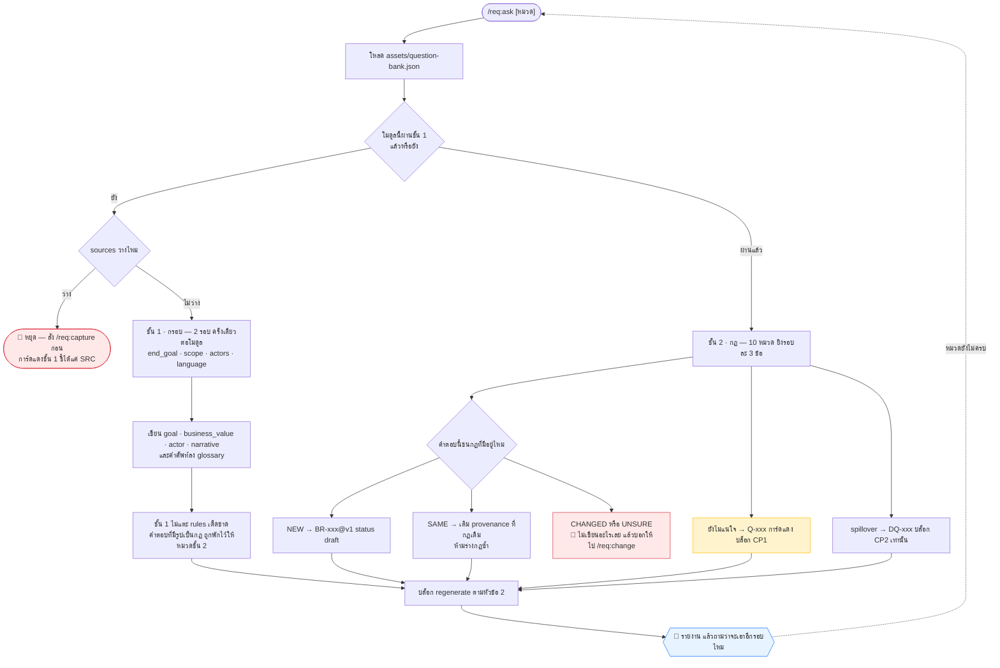

**ได้ไฟล์อะไร** — บล็อก regenerate ทั้งชุด ไม่มีไฟล์พิเศษของตัวเอง

**เรียกอะไรต่อ**

| สถานะหลังจบรอบ | คำสั่งถัดไป |
|---|---|
| เพิ่งจบชั้น 1 | `/req:ask` (ชั้น 2 จะถูกเลือกให้เอง) |
| หมวดชั้น 2 ยังไม่ครบ | `/req:ask [หมวด]` ซ้ำ |
| ได้กฎที่มีการคิดเลข | `/req:calc <BR-id>` |
| กฎครบแล้ว | `/req:example <BR-id>` — ไพ่น้ำเงินก่อนไพ่เขียว |
| มีคำตอบชนกฎเดิม | `/req:change <BR-id@v>` — `ask` **ไม่เคย**ยกเวอร์ชันเอง |

> **`ask` แก้ร่างของตัวเองทับที่เดิมได้ ก็ต่อเมื่อครบทั้ง 5 ข้อ** — `status` เป็น `draft` · `version` เป็น 1 · ยังไม่มี `examples[]` ·
> ไม่มี `CALC` ผูก · ไม่มี `GD`/`CHG` อ้างถึง · ขาดข้อเดียว = ไม่แก้ แล้วบอกว่าติดข้อไหน
> ทั้ง 5 ข้ออ่านจาก `spec.json` ตรง ๆ ไม่มีข้อไหนให้ AI ตัดสิน
> **ชั้น 1 ทั้งชั้นยังเป็น `provisional`** — ยังไม่ผ่านสนามจริง ต้องบอกผู้ใช้หนึ่งครั้งต่อโมดูล

### 4.3 `/req:calc <BR-id>` — สัญญาการคำนวณ

กฎบอกว่า **อะไรต้องเป็นจริง** · สัญญาการคำนวณบอกว่า **ตัวเลขถูกผลิตยังไง** — สองคนเขียนกฎเดียวกันถูกทั้งคู่แล้วได้ตัวเลขต่างกันหนึ่งสตางค์ ทุกครั้งสาวกลับมาที่ฟิลด์ที่ไม่มีใครเขียนไว้

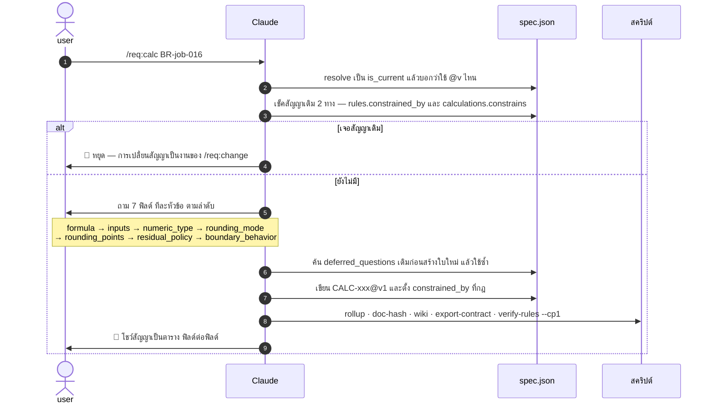

**7 ฟิลด์ และราคาของการไม่เขียนมัน**

| ฟิลด์ | ไม่เขียนแล้วเกิดอะไร |
|---|---|
| `formula` | ทุกคนประกอบสูตรกลับมาจากความจำ คนละแบบ |
| `inputs[]` | ชนิดข้อมูลผสมกันแล้วตัดทศนิยมทิ้งเงียบ ๆ |
| `numeric_type` | **float แทน 0.1 ไม่ได้ — เงินเพี้ยนแล้วไม่มีขั้นตอนไหนซ่อมได้** · enum ไม่มีค่า `float` เลย |
| `rounding_mode` | แต่ละภาษาปัดไม่เหมือนกัน .NET ปัดครึ่งไปเลขคู่ |
| `rounding_points` | **ที่ไหน** ไม่ใช่แค่ **ยังไง** — ปัดทุกงวดกับปัดครั้งเดียวตอนท้าย ต่างกันเป็นบาท |
| `residual_policy` | ยอดที่ไม่มีวันปิดลงศูนย์ · **ไม่มีเศษก็ปล่อย null ห้ามแต่งขึ้นมาให้เต็มช่อง** |
| `boundary_behavior[]` | หารด้วยศูนย์ที่ไม่มีใครเขียนไว้ หลุดขึ้น production |

**เรียกอะไรต่อ** — `/req:example <BR-id>` (ตัวอย่างที่ดีของกฎคิดเลขคือตัวอย่างที่ยืนบนขอบเขตของสัญญา) แล้ว `/req:golden`

> **คำสั่งนี้ห้ามคำนวณเลขสักตัว** — การผลิตตัวเลขเป็นงานของ `/req:golden` ที่รันโค้ดจริงแล้วให้คนเซ็น
> สูตรที่เจ้าของยืนยัน ≠ คำตอบที่มีคนตรวจแล้ว · และห้ามอ้าง `sample_data` เป็นที่มาของสัญญา — ข้อมูลลูกค้าเป็นหลักฐานของ **ค่า** ไม่ใช่ของ **กฎ**

### 4.4 `/req:example <BR-id>` — ไพ่เขียว

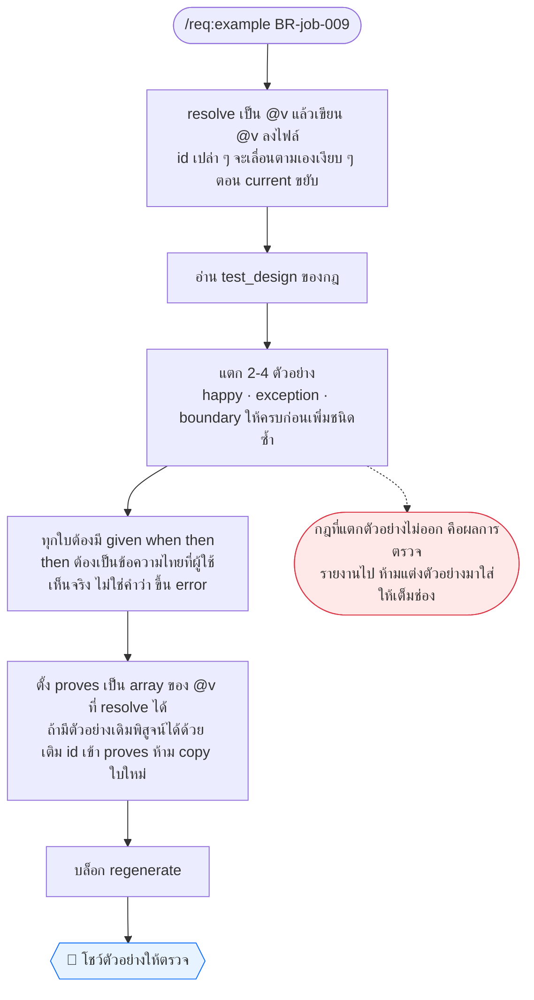

**`test_design` บอกว่าต้องแตกกี่ใบ** — `state_transition` = ย้ายถูก 1 · ย้ายผิด 1 · ที่สถานะปิด 1 · `decision_table` = ใบละสาขาที่เปลี่ยนผล · `BVA` = ที่ขอบ กับข้างละใบ · `EP` = ตัวแทนคลาสละใบ

**เรียกอะไรต่อ** — กฎข้อถัดไป หรือ `/req:check` เมื่อครบ · กฎที่มี `CALC` → `/req:golden`

### 4.5 `/req:golden <BR-id|CALC-id>` — เลขเฉลย

คำสั่งชนิด **Verify** ใบเดียวใน Phase 1 · ใบอื่นเก็บสิ่งที่คนพูด ใบนี้ผลิตตัวเลขแล้วถามว่ามันถูกไหม

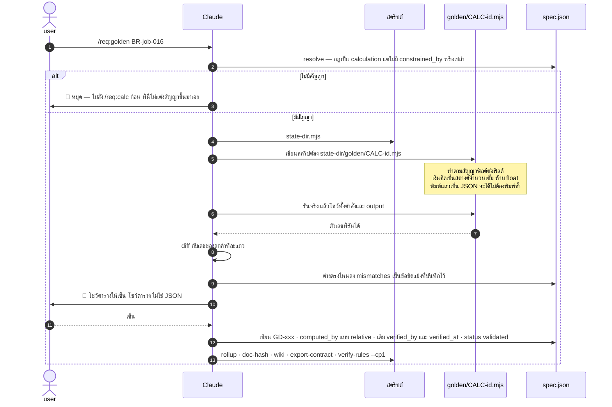

**ได้ไฟล์อะไร** — `<state-dir>/golden/<CALC-id>.mjs` (**เก็บไว้เพื่อรันซ้ำได้ ไม่ใช่ผลลอย ๆ**) + บล็อก regenerate
ตัวจริงดูได้ที่ `plugins/req/scripts/fixtures/clean/.aeon/golden/CALC-job-001@v1.mjs`

**4 ข้อที่ต่อรองไม่ได้**

1. **ห้ามคิดเลขในหัว และห้ามเขียนเลขที่ไม่ได้รัน** — ผลเลขที่โมเดลให้เหตุผลออกมา แยกไม่ออกจากการเดาที่ฟังดูเข้าท่า
2. **ตัวเลขเป็นแค่ข้อเสนอจนกว่าคนจะเซ็น** — `verified_by`/`verified_at` ว่างไว้ได้อย่างสุจริต check 13 แค่เตือน ไม่บล็อก
3. **เลขไม่ตรงสัญญา = สัญญาเปลี่ยน ไม่ใช่เลขเปลี่ยน** — แก้เลขเฉลยให้เข้าสูตร คือทำลายเครื่องตรวจอิสระชิ้นเดียวของ Phase 1 แบบเงียบ ๆ
4. **ข้อมูลลูกค้าเป็นอินพุต ไม่ใช่กฎ** — แถวที่ไม่ตรงมักแปลว่ามีกฎที่ไม่มีใครบอกเรา และนั่นคือผลลัพธ์ที่มีค่าที่สุดที่ plugin นี้ผลิตได้

**เรียกอะไรต่อ** — ตรงหมด → `/req:check` · ไม่ตรง → **`/req:calc`** (ลูป L2 ในหัวข้อ 5) ไม่ใช่ไปแก้เลข

### 4.6 `/req:change <BR-id|CALC-id>` — ทางเดียวที่เกิด `@v(n+1)`

ไม่ใช่ความสะดวก แต่เป็นข้อบังคับ — ถ้า `capture` ยกเวอร์ชันได้ด้วย จะมีสองทางผลิตโหนดเดียวกัน ซึ่งเป็นสิ่งเดียวที่ doctrine ห้ามตรง ๆ

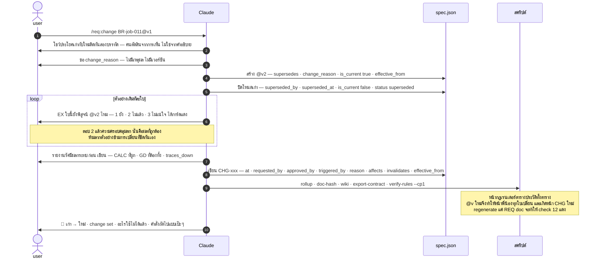

**`effective_from` อยู่บนโหนดเวอร์ชัน ไม่ใช่แค่บน `CHG`** — check 14 เป็นแค่ warn การเดินจาก `CHG` กลับมาที่โหนดจึงไม่การันตี
ถ้าวันที่อยู่แค่บน `CHG` คำถาม *"งานใบนี้สร้างตอนกฎเวอร์ชันไหน"* จะตอบไม่ได้พอดีตอนที่ลูกค้าถาม
`effective_from` (มีผลในโลกจริงเมื่อไหร่) กับ `superseded_at` (เลิกเป็น current ที่นี่เมื่อไหร่) คนละวัน ทุกครั้งที่ตกลงกันก่อนวันมีผล — ซึ่งเป็นกรณีปกติ

**เรียกอะไรต่อ — สั่งเอง ทีละใบ คำสั่งนี้ไม่รันตามให้**

1. `/req:change <CALC-id@v>` — กฎเปลี่ยนมักแปลว่าสัญญาต้องยกเวอร์ชันด้วย และนั่นคือ `/req:change` ใบที่สอง ไม่ใช่การแก้
2. `/req:golden <BR-id>` — `GD` ที่คำนวณใต้สัญญาเก่าไม่ใช่หลักฐานอีกแล้ว ต้องรันใหม่
3. `/req:example <BR-id>` — ถ้ามีตัวอย่างถูกปลด ความครอบคลุมจะตก · **ห้ามซ่อมด้วยการเติมตัวอย่างในคำสั่งนี้**

> **ห้ามแก้เวอร์ชันเดิมทับที่** — โหนดที่ถูก supersede ต้องอ่านได้ตลอดไป feature และ test ที่สร้างบน `@v1` ยังชี้ `@v1` อยู่
> นั่นคือวิธีที่ประโยค *"ตอนสร้างงานใบนั้น กฎยังเป็นอีกแบบ"* ยังตอบได้

### 4.7 `/req:check [--cp2]` 👁 — สถานะ + ด่าน CP1

**อ่านอย่างเดียว เขียนไม่ได้เลย แม้แต่เอกสารที่ค้าง** · ยุบ `/req:gap` เข้ามาแล้ว เพราะทั้งคู่อ่าน output ของตัวตรวจตัวเดียวกัน

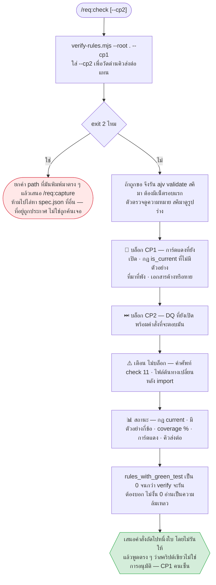

**แปลผลเป็นการกระทำ**

| เจออะไร | ทำอะไร |
|---|---|
| การ์ดแดงยังเปิด | ไปเอาคำตอบมา · **ห้ามปิดด้วยการเดา** |
| กฎไม่มีตัวอย่าง | `/req:example <BR-id>` หรือยอมรับว่าประโยคกฎกำกวมเกินกว่าจะสร้างตาม |
| hash ไม่ตรง ⚠️ | คำพูดที่บันทึกไว้อาจไม่ตรงไฟล์แล้ว — ไปอ่านต้นทางใหม่ |
| เอกสารค้าง | `/req:capture` แบบไม่แนบอะไร มันจะ regenerate ให้ · **ห้ามแก้ `.md` เอง** |

> **ห้ามลดโทนรายงาน** — กฎที่ไม่มีตัวอย่างไม่ใช่ "ก็เกือบโอเคแล้ว"

### 4.8 `/req:help` 👁

พิมพ์คำอธิบายทุกคำสั่งพร้อมตัวอย่าง ภาษาไทย · ไม่เขียนไฟล์ · สั่งได้ทุกเมื่อ

---

## 5. เส้นทางที่ไม่ตรง — ลูปที่เกิดจริงบ่อยที่สุด

เส้นตรงในหัวข้อ 1 คือกรณีที่ทุกอย่างเรียบร้อย · ของจริงเดินสองลูปนี้เสมอ

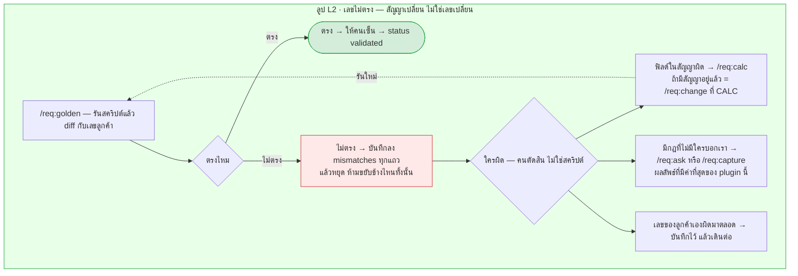

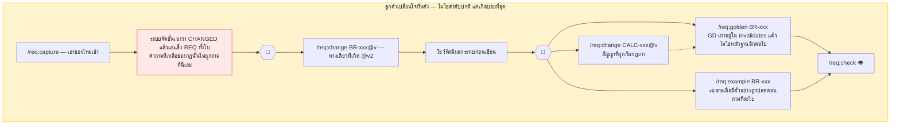

> ลูกศรจาก 🛑 ทั้งสามเส้น **คือคนพิมพ์คำสั่ง** · `/req:change` ประกาศไว้ตรง ๆ ว่า *"ห้ามรันคำสั่งตามให้ ต่อให้มันชัดแค่ไหน"*
> เชนที่รันสามคำสั่งจากคำสั่งเดียว คือ orchestration ที่ทั้ง plugin นี้ตั้งใจหนี

---

## 6. แผนที่ไฟล์ผลลัพธ์ — ใครเขียน ใครอ่าน แก้มือได้ไหม

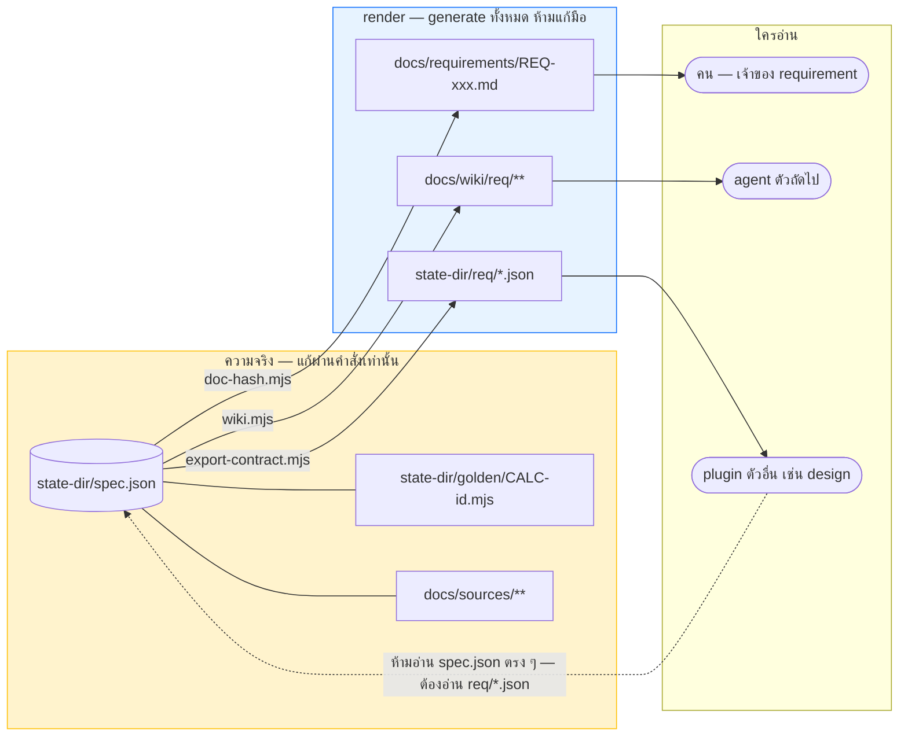

| ไฟล์ | ใครเขียน | แก้มือได้ไหม |
|---|---|---|
| `<state-dir>/spec.json` | 6 คำสั่งที่เขียน | ❌ แก้ผ่านคำสั่ง · `rollup` ให้สคริปต์นับ |
| `<state-dir>/golden/<CALC-id>.mjs` | `/req:golden` | ❌ ถ้าสูตรเปลี่ยน ให้เปลี่ยนที่สัญญาแล้วรันใหม่ |
| `docs/sources/**` | `/req:capture` | ❌ เป็นต้นฉบับที่ hash ผูกอยู่ |
| `docs/requirements/REQ-xxx.md` | `doc-hash.mjs` | ❌ อยากแก้เนื้อความ → แก้ `narrative` ใน `spec.json` แล้วสั่ง `/req:capture` เปล่า ๆ |
| `docs/wiki/req/**` | `wiki.mjs` | ❌ แก้มือแล้วหน้าจะขึ้น STALE และ check 12 แดง · `log.md` ต่อท้ายอย่างเดียว |
| `<state-dir>/req/*.json` | `export-contract.mjs` | ❌ `req` เป็นเจ้าของคนเดียว |

**`<state-dir>/req/` — ประตูออกไปหา plugin ตัวอื่น**

| ไฟล์ | เขียนเมื่อไหร่ |
|---|---|
| `requirements.json` · `glossary.json` · `change-set.json` | ทุกครั้งที่คำสั่งใดก็ตามเขียน `spec.json` |
| `stakeholders.json` | **เฉพาะเมื่อ `stakeholders[]` ไม่ว่าง** — array ว่างแปลว่า "ถามแล้ว ไม่มีใครเพิ่ม" ส่วนไม่มีไฟล์แปลว่า "ยังไม่ได้เก็บ" สองสถานะนี้ยุบรวมกันไม่ได้ |
| `okr.json` | **ไม่ผลิตเลย** — ไม่มี OKR ในสคีมา และไม่มีคำถามไหนในคลังถามถึงมัน |

> **ไม่มีคำสั่งสำหรับ export** — ชุดคำสั่งของ `req` หยุดที่ 8 ตัว ไฟล์สัญญาจึงถูกเขียนใหม่อัตโนมัติในบล็อก regenerate
> ไฟล์สัญญาที่ต้องรอคนสั่งอัปเดต คือไฟล์ที่จะล้าสมัยแน่นอน

---

## 7. สี่กติกาที่ทำให้ผังทั้งหมดข้างบนเป็นจริง

1. **🛑 ทุกใบ ไม่มีข้อยกเว้น** — คำสั่งจบแล้วรอคนอนุมัติ ไม่มีใบไหนไหลไปใบถัดไปเอง แม้ใบถัดไปจะชัดเจนแค่ไหน
2. **`/req:change` เป็นทางเดียวที่ผลิต `@v(n+1)`** — `capture` และ `ask` เจอกฎที่เปลี่ยนแล้วต้องหยุดและชี้มาที่นี่ ไม่มีทางที่สอง
3. **ตัวเลขทุกตัวมาจากสคริปต์** — `rollup` นับ · `doc-hash` แฮช · `golden/*.mjs` คำนวณ · ไม่มีตัวไหนให้นับด้วยมือแล้วพิมพ์ลงไฟล์
4. **ไม่รู้ = การ์ดแดง ไม่ใช่การเดา** — `Q-xxx` บล็อก CP1 และการเปิดการ์ดแดงคือผลลัพธ์ที่ดี ไม่ใช่ความล้มเหลว

| | การ์ดแดง `Q-xxx` | คิวส่งต่อ `DQ-xxx` |
|---|---|---|
| คือ | **ไม่รู้คำตอบ** ต้องถามลูกค้า | **รู้ว่าจะตอบยังไง** แต่ต้องเห็น entity ก่อน |
| ตัวอย่าง | "ใครเป็นคนอนุมัติ" | "ปัดกี่ตำแหน่ง · `decimal(p,s)` เท่าไหร่" |
| บล็อก | **จบ Phase 1 ไม่ได้** | บล็อก Phase 2 — Phase 1 ผ่านได้ตามปกติ |
| ใครเปิดได้ | ทุกคำสั่ง | `/req:ask` ชั้น 2 และ `/req:calc` เท่านั้น (สคีมาปิดหมวดไว้ให้ชั้น 2) |

---

## 8. คำสั่งที่ไม่มี และจะไม่มี

| คำสั่ง | สถานะ |
|---|---|
| `/req:rule` | ❌ **ตัดถาวร** — เพิ่มกฎ = `/req:ask` · ดูกฎ = เปิด `docs/wiki/req/rules/index.md` · แก้กฎ = `/req:change` |
| `/req:new` `/req:import` `/req:append` | ยุบเข้า `/req:capture` |
| `/req:gap` | ยุบเข้า `/req:check` |
| `/req:impact` `/req:lock` | ⏸ ยังไม่ตัดสิน — สั่งไปตอนนี้ Claude จะบอกว่ายังไม่มี ไม่เดาทำให้ |

**ชุดคำสั่งหยุดที่ 8 ตัว ไม่ยุบเพิ่ม ไม่เพิ่มใหม่** (CLAUDE.md §5 ประตู 4) — งานที่ไม่ต้องให้คนตัดสินอะไรเลย เช่นการปล่อยไฟล์สัญญา ถูกทำเป็น **สคริปต์ในบล็อก regenerate** ไม่ใช่คำสั่งใบที่ 9

---

## 9. ตรวจว่าใบนี้ยังตรงกับของจริงไหม

คู่มือใบนี้เป็นเอกสารชั้น B — เขียนด้วยมือ ไม่มีสคริปต์ไหน generate หรือ verify มัน จึงล้าสมัยได้เงียบ ๆ
เทียบกับต้นทางด้วย 3 คำสั่งนี้ (รันใน repo ของ marketplace)

```bash
# 1. ยังมี 8 คำสั่งเท่าเดิมไหม
ls plugins/req/commands/*.md

# 2. ทุกใบยังมี 🛑 ไหม — ต้องเจอครบ 8 ไฟล์ ไม่มีไฟล์ไหนได้ 0
#    (check.md กับ help.md นับเจอเพราะ 🛑 อยู่ในรายงานของมัน ไม่ใช่เพราะมันหยุดเขียนไฟล์)
grep -c "🛑" plugins/req/commands/*.md

# 3. บล็อก regenerate ยังเป็น 4 สคริปต์เดิมไหม — ต้องเจอครบทุกใบที่เขียน
grep -l "export-contract.mjs" plugins/req/commands/*.md
```

ตัวเลขสัญญาของด่านทั้งหมดอยู่ที่ [`CLAUDE.md` §3](../../CLAUDE.md) — **ห้าม copy มาไว้ที่นี่** ข้อเท็จจริงหนึ่งอย่างมีที่อยู่ที่เดียว
