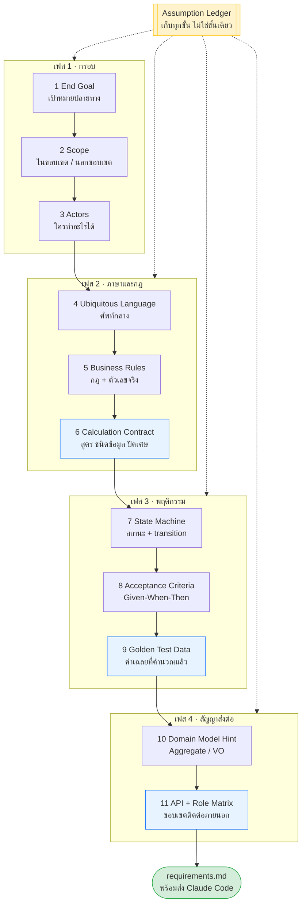
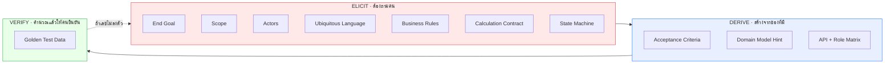
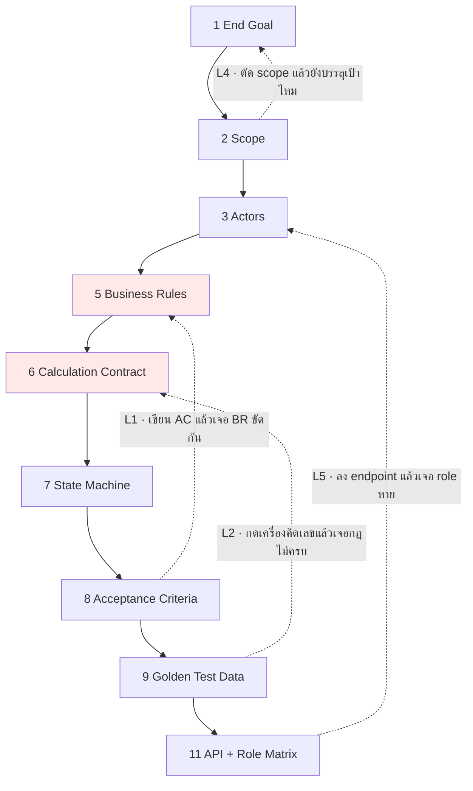

# Requirement Pipeline — Diagram + Node Cards

> **ชั้นเอกสาร:** B · Authored (วัตถุดิบสไลด์) — สคริปต์ห้ามเขียนทับ
> **owner:** พี่ปู · **ทบทวนล่าสุด:** 2026-08-13 · **ตามมาตรฐาน:** [DOC-STANDARD v1.1](standard/DOC-STANDARD.md)
>
> วัตถุดิบสำหรับสไลด์ช่วง "ลำดับการเก็บ requirement" (~10 นาที)
> Mermaid ทุกบล็อกวางลง Obsidian / marp / reveal.js ได้เลย
>
> **ไฟล์นี้ถูกอ้างเป็นเหตุผลของการตัดสินใจจริง** — CLAUDE.md §5 ประตู 4 ใช้ "ขั้น 6 🔵" ของที่นี่
> เป็นเหตุผลว่าทำไม `/req:calc` ถึงไม่ถูกยุบเข้า `/req:ask` · แก้การ์ดใบไหนต้องรู้ว่ามีคนยืนอยู่บนมัน

---

## สไลด์ 1 — ภาพรวม: 11 ขั้น 4 เฟส

**สีฟ้า = 3 ขั้นที่เอกสารทั่วไปไม่มี** และเป็นเหตุผลว่าทำไม LLM ถึงเขียนโค้ดผิดทั้งที่ requirement "ครบ"

**ประโยคพูดบนเวที:** "ลำดับนี้ไม่ได้เรียงตามความสวย แต่เรียงตาม dependency — ขั้นก่อนหน้าคือวัตถุดิบของขั้นถัดไป ลองสลับดูจะพังทันที"

---

## สไลด์ 2 — งาน 3 ชนิดที่ไม่เหมือนกัน

> จุดที่คนสอน requirement ส่วนใหญ่ข้าม: ไม่ใช่ทุกขั้นได้มาด้วยการ "ถาม"

| ชนิด | ใครเป็นแหล่งความจริง | ถ้าทำผิดชนิด |
|------|---------------------|--------------|
| **Elicit** | คน — stakeholder เท่านั้น | เดาแทนลูกค้า เอกสารดูดีแต่ผิด |
| **Derive** | เอกสารเอง — สร้างต่อยอดได้ | ไปถามลูกค้าว่าอยากได้ Aggregate อะไร ลูกค้างง |
| **Verify** | เครื่องคิดเลข + คนยืนยัน | ไม่มีเฉลย → LLM เขียน test ยืนยันบั๊กตัวเอง |

**ประโยคพูดบนเวที:** "ถ้าเอาข้อ Derive ไปถามลูกค้า คุณกำลังโยนงานตัวเองให้เขา ถ้าเอาข้อ Elicit ไปเดาเอง คุณกำลังเขียนนิยาย"

---

## สไลด์ 3 — Feedback Loop: การย้อนกลับคือสัญญาณว่าทำถูก

| Loop | เกิดเมื่อ | ตัวอย่างจริงจาก MiniLoan |
|------|----------|-------------------------|
| **L1** AC → BR | เขียน Given-When-Then แล้วเขียนไม่ออก | US-05 ให้เจ้าหน้าที่ปรับวงเงิน แต่ US-02 ล็อกการแก้ไขไปแล้ว |
| **L2** Golden → Calc | ลงมือคำนวณจริง | EMI งวดสุดท้าย 9,504.**43** ไม่เท่างวดอื่น — เพิ่งรู้ตอนกดเลข |
| **L4** Scope → Goal | ตัดของออกเยอะ | ตัด collection ออกแล้ว ระบบยังเรียกว่าระบบสินเชื่อได้ไหม |
| **L5** API → Actors | เขียน endpoint แล้ว | Applicant ยิง `/approve` ได้ไหม — ไม่มีใครเคยตอบ |

**ประโยคพูดบนเวที:** "ในตำรามันเป็นลูกศรเส้นเดียว ในงานจริงมันวนอย่างน้อย 2 รอบเสมอ ถ้าคุณเก็บ requirement แล้วไม่เคยต้องย้อนกลับ แปลว่าคุณยังไม่ได้ตรวจ ไม่ใช่ว่าคุณเก่ง"

---

## Node Cards — 11 ใบ

> ฟอร์แมตเดียวกันทุกใบ: ตอบคำถามอะไร / ได้อะไรออกมา / กับดัก / ประโยคพูด

### 1 · End Goal
- **ตอบคำถาม:** ถ้าระบบนี้สำเร็จ วันนั้นหน้าตาเป็นยังไง ใครได้อะไร
- **ได้:** ประโยคเดียว ไม่เกิน 3 บรรทัด
- **กับดัก:** เขียนเป็นรายการฟีเจอร์แทนผลลัพธ์
- **พูด:** "ถ้าเขียนเป็นประโยคเดียวไม่ได้ แปลว่ายังไม่รู้ว่าจะทำอะไร"

### 2 · Scope
- **ตอบคำถาม:** อะไรอยู่ใน อะไรอยู่นอก
- **ได้:** 2 ลิสต์ — **นอกขอบเขตสำคัญกว่าใน**
- **กับดัก:** มีแต่ In Scope → ทุกคนคิดว่าของที่ตัวเองอยากได้อยู่ในนั้น
- **พูด:** "Out of Scope คือที่กันตัวคุณตอนส่งมอบ ไม่ใช่ที่โชว์ว่าทำน้อย"

### 3 · Actors
- **ตอบคำถาม:** ใครใช้ ทำอะไรได้ และ **ทำอะไรไม่ได้**
- **ได้:** ตาราง actor + ความสามารถ
- **กับดัก:** ลืมเขียนว่าทำอะไรไม่ได้ → กลายเป็นช่องโหว่สิทธิ์ในข้อ 11
- **พูด:** "Actor ที่ไม่มีข้อห้าม คือ actor ที่ทำได้ทุกอย่าง"

### 4 · Ubiquitous Language
- **ตอบคำถาม:** คำไหนที่ทีมเรียกไม่ตรงกัน
- **ได้:** ตารางศัพท์ + นิยาม ใช้ชื่อเดียวกันทั้งเอกสาร โค้ด และ UI
- **กับดัก:** "ลูกค้า / ผู้สมัคร / ผู้กู้" คือคนเดียวกันแต่เขียนคนละคำ → LLM สร้าง 3 คลาส
- **พูด:** "นี่คือขั้นที่ SRS แบบเก่าไม่มี และเป็นขั้นที่ทำให้โค้ดอ่านรู้เรื่อง"

### 5 · Business Rules
- **ตอบคำถาม:** กฎอะไรบ้าง ตัวเลขเท่าไร
- **ได้:** `BR-01`, `BR-02`, … ที่มีเลขจริงทุกตัว
- **กับดัก:** คำว่า "เหมาะสม / โดยประมาณ / ตามความจำเป็น" — ตรวจไม่ได้
- **พูด:** "ทุกกฎต้องมี ID เพราะเดี๋ยว AC ต้องอ้างถึง กฎที่ไม่มีใครอ้าง คือกฎที่ไม่มีใครทดสอบ"

### 6 · Calculation Contract 🔵
- **ตอบคำถาม:** ปัดเศษยังไง ทศนิยมกี่ตำแหน่ง ปัดตอนไหน สูตรไหน
- **ได้:** ข้อตกลงการคำนวณที่ล็อกตายตัว
- **กับดัก:** เขียนแค่ "ปัดเศษให้สม่ำเสมอ" → ไม่มีความหมาย
- **พูด:** "พิมพ์เขียวบอกว่ามีกี่ห้อง แต่ไม่บอกอัตราส่วนปูน ห้องถูก แต่ผนังร้าวใน 2 ปี"

### 7 · State Machine
- **ตอบคำถาม:** ของชิ้นนี้มีสถานะอะไร เปลี่ยนไปไหนได้ ใครสั่ง
- **ได้:** diagram + ตาราง transition + **transition ต้องห้าม**
- **กับดัก:** วาดแต่ happy path
- **พูด:** "ลูกศรที่ไม่ได้วาด คือบั๊กที่ยังไม่เกิด"

### 8 · Acceptance Criteria
- **ตอบคำถาม:** ยังไงถึงเรียกว่าทำถูก
- **ได้:** Given-When-Then ต่อ user story รวม negative case
- **กับดัก:** มีแต่เคสที่สำเร็จ ไม่มีเคสที่ต้องปฏิเสธ
- **พูด:** "AC คือ test case ที่เขียนไว้ก่อนมีโค้ด — และเป็นขั้นที่คุณจะเจอว่า BR ขัดกันเอง"

### 9 · Golden Test Data 🔵
- **ตอบคำถาม:** ค่าที่ถูกต้องคือเท่าไร
- **ได้:** ตารางอินพุต → เอาต์พุตที่คำนวณไว้แล้ว
- **กับดัก:** ไม่มีเลย → LLM เขียนโค้ดแล้วเขียน test ให้ผ่านโค้ดตัวเอง บั๊กกับ test เห็นตรงกันเป๊ะ
- **พูด:** "AC บอกพฤติกรรม Golden Data บอกตัวเลข ขาดอย่างหลัง คุณไม่มีทางรู้ว่าผิด"

### 10 · Domain Model Hint
- **ตอบคำถาม:** ของพวกนี้จับกลุ่มเป็นก้อนอะไร ใครคุมความถูกต้องของใคร
- **ได้:** Aggregate / Entity / Value Object เบื้องต้น
- **กับดัก:** ไปถามลูกค้าว่าอยากได้ Aggregate อะไร — นี่คือของที่ derive เอง
- **พูด:** "นี่คือสะพานจาก requirement ไปโค้ด และเป็นวัตถุดิบของ skill วันพรุ่งนี้"

### 11 · API + Role Matrix 🔵
- **ตอบคำถาม:** ข้างนอกเรียกเข้ามายังไง ใครเรียกอะไรได้
- **ได้:** รายการ endpoint + ตาราง role × endpoint
- **กับดัก:** มี token แต่ไม่มีตารางสิทธิ์ → ทุกคนเรียกได้ทุกอย่าง
- **พูด:** "ถ้าไม่ล็อกตรงนี้ ผู้เรียน 10 คนจะได้ API 10 แบบ สอนพร้อมกันไม่ได้"

### ⧉ Assumption Ledger (ขนานตลอดทาง)
- **ตอบคำถาม:** อะไรที่เราเดาเอง ไม่ได้มาจากปากลูกค้า
- **ได้:** ตาราง `A-01`, `A-02` + สถานะยืนยันแล้ว/ยัง
- **กับดัก:** ทำเป็นขั้นสุดท้าย → ลืมไปแล้วว่าเดาอะไรไว้ตอนขั้น 5
- **พูด:** "ข้อสมมติที่ไม่ได้จด จะกลายเป็นข้อเท็จจริงภายใน 3 วัน"

---

## หมายเหตุสำหรับผู้สอน

**ลำดับขยับจากที่คุยกันไว้เดิม 2 จุด และมีเหตุผล:**

1. **Calculation Contract ย้ายมาอยู่ที่ 6** (ติดกับ BR) เพราะกฎการคำนวณคือ business rule ชนิดละเอียด
   ถ้าไปอยู่ท้ายสุด AC ในขั้น 8 จะอ้างอิงไม่ได้
2. **Golden Test Data อยู่หลัง AC** เพราะต้องรู้ทั้งสูตรและพฤติกรรมก่อนถึงคำนวณเฉลยได้

**ต้องแก้ให้สอดคล้องกัน:** `question-bank.md` ใน build prompt ตอนนี้มี 9 กลุ่ม แต่ pipeline นี้มี 11 ขั้น
ความต่างไม่ใช่ความผิดพลาด — เพราะ **ถามได้แค่ 7 ขั้นที่เป็น Elicit** ส่วน Derive/Verify ไม่ใช่คำถาม
แนะนำปรับ `question-bank.md` เป็น **7 กลุ่มคำถาม + 4 ขั้นประมวลผล** แล้วให้ `SKILL.md` แยกสองส่วนนี้ชัดเจน
ไม่งั้น skill จะไปถามผู้ใช้ว่า "อยากได้ Aggregate อะไร"
